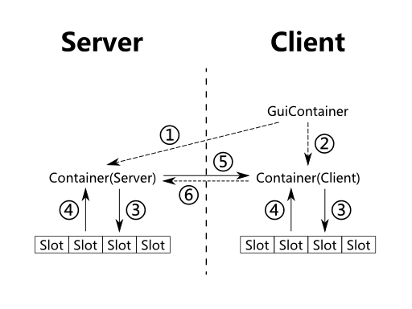

# Mod 信息

@Mod 注解

*推荐分包策略:*
*common: 同时运行于 server 和 client 端*
​    *Item, Block, Tile Entity 等*
*client: 仅运行于 client 端*
​    *GUI, Render 等*

```java
/* Mod 类入口
#version: 版本范围
1.0             x >= 1.0
1.1             x == 1.0
(,1.0]          x <= 1.0
(,1.0)          x < 1.0
[1.0]           x == 1.0
[1.0,)          x >= 1.0
(1.0,)          x > 1.0
(1.0,2.0)       1.0 < x < 2.0
[1.0,2.0]       1.0 <= x <= 2.0
(,1.0],[1.2,)   x <= 1.0 or x >= 1.2
(,1.1),(1.1,)   x != 1.1

推荐分包策略:
common: 同时运行于 server 和 client 端
    Item, Block, Tile Entity 等
client: 仅运行于 client 端
    GUI, Render 等

推荐类名：以 类型 开头
 */
@Mod(modid = MyMod.MODID,// 唯一标识符 非大写且只保留最多 64 位，必备 推荐格式 [a-z0-9\-_]{1,64}
        name = MyMod.NAME,// Mod 名称，不填则使用 modid 推荐格式 [\w ]+
        version = MyMod.VERSION, // Mod 版本 无限制 推荐格式 SemVer(MAJOR.MINOR.PATCH)
        /*
        * 依赖
        * 格式 : {type}:{modid}@{version}
        *   type: before after required-before required-after
        *   modid: 被依赖 mod 的 id
        *   version: 被依赖 mod 的版本范围, 格式 为 #version
        */
        // dependencies = "",
        // useMetadata = false,                    使用 mcmod.info 覆盖该注解的参数
        // clientSideOnly = false,                 仅适用于 Server 端, Client 端将不被加载
        // serverSideOnly = false,                 仅适用于 Client 端, Server 端将不被加载
        acceptedMinecraftVersions = "1.12.2"    // 可用 java 版本 格式为 #version
        // acceptableRemoteVersions = "",          指定有效 Server 端版本 格式为 #version
        // acceptableSaveVersions = "",            指定兼容的存档版本 格式为 #version 或使用 SaveInspectionHandler 注解
        /*
        * 证书 用于检查文件完整性
        *   1 创建私钥
        *       keytool -genkey -alias signFiles -keystore <name>.jks
        *   2 获取公钥 DC:FC:6B:A8:B7:83:02:F1:70:4B:7C:41:B6:65:62:EE:99:99:E2:64
        *       keytool -list -alias signFiles -keystore <name>.jks
        *       处理：去除引号，转换为小写
        *   3 添加至此 用于检查
        *   4 修改 build.gradle 使用对应私钥签名
        *       task signJar(type: SignJar, dependsOn: reobfJar) {
        *           inputFile = jar.archivePath
        *           outputFile = jar.archivePath
        *       }
        *       build.dependsOn signJar
        *
        *       dependsOn: reobfJar - 这个片段非常重要，因为Gradle必须要在ForgeGradle重混淆Jar之后来对Jar签名。
        *       jar.archivePath - 档案(Jar)构造时所处的路径。
        *       build.dependsOn signJar - 这一行告诉Gradle这个任务是 build 任务的一部分，通过 gradlew build来启动。
        *   5 在 gradle.properties 定义
        *       keyStore - 这个值告诉Gradle该去哪里找之前生成的密钥库。
        *       alias - 必须要提供之前定义的那个别名来让Gradle对Jar签名。
        *       storePass - 创建密钥库时使用的密码，Gradle需要它来访问这个文件。
        *       keyPass - 创建密钥库时生成的密钥的密码，Gradle需要它来访问这个文件。这个密码可能与 storePass 相同，但也可能不同。
        *   *6 当校验失败时，触发特殊生命周期事件 FMLFingerprintViolationEvent
        */
        // certificateFingerprint = "dc:fc:6b:a8:b7:83:02:f1:70:4b:7c:41:b6:65:62:ee:99:99:e2:64",
        // modLanguage = "java",                   使用语言 可选 java 和 scala
        // modLanguageAdapter = "",                语言处理器。一个实现 ILanguageAdapter 的类，覆盖 modLanguage
        // canBeDeactivated = false,               无效。但设为 true 后可以接受 FMLDeactivationEvent 事件
        // guiFactory = "",                        自定义 GUI 用于自定义屏幕配置，一个实现 IModGuiFactory 的类
        /*
        * 自动检测更新文件地址 但不会自动更新 只会提示
        * 版本大小的比对 可用 ComparableVersion 类检查是否合法 或 https://semver.org/
        * 日志支持 \n 换行
        * 文件格式:
        * {
        *   "homepage": "<下载地址>",
        *   "<mc 版本>": {
        *     "<mod 版本>": "<mod 更新日志>",
        *     "<mod 版本>": "<mod 更新日志>", ...
        *   }, ...,
        *   "promos": {
        *     "<mc 版本>-latest": "<该版本 mc 适用的 mod 最新版本>",
        *     "<mc 版本>-recommended": "<该版本 mc 适用的 mod 最新稳定版本>",
        *     "<mc 版本>-latest": "<该版本 mc 适用的 mod 最新版本>", ...
        *     "<mc 版本>-recommended": "<该版本 mc 适用的 mod 最新稳定版本>", ...
        *   }
        * }
        * 检查结果通过 ForgeVersion 获取
        *   ForgeVersion.getResult(Loader.instance().activeModContainer())
        *   ForgeVersion.getResult(Loader.instance().getIndexedModList().get({modid}))
        *   结果：
        *       state:
        *           FAILED          获取失败
        *           UP_TO_DATE      不低于最新 Stable 版本
        *           OUTDATE         有一个新的 Stable 版本
        *           BETA_OUTDATE    有一个新的 Unstable 版本
        *           BETA            不低于最新的 Unstable 版本
        *           FENDING         正在获取中，还没结果
        */
        // updateJSON = "",
        // customProperties = {}                   文档没提 不知道干啥的 自定义参数?
    )
public class MyMod {
    public static final String MODID = "mymod";
    public static final String NAME = "MyMod";
    public static final String VERSION = "0.1.0";
}
```


resources/assets/mcmod.info：该 mod 的描述文件

​	数组：一个包内可有多个 @Mod

```json
[
  {
      // 必选，该 info 文件连接的 mod id，没有此 id 时，该文件将被忽略
      "modid": "mymod",
      // 必选 该 mod 的名字
      "name": "My Mod",
      // 对于该 mod 的描述
      "description": "测试 mod"
      // 版本
      "version": "${version}",
      // 适用 MC 版本
      "mcversion": "${mcversion}",
      // 定义但不必须。可取代 updateJSON
      "url": "No url",
      // 更新信息地址 已失效
      "updateUrl": "No url",
      // 更新信息地址
      "updateJSON"："No url"
      // 数组，Mod 作者列表
      "authorList": ["lq2007"],
      // 鸣谢名单
      "credits": "The Forge and FML guys, for making this example",
      // Mod Logo 图片 / => src/main/resources/
      "logoFile": "logo.jpg",
      // 数组，截图，目前无效
      "screenshots": [],
      // 父 mod，使用它允许在信息页下面列出另一个mod的模块
      "parent": "",
      // 当为 true 且 Mod.useMetadata 时，下面三个参数有效
      //    requiredMods：数组。mod 列表。只要有一个不存在游戏就崩溃；不影响 mod 加载顺序。与 dependencies 参数连接。
	  //    dependencies：数组。mod 列表。列表中所有 mod 会在该 mod 之前加载。
	  //    dependants：数组。mod 列表。列表中所有 mod 会在该 mod 之后加载。
      "useDependencyInformation": false
  }
]
```


# Mod 主类构成

```java
// Mod 主类：被 @Mod 注解的任意类
@Mod(...)
public class MyMod {
    
    // Mod.Instance 注解：自动调用空参构造创建主类并赋值
    @Mod.Instance(MyMod.MODID)
    public static MyMod instance;
    // @Mod.InstanceFactory 注解：自定义创建主类的方法，尤其是当主类没有空参构造时，如枚举
    @Mod.InstanceFactory
    public static MyMod getInstance() {
        MyMod myMod = new MyMod();
        myMod.useFactory = true;
        return myMod;
    }
    
    // Proxy 代理类，自动调用空参构造
    // 通常，服务端代码，客户端都会执行，因此 ClientProxy 通常继承于 CommonProxy
    @SidedProxy(clientSide = "ClientProxy 全类名",     // 运行于客户端
            serverSide = "CommonProxy 全类名")         // 运行于服务端
    public static CommonProxy PROXY;
    
    // 可选 @Mod(certificateFingerprint) 设置了后有用
    @Mod.EventHandler
    public void checkFail(FMLFingerprintViolationEvent event) {
        event.isDirectory();            // 在开发环境时 返回 true
        event.getSource();              // 返回不匹配的密钥
        event.getFingerprints();        // 返回发现的所有公钥
        event.getExpectedFingerprint(); // 返回公钥
        System.out.println(String.format(
                "check error: %b, %s, %d, %s",
                event.isDirectory(),
                event.getSource().getAbsolutePath(),
                event.getFingerprints().size(),
                event.getExpectedFingerprint()));
    }
}
```


# 物理端/服务端

1.3 开始，MC 单人模式实现成为模拟一台 127.0.0.1 的 MC 服务器

跨端访问必须使用数据包 Packet，不能使用 Static 成员。因为双端使用的 JVM 可能不同

## Client：客户端

- physical client：物理客户端，通过启动器启动的 MC 程序

  * 所有进程 线程 服务都在此运行

- logical client：逻辑客户端，接收玩家输入并转交给逻辑服务器
- 接收从逻辑服务器的信息，并转化为可视化的信息转交给玩家
  - 运行于 Client Thread 客户端线程，包括对声音和区块渲染

## Server：服务端

- physical server：物理服务端，就是通常所说的服务器，启动 minecraft_server.jar 的地方，没有 GUI

- logical server：辑服务端，运行怪物生成，天气，背包，生命，AI 等游戏机制

  通常运行于物理服务器，但也会运行于物理逻辑端（单人游戏时）
  
  通常运行于 Server Thread

## 区分

- world.isRemote：确定 World 对象的逻辑端，true 则确定的为逻辑客户端，false 则确定为逻辑服务端

  *最稳妥 最高效 最常用*
  
  *物理服务端一定返回 false，但 false 不一定为物理服务端 如单人游戏*

- SideProxy 注解：判断物理端，生成不同的代理类。单人游戏会初始化 Side.Client

  *net.minecraft.client 包只存在于物理客户端*
  
  *net.minecraft.server.dedicated 包只存在于物理服务端*

- FMLCommonHandler.instance().getEffectiveSide()：根据进程推测逻辑端

  *应尽可能不用该方法，因为其结果不一定正确*
  
  *hack：之前根据线程名推断，现在根据线程所属 ThreadGroup 判断*

- SideOnly 注解：用于合并 Minecraft 代码到同一个 jar 包的过程

  *被注解的方法表示：此方法仅在指定物理端出现，若当前生产环境与给定业务端不匹配，则移除此方法*
  
  *这个注解的存在是因为你的 Mod 可以不经任何修改，直接同时适用于服务器和客户端。*

  - 未注解：代表这个类／方法／字段在服务器和客户端同时存在
  - @SideOnly(Side.CLIENT)：代表这个类／方法／字段只应该在客户端软件中存在
  - @SideOnly(Side.SERVER)：代表这个类／方法／字段只应该在服务器端软件中存在

- FMLCommonHandler.instance().getSide：获取物理端，绝对正确

  *SideOnly 注解不应出现在代码中，只应出现在复写的原版方法中，其余应使用 getSide 确定*

# 事件

使用参数为 Event 的方法，注册监听事件

## 生命周期事件

使用 @Mod.EventHandler 注解

应在 @Mod 注解的主类下，下面按顺序排列

一般处理方法是调用 Proxy 对应的方法

此事件不使用 Forge 事件总线，而是 FML 事件总线（即 guava 总线）

- FMLConstructionEvent

  *Mod 开始加载*

- FMLPreInitializationEvent

  *在所有 Mod 初始化之前调用，加载配置信息，实例化并注册物品和方块*

- FMLInitializationEvent

  *设置 Mod，注册合成表及烧炼，向其他 Mod 发送交互信息*

- FMLInterModComms.IMCEvent

- FMLPostInitializationEvent

  *接收其他 Mod 发送的信息，完成对 Mod 的设置*

- FMLLoadCompleteEvent

  *Mod 加载结束*

## 注册事件

### 生命周期事件

Mod 主类中使用 @Mod.EventHandler 注解

### Forge 事件

MC 游戏本体没有事件系统，而是由 Forge 提供

#### 事件总线

- 一般事件总线 MinecraftForge.EVENT_BUS
- 矿物生成总线 MinecraftForge.ORE_GEN_BUS
- 地形生成总线 MinecraftForge.TERRAIN_GEN_BUS

#### 事件订阅

监听器：返回 void，有且仅有一个参数为要处理的 Event，且该方法由 @SubscribeEvent 注解的方法

当监听父事件，所有子事件也将被监听

通常于 FMLPreInitializationEvent 事件中进行注册

- 事件方法为静态方法

  *监听器所在类的 class 对象*

  ```java
  public class EventClass {
      @SubscribeEvent
      public static void onEvent(Event event) {
          // do something
      }
  }
  MinecraftForge.EVENT_BUS.register(EventClass.class);
  ```

- 事件处理方法为普通方法

  *监听器所在类的对象*

  ```java
  public class EventClass {
      @SubscribeEvent
      public void onEvent(Event event) {
          // do something
      }
  }
  MinecraftForge.EVENT_BUS.register(new EventClass());
  ```

- 自动注册

  *使用 @Mod.EventBusSubscriber 注解监听器所在类*
  
  *监听器必须为静态*

  ```java
  @Mod.EventBusSubscriber
  public class EventClass {
  	@SubscribeEvent
      public static void onEvent(Event event) {
      	// do something
      }
  }
  ```


## 事件属性

### @SubscribeEvent

- priority：优先级，默认 NORMAL
- receiveCanceled：是否接收被取消的事件，默认 false

### Event

- isCancelable/isCanceled/setCanceled

  - 被 @Cancelable 注解的事件可被取消
  
    试图取消不可取消的事件时，会抛出 UnsupportedOperationException

- hasResult/getResult/setResult: 结果, 只有 Result.DENY DEFAULT ALLOW 三种

  - 被 @HasResult 注解的事件拥有一个 结果

- getListenerList: 所有注册该事件的监听器

- getPhase/setPhase: 优先级

## 自定义事件

- 创建事件类

  ```java
  @Cancelable // 该事件可被取消
  public class CustomEvent extends PlayerEvent {
      // 所有 event 字段都应为 final
      // 该事件存储了一个位置和世界
      public final BlockPos pos;
      public final World world;
      
      public CustomEvent(EntityPlayer player, BlockPos pos, World world) {
          super(player);
          this.pos = pos;
          this.world = world;
      }
  }
  ```

  

- 定义注册总线

  可以直接使用 MinecraftForge.EVENT_BUS，也可以自己创建

  ```java
  public static final EventBus MY_EVENT_BUS = new EventBus();
  ```

  

- 设置触发

  ```java
  // 于特定时机触发
  CustomEvent event;
  event = new CustomEvent(playerIn, pos, worldIn);
  MY_EVENT_BUS.post(event);
  if (!event.isCanceled() && !worldIn.isRemote) {
      // 事件没有被取消的话, 则变成空气
      worldIn.setBlockToAir(pos);
      return true;
  }
  ```

  

- 定义并注册事件处理器 与其他事件相同，两种注册方法

  ```java
  public class EventHandler {
      @SubscribeEvent
      public static void onEvent(CustomEvent event) {
          // do something
      }
  }
  
  MY_EVENT_BUS.register(EventHandler.class);
  ```


## 常用事件

- BlockEvent.HarvestDropsEvent：掉落物


# 创造模式物品栏

```java
// 无需注册
// MC 默认创造模式物品栏都在 CreativeTabs 的静态变量中
public class MyCreativeTab extends CreativeTabs {

    private static CreativeTabs sTab = null;
    public static CreativeTabs get() {
        if (sTab == null) sTab = new MyCreativeTab();
        return sTab;
    }
    
    public MyCreativeTab() {
        super("mymod");
        // 开启搜索框
        hasSearchBar();
        // 背景
        //  位于 assets.minecraft.textures.gui.container.creative_inventory.tab_creative.png
        //  大小: 256*256
        //      背景位于左上角, 其他位置留透明
        setBackgroundImageName("creative.png" /* 实际上是 tab_creative.png */);
    }

    // 创造模式物品栏显示的物品
    @Override
    public ItemStack getTabIconItem() {
        return new ItemStack(Blocks.DIAMOND_BLOCK);
    }
}
```


# ResourceLocation

用于识别资源，也用于识别唯一对象

registerName 应符合 ResourceLocation 的一般约定，不能用大写

```java
// 代表资源：resources/assets/<domain>/<path>
// domain 默认 minecraft，mod 应当使用自己的 domain
new ResourceLocation("<domain>", "<path>");
// 从 MC 资源包系统中获取资源
Minecraft.getMinecraft().getResourceManager().getResource(new ResourceLocation("...", "..."));
```

## ModelResourceLocation

注模型位置, 由三部分组合而成: 资源域:资源名#位置

```java
// 代表资源：assets/<domain>/<variant>/<path>.json
// <variant> 为 inventory 表示 根据上下文判断，如 models.item 等
new ModelResourceLocation("<domain>:<path>", "<variant>");
```


# 注册表

用于注册 Mod 中的对象，物品，方块，声音等，是键值对，使用 ResourceLocation 作为键

## 支持类

Block, Item, Potion, Biome, SoundEvent, PotionType, Enchantment, VillagerProfession 村民职业, EntityEntry 实体

合成表 IRecipe 也会在这里注册，但推荐写 json

顺序：Item->Block->其他随机（or 字母顺序？）

## 注册

### 推荐：注册事件

每个方法只能注册一种种类 T extends IForgeRegistryEntry\<T>，

```java
@SubscribleEvent
public static void onRegistry(RegistryEvent.Register<T extends IForgeRegistryEntry<T>> event) {
    regBlock.getRegistry().register(value);
}
```


### GameRegistry.register

### IForgeRegistryEntry::getRegistryType


## ObjectHodler

注解，自动注入注册表中注册的值

必须为 public static，null 可选，可先赋值 AIR 或 null，框架会自动注入

```java
// 标记在主类上的注解指定 domain，没有则默认 minecraft
@GameRegistry.ObjectHolder("minecraft")
public class MyStuffHolder {

    // minecraft:beacon
    //  <domain>.<value>
    @GameRegistry.ObjectHolder("beacon")
    public static final Block VANTLLA_BEACON = Blocks.AIR;

    // 子项不添加注解，则主类必须注解才有效，成员名将转化为小写
    //  minecraft:iron_hoe
    //  <domain>:{FIELD_NAME.toLowerCase()}
    public static final Block IRON_HOE = Blocks.AIR;

    // 使用完整的 ResourceLocation 类型参数，可覆盖主类定义的 domain，可省略主类注解
    //  forestry:grafter
    //  <VALUE>
    @GameRegistry.ObjectHolder("forestry:grafter")
    public static final Item FORESTRY_GRAFTER = Items.AIR;
}
```

## 自定义注册表 TODO

> https://harbinger.covertdragon.team/chapter-06/

- 使用一个类 实现 IForgeRegistryEntry，推荐继承 IForgeRegistryEntry.Impl
- 在 RegistryEvent.NewRegistry 事件中，使用 RegistryBuilder::create 创建
- 通过 GameRegistry.findRegistry(Class) 获取


# 某些枚举意义

## EnumActionResult

表示事件/动作处理情况

- SUCCESS：成功处理完成，并禁止继续向下传播
- PASS：成功处理，并允许继续向下传播
- FAIL：处理失败，并禁止继续向下传播

# 物品

玩家通过 ItemStack 互动行为处理机制的逻辑存放类

享元：一个 Item 的实例代表一类物品，因此可用 == 判断两个物品是否一类

## 物品栈

ItemStack：反映一种描述物品堆叠的类，包含一个物品的种类 数量 一个 Metadata 一个 NBT 标签

nbt：ItemStack 携带有一个 NBT 标签，能够携带更多自定义数据，表示使用物品时表现出的特性

metadata：可以存储一个长度 16bit 的数组，如耐久

每个 ItemStack#getItem 均为非空，ItemStack.EMPTY 也存在：AIR

## 创建物品

### 普通物品

```java
public class MyItems {
    static {
        simpleItem.setCreativeTab(MyCreativeTab.get()); // 创造物品栏，不设置则不会在创造物品栏显示
        simpleItem.setMaxDamage(10); // 最大伤害值。当大于 0 时，damaged 和 damage 两种状态将被添加
        simpleItem.setMaxStackSize(64); // 最大堆叠数量
        simpleItem.setNoRepair(); // 使其无法被修复
        simpleItem.setHarvestLevel("shovel", 1); // 工具挖掘等级 type 需要一个 harvest class 如 shovel axe 等
        simpleItem.setUnlocalizedName(MyMod.MODID + ".simple_item"); // 本地化名称 item.UnlocalizedName.name
        simpleItem.setRegisterName(MyMod.MODID + ":simple_name") // 注册物品id
    }
    
    // 没有特殊方法的物品：直接新建 Item 类的实例，如只用于合成的物品
    public static Item simpleItem = new Item();
    
    // 有特殊方法的物品：继承 Item 类，或实现一个匿名类
    public static Item myItem = new Item() {
        @Override
        public ActionResult<ItemStack> onItemRightClick(World worldIn, EntityPlayer playerIn, EnumHand handIn) {
            worldIn.playSound(playerIn, playerIn.getPosition(), SoundEvents.ENTITY_GHAST_SCREAM, SoundCategory.NEUTRAL, 0.5f, 0.4f / itemRand.nextFloat() * 0.4f + 0.8f);
            return super.onItemRightClick(worldIn, playerIn, handIn);
        }
    };
}
```

- 其他方法

  - onItemUse

    > 使用该物品右键时触发

  - doesSneakBypassUse

    > 重写该方法返回 true 则玩家潜行右键方块时，可以调用方块的 onBlockActivated 方法。

### 食物

```java
public class MyFood extends ItemFood {

    public MyFood() {
        super(4,           // 回复的饥饿值
              0.6f,        // 回复的饱食度与饥饿值的比值 饱食度=2*amount*saturation
              false);      // 是否可被狼食用
        // 可随时食用，否则只有在饱食度不满时可食用
        setAlwaysEdible();
        // 药水效果 只能设置一个
        // 要设置多个 复写 onFoodEaten
        setPotionEffect(new PotionEffect(
                MobEffects.ABSORPTION,  // 药水效果
                        1000, // 持续时间
                        3)，   // 药水等级
                        1.0f); // 产生效果的概率
    }

    /**
     * 食用后的效果
     */
    @Override
    protected void onFoodEaten(ItemStack stack, World worldIn, EntityPlayer player) {
        super.onFoodEaten(stack, worldIn, player);

        if (!worldIn.isRemote) {
            player.addPotionEffect(new PotionEffect(MobEffects.FIRE_RESISTANCE, 1000, 3));
            player.addExperience(10);
        }
    }
}
```


### 工具 武器

```java
public class MyPickaxe extends ItemPickaxe /* 工具子类，或 ItemTool */ {

    // 添加可作为工具材质的枚举
    // 材质内数据也将作为工具的一部分属性，参考构造方式
    private static final ToolMaterial MY_TOOL_MATERIAL = EnumHelper.addToolMaterial("MY_TOOL_MATERIAL",
            3,          // 挖掘等级
            16,         // 工具耐久
            16f,        // 工具效率
            0f,         // 攻击力
            10);        // 附魔等级

    public MyPickaxe() {
        super(MY_TOOL_MATERIAL);
    }
}
```


### 盾

```java
public class MyShied {
    // ...
    public boolean isShield(ItemStack stack, @Nullable EntityLivingBase entity) {
        // 注意它传入了盾牌本身和持盾的实体。（注意到持盾的不一定是玩家！）
        // 换言之，你可以在这个时候对这玩意搞各种事情
        return true;
    }
}
```


### 护甲 TODO

> TODO: https://harbinger.covertdragon.team/chapter-04/advanced/armor.html

```java
public class ItemRedstoneHelmet extends ItemArmor {

    /**
     * 护甲材质 必须使用 EnumHelper 获取自定义类型 Enum 类型
     */
    private static ArmorMaterial REDSTONE = EnumHelper.addArmorMaterial(
            "REDSTONE",
            MyMod.MODID + ":redstone",            // 与材质所在位置有关, resources\assets\mymod\textures\models\armor\redstone_layer_1/2.png
            10,                                   // 与所在位置的耐久成正比
            new int[]{2, 4, 6, 2},                // 头盔 护腿 胸甲 鞋子的防御力, 和不要超过 20
            10,                                   // 附魔等级
            SoundEvents.ITEM_ARMOR_EQUIP_DIAMOND, // 穿戴声音
            5f);                                  // 护甲韧性

    ItemRedstoneArmor() {
        super(REDSTONE, EntityEquipmentSlot.HEAD.getSlotIndex(), EntityEquipmentSlot.HEAD);
    }
    
    @Override
    public void onArmorTick(World world, EntityPlayer player, ItemStack itemStack) {
        super.onArmorTick(world, player, itemStack);
        // 穿上该护甲后 每 tick 都会调用
    }
    
    @Nullable
    @Override
    public String getArmorTexture(ItemStack stack, Entity entity, EntityEquipmentSlot slot, String type) {
        return super.getArmorTexture(stack, entity, slot, type); // 贴图
    }
    
    // ISpecialArmor 接口
    public ArmorProperties getProperties(EntityLivingBase player, ItemStack armor, DamageSource source, double damage, int slot);
    public int getArmorDisplay(EntityPlayer player, ItemStack armor, int slot);
    public void damageArmor(EntityLivingBase entity, ItemStack stack, DamageSource source, int damage, int slot)
}
```


### 投掷物

```java
public MyItem extends Item {
    //...
    
    @Override
    public ActionResult<ItemStack> onItemRightClick(World worldIn, EntityPlayer playerIn, EnumHand handIn) {
        ItemStack stack = playerIn.getHeldItem(handIn);
        // 雪球声效
        worldIn.playSound(null, playerIn.getPosition(),
                SoundEvents.ENTITY_SNOWBALL_THROW,
                SoundCategory.NEUTRAL, 0.5f, 0.4f / (itemRand.nextFloat() * 0.4f + 0.8f));
        if (!worldIn.isRemote) {
            // 生成雪球 实体
            EntitySnowball snowball = new EntitySnowball(worldIn, playerIn);
            snowball.shoot(playerIn, playerIn.rotationPitch, playerIn.rotationYaw, 0f, 1.5f, 1f);
            worldIn.spawnEntity(snowball);
        }
        // 物品数量 -1
        stack.setCount(stack.getCount() - 1);
        // 交互成功
        return new ActionResult<>(EnumActionResult.SUCCESS, stack);
    }
}
```


### Hack

> Hack: 使用 metadata 避免占用过多物品id
>
> 1.13 取消 metadata，此方法不再有效

```java
public class MultiMetaItem {
    public MultiMetaItem() {
        super();
        // 声明该物品具有子类型，即有 metadata
        // metadata 范围 [0, Short.MAX_VALUE]
        setHasSubtypes(true);
        // 最大损害值为 0（耐久） 避免物品修复类设备产生bug
        // 损害值与 metadata 其实是耦合的，损害值由 metadata 存储，由 setHasSubtypes 控制其意义
        // 可以将耐久转到 nbt 数据存储（如 IE 工程师系列工具）
        setMaxDamage(0);
        // 防止被修复 避免物品修复类设备产生bug
        setNoRepair();
    }

    @SideOnly(Side.CLIENT)
    @Override
    public void getSubItems(CreativeTabs tab, NonNullList<ItemStack> items) {
        // 向创造物品栏添加物品
        if (isInCreativeTab(tab)) {
            items.add(new ItemStack(this, 1, 0));
            items.add(new ItemStack(this, 1, 1));
        }
    }
}
```


### 损害值

限定物品耐久值


### 合成保留

```java
setContainerItem(this);
```


## 注册

```java
// 物品
@SubscribeEvent
public static void register(RegistryEvent.Register<Item> register) {
    register.getRegistry().register(MyItems.simpleItem);
}
// 模型注册 见 渲染/模型注册/物品模型
```


## 语言文件

> 语言文件位于 resources/assets/[mod_id]/lang/[locale].lang

```properties
item.[unlocalizedName].name=实际显示名称
```


# 方块

## 创建方块

### 普通方块

```java
public class MyItems {
    // 没有特殊方法的物品：直接新建 Item 类的实例，如只用于合成的物品
    public static Block simpleBlock = new Block();
    
    // 有特殊方法的物品：继承 Item 类，或实现一个匿名类
    public static Block myBlock = new Block() {
        //...
    };
}
```

#### 属性

- setRegistryName && unlocalizedName && creativeTabClass
- setTickRandomly 是否可接受随机刻
- setSoundType 声音
- setLightLevel 亮度 0-1，游戏中取 n*16
  - 岩浆1，红石火把0.5
- setLightOpacity 透光率（越大越低）
  - 树叶和蛛网1，水和冰3
  - 实际效果是 光线穿透后，光亮等级-x
- setHarvestLevel 挖掘等级
  - toolClass: "pickaxe"(镐) "shovel"(铲子) "axe"(斧头)
  - level: 钻石镐3，铁2，石1，木0
- setHardness 硬度
  - 黑曜石50，铁块5，金块3，圆石2，石头1.5，南瓜1，泥土0.5，甘蔗0，基岩-1
  - 先设置硬度再设置抗暴性，因为设置硬度后，抗暴性将提高到最低硬度的 5 倍 本身超过5x则不变
- setResistance 爆炸抗性
  - 木头4，石头10，黑曜石2000，基岩6000000
  - 实际数值是传入值的三倍
- setBlockUnbreakable 无法破坏, 硬度 -1

#### 方法

- breakBlock 当方块被破坏时调用，用于附加工作，如将 TileEntity 数据以掉落物形式出现，并清空

- onBlockActivated 响应右键。该方法在 Server 和 Client 都会调用，因此要注意调用的位置，打开 GUI，变动世界等都只能在 Server 调用

  > 返回 这个方法是否做了什么。
  >
  > Client 返回 false 会阻止该方法在 Server 的调用
  >
  > 通常会在 worldIn.isRemote 时返回 true，否则执行正常的激活逻辑

- onBlockClicked 响应左键

##### 掉落物

- getItemDropped 决定掉落物的种类

- quantityDropped 决定掉落物数量

- quantityDroppedWithBonus 决定由时运参与下掉落物数量

- getExpDrop 决定掉落经验数量

- getPickBlock 决定创造模式下鼠标中键获取的物品类型，取代 getItem

- getDrops 总方法 收集方块掉落物。可直接重写此方法而不重写上面的方法

- getSilkTouchDrop 精准采集

  

### 红石敏感 TODO

> https://harbinger.covertdragon.team/chapter-05/advanced/redstone-sensitive.html

### 树苗 TODO

> https://harbinger.covertdragon.team/chapter-05/advanced/sapling.html

### 作物

> 简单作物可直接继承 BlockCrops 类

```java
class CropBlock extends BlockCrops {

    // 作物种子
    @Override
    protected Item getSeed() {
        return super.getSeed();
    }

    // 作物产物
    @Override
    protected Item getCrop() {
        return super.getCrop();
    }

    // 生长年限，默认 7
    @Override
    public int getMaxAge() {
        return super.getMaxAge();
    }
}
```


### 带状态方块

> 正如 ItemStack 是 Item 的存在形式，Block 放置后其状态由 IBlockState 定义（1.9后改为 BlockStateContainer）

#### BlockStack

> BlockState：标记方块状态，让不同的状态或属性，但类型相似的方块共享 id
>
> 为了方便存储, 方块本身存储方式仍是 Metadata，但 BlockState 与 Metadata 不是一一对应的

- 有限数量：

  - 方块的 Metadata 只能存储 4bit, 也就是 16 种（1.13 后使用 调色盘 实现）

  - 常用 位运算 属性实现与 BlockState 对应

  - 需要更多数据：

    - getActualState：通过获得附近的方块确定

      > 不能通过 world.getBlockState 获取
      > 必须进行安全检查

      ```java
      @override
      public IBlockState getActualState(IBlockState state, IBlockAccess worldIn, BlockPos pos) {
          // 返回补全属性的 BlockState
          // 如 红石线 栅栏 火等，以下是红石线的实现
          state = state.withProperty(WEST, this.getAttachPosition(worldIn, pos, EnumFacing.WEST));
          state = state.withProperty(EAST, this.getAttachPosition(worldIn, pos, EnumFacing.EAST));
          state = state.withProperty(NORTH, this.getAttachPosition(worldIn, pos, EnumFacing.NORTH));
          state = state.withProperty(SOUTH, this.getAttachPosition(worldIn, pos, EnumFacing.SOUTH));
          return state;
      }
      
      BlockRedstoneWire.EnumAttachPosition getAttachPosition(IBlockAccess, BlockPos, EnumFacing) {
          // 实现省略
          // BlockRedstoneWire.EnumAttachPosition: UP, SIDE, NONE
      }
      ```

      

    - 使用多个方块实现

    - 不会大量生成的话 使用 TileEntity，可以保存近乎无限的数据，但若大量生成会导致游戏卡顿

#### IProperty

> 一个由一个或多个有限可能性的一个属性

- PropertyDirection

  >表示方向, 常用实例有 EnumFacing.Plane, EnumFacing.Axis

- PropertyBool

- PropertyEnum\<T> 

  > 表示状态的枚举类，T 需要实现 IStringSerializable 并复写 toString

- PropertyInteger

- 方法

  - withProperty 设置 BlockStack
  - cycleProperty 循环同一属性对应的 BlockState

#### IBlockState

> IBlockState：接口，存储了一个方块的种类和一个用于表示 BlockStack 的 由 IProperty 接口和与之对应的 Comparable 接口组成的键值对
>
> IBlockState#getAllowedValues 即返回所有 IProperty 的笛卡尔积
>
> 内部实现是一个 ImmutableMap，因此每次编辑属性都会返回一个新对象

```java
// 创建所需方块属性
// 使用 PropertyXXX.create 方法
public static final PropertyDirection FACING = 
    PropertyDirection.create("facing", EnumFacing.Plane.HORIZONTAL);
public static final PropertyBool BOOL = PropertyBool.create("boolean");

// 在构造函数中创建默认属性
constructor() {
    super();
    IBlockState state = getDefaultState().withProperty(FACING, EnumFacing.SOUTH);
    setDefaultState(state);
}

// 从 meta 读取属性
@Override
public IBlockState getStateFromMeta(int meta) {
    EnumFacing facing = EnumFacing.getHorizontal(meta & 3 /* 0011 */);
    Boolean bool = (meta & 4 /* 0100 */) != 0;
    return getDefaultState().withProperty(FACING, facing).withProperty(BOOL, bool);
}

// 将属性还原成 meta
@Override
public int getMetaFromState(IBlockState state) {
    int facing = state.getValue(FACING).getHorizontalIndex(); // 11 -> 0011
    int bool = state.getValue(BOOL) ? 4 : 0;
    return facing | bool;
}

/*
 * 创建 BlockState 的方法, 告知方块使用了哪些 IProperty, 并声明默认 BlockState(位于构造函数)
 *  没有设置默认 BlockState 则会随机选择一个作为默认
 *  由于 BlockStateContainer 是已经预先生成的，所以可以使用 == 判断
 *  使用 world.setBlockState 和 world.getBlockState 从世界中获取 IBlockState
 *    不包括 getActualState
 *	  注意 使用 world.setBlockState 会移除并重建 TileEntity
 */
@Override
protected BlockStateContainer createBlockState() {
    // 使用三方模型的话, 要使用 ExtendedBlockState
    //  Block 方块, IProperty[] 包含的 IProperty, IUnlistedProperty[] 根据三方模型选择
    //      IUnlistedProperty: B3D -> B3DLoader.B3DFrameProperty.INSTANCE
    //      IUnlistedProperty: OBJ -> OBJModel.OBJProperty.INSTANCE
    return new BlockStateContainer(this, FACING, BURNING);
}

// 创造模式物品栏显示的物品
@Override
@SideOnly(Side.CLIENT)
public void getSubBlocks(CreativeTabs itemIn, NonNullList<ItemStack> items) {
    items.add(new ItemStack(this, 1, 0 /* 0000 */));
    items.add(new ItemStack(this, 1, 4 /* 0100 */));
}

// 方块放置
// onBlockPlacedBy 可以在方块及Entity生成后做调整, 支持 ItemStack
@Override
public IBlockState getStateForPlacement(World world, BlockPos pos, EnumFacing facing,
                                        float hitX, float hitY, float hitZ,
                                        int meta, EntityLivingBase placer, EnumHand hand) {
    IBlockState origin = super.getStateForPlacement(world, pos, facing, 
                                                    hitX, hitY, hitZ, meta, placer, hand);
    return origin.withProperty(FACING, placer.getHorizontalFacing().getOpposite());
}

// 被破坏或中键选取物品时，物品的 meta
@Override
public int damageDropped(IBlockState state) {
    return state.getValue(MATERIAL).ordinal() << 2; // 1 -> 0100
}
```


### 类似 空气方块

```java
/**
 * 这是一个模拟空气方块的方块
 */
public class AirBlock extends Block {

    public AirBlock() {
        super(Material.AIR);
    }

    @Override
    public boolean isFullBlock(IBlockState state) {
        return false;   // 该方块并非 1*1*1 的完整方块，会影响窒息 碰撞 光照等判定及计算
    }

    @Override
    public boolean isBlockNormalCube(IBlockState state) {
        return false;
    }

    @Override
    public boolean isNormalCube(IBlockState state, IBlockAccess world, BlockPos pos) {
        return false;
    }

    @Override
    public boolean isNormalCube(IBlockState state) {
        return false;
    }

    @Override
    public boolean isPassable(IBlockAccess worldIn, BlockPos pos) {
        return true;    // 该方块可穿过
    }

    @Override
    public boolean isOpaqueCube(IBlockState state) {
        return false;   // 是完整的 1*1*1 方块，且无透明材质
    }

    @Override
    public EnumBlockRenderType getRenderType(IBlockState state) {
        return EnumBlockRenderType.INVISIBLE;   // 不渲染
    }

    @Nullable
    @Override
    public AxisAlignedBB getCollisionBoundingBox(IBlockState blockState, IBlockAccess worldIn, BlockPos pos) {
        return Block.NULL_AABB; // 从 0.0.0 到 0.0.0 的 AABB，去鼠标移上去时的黑边
    }
}
```


## TileEntity

> 类似实体，可存储一个 NBT 数据的特殊对象，用于扩展方块存储的数据
>
> 可实现 ITickable 实现一秒 20 次的刷新能力
>
> 使用 setBlockState 时会创建新 TE 覆盖当前 TE 并使当前 TE 失效
>
> ​	可使用当前 TE.validate() 方法重新激活当前 TE

### 标记方块使用 TileEntity

- 重写 hasTileEntity/createTileEntity

  ```java
  public class Class extends Block {
  
      public Class(Material materialIn) {
          super(Material.WOOD);
      }
  
      @Override
      public boolean hasTileEntity(IBlockState state) {
          return true;
      }
  
      @Nullable
      @Override
      public TileEntity createTileEntity(World world, IBlockState state) {
          return new MyTileEntity();
      }
  }
  ```

  

- 实现 ITileEntityProvider

  ```java
  public class Class extends Block implements ITileEntityProvider {
  
      public Class(Material materialIn) {
          super(Material.WOOD);
      }
  
      @Nullable
      @Override
      // hasTileEntity createTileEntity 默认实现都会检查该方块是否实现 ITileEntityProvider，因此不需要重写
      public TileEntity createNewTileEntity(World worldIn, int meta) {
          return new MyTileEntity();
      }
  }
  ```


- 继承 BlockContainer

  ```java
  public class Class extends BlockContainer {
  
      public Class(Material materialIn) {
          super(Material.WOOD);
      }
  
      @Nullable
      @Override
      public TileEntity createNewTileEntity(World worldIn, int meta) {
          return new MyTileEntity();
      }
  
      @Override
      // 恢复方块渲染 
      // BlockContainer 默认会将该值设为 INVISIBLE，意义为 让我们自己编写 OpenGL 手动渲染
      public EnumBlockRenderType getRenderType(IBlockState state) {
          return EnumBlockRenderType.MODEL;
      }
  }
  ```

  

### 创建 TileEntity

```java
public class MyTileEntity extends TileEntity implements ITickable {

    long mTimeWrite = 0;

    @Override
    // 向 TileEntity 写数据，从 compound 读取
    // super 必须调用
    public void readFromNBT(NBTTagCompound compound) {
        if (compound.hasKey("write")) mTimeWrite = compound.getLong("write");
        super.readFromNBT(compound);
    }

    @Override
    // 从 TileEntity 读取数据，写入到 compound
    // super 必须调用
    public NBTTagCompound writeToNBT(NBTTagCompound compound) {
        compound.setLong("write", Minecraft.getMinecraft().world.getWorldTime());
        return super.writeToNBT(compound);
    }
}
```


### ITickable

```java
// ITickable 接口方法，每 1 tick 调用一次
// 运行于 MC 主线程，因此不要想在这里做一些 while true 之类的死循环
// 只为存储数据，则不要实现此接口，以节约资源
@Override
public void update() {
    // do something
}
```


### 数据同步

> 将数据同步到 Client
>
> TileEntity#markDirty()：数据修改完成后，调用此方法，否则当世界保存时区块可能忽略你的改动

- 区块加载时同步：仅在区块加载时触发

  ```java
  public class MyTileEntity extends TileEntity {
  
      long mTimeChunk = 0;
  
      @Override
      // 用于构建从服务器发送到客户端的数据包。此方法调用在服务器
      public NBTTagCompound getUpdateTag() {
          Debug.warn(world, "getUpdateTag");
          // 更新数据
          NBTTagCompound compound = super.getUpdateTag();
          compound.setLong("chunk", Minecraft.getMinecraft().world.getWorldTime());
          // 标记数据更新
          markDirty();
          return compound;
      }
  
      @Override
      // 用于处理服务器发送到客户端的数据。此方法调用在客户端
      public void handleUpdateTag(NBTTagCompound tag) {
          Debug.warn(world, "handleUpdateTag");
          super.handleUpdateTag(tag);
          // 保存数据
          mTimeChunk = tag.getLong("chunk");
      }
  }
  ```

  

- 方块更新时同步：伴随方块更新

  > 只有在 World::notifyBlockUpdate 方法调用时，才会触发方块更新
  >
  > 该方法于客户端调用

  ```java
  public class MyTileEntity extends TileEntity {
  
      long mTimeBlock = 0;
  
      @Nullable
      @Override
      // 用于构建从服务器发送到客户端的数据包。此方法调用在服务器
      // 发送的数据可用 onDataPacket 访问
      // SPacketUpdateTileEntity 构造第二个参数 如果不是原版 TileEntity 则无意义
      public SPacketUpdateTileEntity getUpdatePacket() {
          Debug.warn(world, "getUpdatePacket");
          // 更新数据
          NBTTagCompound compoundIn = new NBTTagCompound();
          compoundIn.setLong("block", Minecraft.getMinecraft().world.getWorldTime());
          // 标记数据更新
          markDirty();
          return new SPacketUpdateTileEntity(getPos(), 1, compoundIn);
      }
  
      @Override
      // 用于处理服务器发送到客户端的数据。此方法调用在客户端
      public void onDataPacket(NetworkManager net, SPacketUpdateTileEntity pkt) {
          super.onDataPacket(net, pkt);
          Debug.warn(world, "onDataPacket");
          // 保存数据
          mTimeBlock = pkt.getNbtCompound().getLong("block");
      }
  }
  ```

  

- 自定义网络信息同步

  > 详见 数据同步 节
  >
  > 需要检查 TileEntity 是否发生了变化以及区块是否被加载

### 注册

> 注册时机：FMLPreInitializationEvent 或 RegistryEvent.Register\<Block>
>
> 没有单独的注册事件，因此需要使用 GameRegistry#registerTileEntity

### 获取

> 获取：world.getTileEntity(pos);
>
> 
>
> 当被其他线程调用且代码中调用了 worldIn.getTileEntity 方法时，会创建新的 TileEntity，引起世界 TileEntity 列表变化，试图创建不存在的实体时会抛出 ConcurrentModificationException 异常。
> 因此 必须要检查 IBlockAccess 是否为 ChunkCache，如果是的话 强转并使用 getTileEntity 的不可变变种
>
> 如 getDrops 方法
>
> TileEntity tileentity = worldIn instanceof ChunkCache
>  ? ((ChunkCache)worldIn).getTileEntity(pos, Chunk.EnumCreateEntityType.CHECK)
>  : worldIn.getTileEntity(pos);
>
> 读取 te 内容需要在服务端

### 其他

- 如果使用 TileEntity 存储 IBlockState，需要注意：

  - 使用 getActualState 设置 IStateBlock
  - 在 TileEntity 中的操作不能直接调用 world.setBlockState 设置
  - 数据同步的两种实现最好都做

- world.markBlockRangeForRenderUpdate(pos, pos); 对该位置方块进行重新渲染

  > 用于 ITickable#update
  
- 用 TileEntity#markDirty 方法标记数据变动，当世界保存时自动保存变化

  - markDirty 会触发周围方块 Block#onNeighborChange 方法，setBlockState 由于会替换 TileEntity 也会触发 

- TileEntity#readFromNBT 方法在第一次从已保存的存档中恢复时，world==null，因此此时如果 setBlockState 会报错。应在 onLoad 中设置

## 注册

```java
// 注册方块
@SubscribeEvent
public void registerBlocks(RegistryEvent.Register<Block> event) {
    Block block
    event.getRegistry().registry(block);
}
// 注册方块所对应物品，可选，如液体方块没有对应物品
// 方块物品也是 Item，基本都继承了 ItemBlock
// 可以通过 Item.getItemFromBlock(block) 获取，注意 null 检查
public void registerItems(RegistryEvent.Register<Item> event) {
    // 普通方块
    // 创建 ItemBlock，会自动设置 unlocalizedName 
    Item item = new ItemBlock(block)
        // 不会设置 RegistryName，需要手动设置。一般会直接设置成 block.getRegistryName()
        .setRegistryName(block.getRegistryName());
    event.getRegistry().registry(item);
    
    // 包含 IBlockState 的方块
    // unlocalizedName: {item.getUnlocalizedName()}.{nameFunction.apply()}
    ItemMultiTexture item = new ItemMultiTexture(block, block, String[](meta->name))
    item.setRegistryName(block.getRegistryName());
    item.setCreativeTab([CreativeTabs])
    event.getRegistry().register(item);
    GameData.getBlockItemMap().put(block, item);
}

// 材质注册详见 渲染/模型注册/方块模型
```

# 流体

## 创建

```java
// 简单流体
public static final Fluid myFirstFluid = new Fluid("my_fluid", 
                                                   new ResourceLocation("mymod:my_fluid"), 
                                                   new ResourceLocation("mymod:fluid"))
    .setGaseous(true).setDensity(Integer.MAX_VALUE);
```

## 方块

> IFluidBlock：更为精密的自定义逻辑，可精确控制其他 mod 泵等方块对其打交道的行为，如可修改一桶从 1000mb 改为 2000mb
>
> BlockFluidBase：抽象类，实现这个可以省去不少代码
>
> BlockFluidFinite：有限源的流体方块实现，可直接 new 或者继承
>
> BlockFluidClassic：无限源的流体方块实现，尽可能还原原版水和熔岩的行为，可直接 new 或者继承

## 注册

## 容器

### 万能桶

> Forge 提供的一个物品，可以方便的实现原版桶装/倒出 mod 流体的行为
>
> 默认关闭

```java
// 自己实现的思路: 注册自己的桶-让自己的桶能放出流体-订阅事件完成普通桶装载流体时返回自己的桶

// 开启：任意一个 Mod 在 FMLPreInitializationEvent 之前显式启用
FluidRegistry.enableUniversalBucket();

// 注册到万能桶（也会尝试注册传入的流体，但无返回值）
FluidRegistry.addBucketForFluid(myFluid);
```

### 物品

```java
public class MyFluidContainer extends Item {

    @Nullable
    @Override
    public ICapabilityProvider initCapabilities(ItemStack stack, @Nullable NBTTagCompound nbt) {
        return new FluidHandlerItemStack(stack, 16000);
    }
}
```


### 方块

> 使用 TileEntity

```java
public class MyFluidContainer extends TileEntity {

    // 使用 Forge 自带容器
    private IFluidHandler tank = new FluidTank(8000);

    // Capability 详见 能力系统
    @Override
    public boolean hasCapability(Capability<?> capability, @Nullable EnumFacing facing) {
        return capability == CapabilityFluidHandler.FLUID_HANDLER_CAPABILITY 
                || super.hasCapability(capability, facing);
    }

    @Nullable
    @Override
    public <T> T getCapability(Capability<T> capability, @Nullable EnumFacing facing) {
        if (capability == CapabilityFluidHandler.FLUID_HANDLER_CAPABILITY )
            return CapabilityFluidHandler.FLUID_HANDLER_CAPABILITY.cast(tank);
        else 
            return super.getCapability(capability, facing);
    }
}
```


### 交互

> FluidUtil

## FluidStack

> 类似 ItemStack，保存有流体类型，nbt，流体数量，但 fluid 可以为 null，null 时不能指定数量
>
> FluidStack#equal 方法只比较流体类型及 nbt

```java
// 空流体
FluidStack nullFluid = null;
// IllegalArgumentException
FluidStack nullFluidError = new FluidStack(nullFluid, 1000);
// 一桶量的水 (1000mb)
FluidStack water = new FluidStack(FluidRegistry.WATER, Fluid.BUCKET_VOLUME);
// 获取流体类型
water.getFluid(); // water
```


# 实体

> 通俗解释，MC 中一切会动的，但不是方块的东西 基本都是实体
>
> ​	物品展示架和盔甲架同样也是实体，粒子效果不是

## 属性

- 运动属性

  > 一个纬度坐标, 三个位置坐标, 两个姿态坐标

- 大小

  > 碰撞箱体积, 底面为正方形的长方体

- 状态

  > 包括实体是不是骑着另一个实体, 是否着火, 是否在水中等

- 既定属性

  > [生物] 经验, 追踪半径, 手持物品, 存活时间等

- 既定行为

  > [生物] 观察, 行走, 跳跃, 攻击, 寻路等

- 人工智能

  > [生物] 对既定行为的一定程度的自动化实施能力

- 标识 UUID

#### 接口

- IAnimals：动物
- IMob：怪物（暴民?）,属于动物
- INpc：NPC 村民等
- IRangedAttackMob：可产生范围攻击，如发射弹射物的怪物
- IBossDisplayData：BOSS，可显示血条
- IEntityOwnable：可被驯服

#### 方法/属性

- setSize(width, height)：碰撞箱，一个底面为指定长度的正方形的长方体

- onLivingUpdate：EntityLivingBase，每次实体更新时调用

  > 添加非 AI 行为 如骷髅在阳光下着火

- dropFewItems/dropEquipment：EntityLivingBase，实体死亡后掉落，第二个专门处理装备

  - boolean wasRecentlyHit：是否为玩家击杀
  - int lootingModifier：抢夺等级
  - 在该方法里调用 dropItem 方法进行掉落

- getXxxSound：设置某些行为播放的声音

  - getFallSound 参数伤害点数

## 创建 TODO

> TODO: https://harbinger.covertdragon.team/chapter-08/

### 实体类

```java
class MyChickenEntity extends EntityLiving {

    public MyEntity(World worldIn) {
        super(worldIn);
    }

    @Override
    protected void entityInit() {
        // 碰撞箱 一个 长宽相同 的 长方体
        setSize(1.2f, 1.8f);
    }
}

// 实体 投掷物 实现了 IProjectile 接口
public class EntityEgg extends EntityThrowable {

    public EntityGoldenEgg(World worldIn) {
        super(worldIn);
    }

    // 在投掷物触碰到实体或方块上时调用
    @Override
    protected void onImpact(RayTraceResult result) {
        if (!world.isRemote) {
            // result.entityHit：击中目标
            if (result.entityHit instanceof EntityChicken) {
                EntityChicken originalChicken = (EntityChicken) result.entityHit;
                EntityGoldenChicken goldenChicken = new EntityGoldenChicken(world);
                goldenChicken.setLocationAndAngles(
                        originalChicken.posX, originalChicken.posY, originalChicken.posZ,
                        originalChicken.rotationYaw, originalChicken.rotationPitch
                );
                originalChicken.setDead();
                world.spawnEntity(goldenChicken);
            } else {
                world.spawnEntity(new EntityItem(world, posX, posY, posZ, {对应实体实例}));
            }
            this.setDead();
        }
    }
}
```


### 实体模型类

```java
@SideOnly(Side.CLIENT)
public class MyChickenModel extends ModelBase {
    
    // ModelRenderer 实际上代表了一堆受统一的位移、旋转中心与旋转角度控制的要被渲染长方体的集合。
    // 这些长方体可以是独立存在的（ModelBox），也可以是另一堆长方体（一个 ModelRenderer 下也可以包含一堆 ModelRenderer）
    public ModelRenderer head;
    public ModelRenderer bill;
    public ModelRenderer chin;
    public ModelRenderer body;
    public ModelRenderer rightLeg;
    public ModelRenderer leftLeg;
    public ModelRenderer rightWing;
    public ModelRenderer leftWing;
    
    public MyEntityModel() {
        // 材质图尺寸 64*32, 这也是默认值和推荐值
        textureWidth = 64;
        textureHeight = 32;
        // 由多个 ModelRenderer 对象组成, 每个对象表示一个长方体
        // 从 this 继承材质, 从材质图第 0,0 像素开始读取材质
        head = new ModelRenderer(this, 0, 0);
        // 初始旋转坐标系原点 O 位于长方体左前上方 左手系
        // 最终旋转中心 O' 在初始系中的坐标为 (-offX, -offY, -offZ) 即反方向平移
        // 即 offX offY offZ 三个变量有一个为正 旋转中心将位于该渲染模型外部
        head.addBox(-2f, -6f, -2f, // 旋转中心平移量 初始位于左前上方
                    4, 6, 3,       // 长方体大小
                    0f);           // 缩放，与尺寸大小有关
        // 实体生物内禀坐标系相对于旋转坐标之间的关系 相当于旋转中心点从实体坐标系向反方向平移
        // 实体内禀坐标系为地面上方 24 格, 即 1.5m
        // 确定该渲染模型相对于实体生物的位置
        head.setRotationPoint(0f, 15f, -4f);
        bill = new ModelRenderer(this, 14, 0);
        bill.addBox(-2f, -4f, -4f, 4, 2, 2);
        bill.setRotationPoint(0f, 15f, -4f);
        chin = new ModelRenderer(this, 14, 4);
        chin.addBox(-1f, -2f, -3f, 2, 2, 2);
        chin.setRotationPoint(0f, 15f, -4f);
        body = new ModelRenderer(this, 0, 9);
        body.addBox(-3f, -4f, -3f, 6, 8, 6);
        body.setRotationPoint(0f, 16f, 0f);
        rightLeg = new ModelRenderer(this, 26, 0);
        rightLeg.addBox(-1f, 0f, -3f, 3, 5, 3);
        rightLeg.setRotationPoint(-2f, 19f, -1f);
        leftLeg = new ModelRenderer(this, 26, 0);
        leftLeg.addBox(-1f, -0f, -3f, 3, 5, 3);
        leftLeg.setRotationPoint(1f, 19f, 1f);
        rightWing = new ModelRenderer(this, 24, 13);
        rightWing.addBox(-0.5f, -0.5f, -1.5f, 1, 4, 6);
        rightWing.setRotationPoint(-3f, 15.5f, 0f);
        leftWing = new ModelRenderer(this, 24, 13);
        leftWing.addBox(-0.5f, -0.5f, -1.5f, 1, 4, 6);
        leftWing.setRotationPoint(3f, 15.5f, 0f);
    }
    
    // 这个方法可以用来更新当前模型的信息，是实现类似走路动画等动画效果的基础
    @Override
    public void setRotationAngles(
         float limbSwing,      // 四肢量, 与实体运动路程成正相关, 数字不断变大, 因此要用三角函数约束
         float limbSwingAmount,// 四肢的速度, 可表示实体运动速度, 但有一定的滞回性, 可直接用来限制实体四肢摆动速度
         float ageInTicks,     // 实体四肢的固有摆动, 缓慢增大, 无特殊处理则为实体存活的 gametick 数
         float netHeadYaw, float headPitch, float scaleFactor, Entity entityIn) {
        head.rotateAngleX = (float) (headPitch / (180/Math.PI));
        head.rotateAngleY = (float) (netHeadYaw / (180/Math.PI));
        bill.rotateAngleX = head.rotateAngleX;
        bill.rotateAngleY = head.rotateAngleY;
        chin.rotateAngleX = head.rotateAngleX;
        chin.rotateAngleY = head.rotateAngleY;
        body.rotateAngleX = (float) (Math.PI / 2);
        rightLeg.rotateAngleX = MathHelper.cos(limbSwing * 0.6662f) * 1.4f * limbSwingAmount;
        leftLeg.rotateAngleX = -MathHelper.cos(limbSwing * 0.6662f) * 1.4f * limbSwingAmount;
        // 这里获取了自定义属性值
        rightWing.rotateAngleZ = ((EntityGoldenChicken) entityIn).getWingSpeed(ageInTicks);
        leftWing.rotateAngleZ = -((EntityGoldenChicken) entityIn).getWingSpeed(ageInTicks);
    }

    // 具体的渲染逻辑
    @Override
    public void render(Entity entityIn, float limbSwing, float limbSwingAmount, float ageInTicks, float netHeadYaw, float headPitch, float scale /* 实体尺寸 一般为 1/16 */) {
        setRotationAngles(
            limbSwing, limbSwingAmount, ageInTicks, netHeadYaw, headPitch, scale, entityIn);
        head.render(scale);
        bill.render(scale);
        chin.render(scale);
        body.render(scale);
        rightLeg.render(scale);
        leftLeg.render(scale);
        rightWing.render(scale);
        leftWing.render(scale);
    }
}
```


### 实体渲染类

> 其他渲染相关内容详见 渲染/实体模型

```java
// 实体渲染 生物
public class RenderGoldenChicken extends RenderLiving<EntityGoldenChicken> {

    private static final ResourceLocation GOLDEN_CHICKEN_TEXTURE =
        // 实体渲染材质
        new ResourceLocation(MyMod.MODID, "textures/entity/golden_chicken.png");

    public RenderGoldenChicken(RenderManager renderManager) {
        super(renderManager,            // 渲染管理器
              new ModelGoldenChicken(), // 实体生物的实体渲染模型
              0.5f);                    // 阴影大小 默认 0.5
    }

    // 对渲染模型整体进行变换操作
    @Override
    protected void preRenderCallback(EntityGoldenChicken entityLivingBaseIn, float partialTickTime) {
        // 模型放大 2.5x
        GlStateManager.scale(2.5, 2.5, 2.5);
    }

    // 指定渲染材质
    @Nullable
    @Override
    protected ResourceLocation getEntityTexture(EntityGoldenChicken entity) {
        return GOLDEN_CHICKEN_TEXTURE;
    }

    /**
     * 使用坐标系：左手系
     *
     * 旋转方向
     *  Pitch   以 X 轴为中轴旋转，Y 轴向 Z 轴旋转方向为正
     *  Yaw     以 Y 轴为中轴旋转，Z 轴向 X 轴旋转方向为正
     *  Roll    以 Z 轴为中轴旋转，X 轴向 Y 轴旋转方向为正
     */
    @Override
    public void doRender(
            MyChickenEntity entity,         // 实体
            double x, double y, double z,   // 实体坐标
            float entityYaw,                // 旋转角度
            float partialTicks) {           // 逻辑循环 tick 数的小数部分（渲染循环与逻辑循环相对独立）
        super.doRender(entity, x, y, z, entityYaw, partialTicks);
    }
}

 // 实体渲染 投掷物
public class MyEgg extends RenderSnowball<EntityGoldenEgg> {

    public RenderGoldenEgg(RenderManager renderManagerIn) {
        super(renderManagerIn, 
              {ItemGoldenEgg 实例} /* 渲染物体 */, 
              Minecraft.getMinecraft().getRenderItem());
    }
}

// 渲染投掷物
public class RanderEgg extends RenderSnowball<EntityEgg> {

    public RenderGoldenEgg(RenderManager renderManagerIn) {
        super(renderManagerIn, {EntityEgg 实例} /* 渲染物体 */, Minecraft.getMinecraft().getRenderItem());
    }
}

```


## 注册

> 使用 `EntityEntry` 

```java
@SubscribeEvent
public static void onEntityRegistry(RegistryEvent.Register<EntityEntry> event) {
    // Entry
    EntityEntry entry = EntityEntryBuilder.create()
        .entity(RenderGoldenChicken.class)
        .id(MyMod.MODID + ":" + Entity_Id, 1) // id 一般为 MODID:Entity_Id 形式; networkId 未知
        .name(Entity_Name)
        // trackerRange: 半径, 即超过该半径, 实体就不更新了 一般生物 64 比较合适
        // updateFrequency: 更新频率 单位 gametick 一般生物 3 比较合适, MAX_VALUE 为 不更新
        // sendVelocityUpdate: 是否同步实体的速度更新, 静止实体和手动更新位置的实体为 false
        .tracker(trackerRange, updateFrequency, sendVelocityUpdate)
        // 怪物蛋（如果存在）
        .egg(eggColorPrimary, eggColorSecondary)
        // 世界生成（如果生成）
        // spawnWeight：生成优先级，越大越先生成
        .spawn(spawnType, spawnWeight, spawnMin, spawnMax, biomes)
        .build();
    event.getRegistry().register(entry);
    // Render
    RenderingRegistry.registerEntityRenderingHandler(
                    RenderGoldenChicken.class,
                    (IRenderFactory<RenderGoldenChicken>) manager -> new RenderGoldenChicken(manager));
}
```


## AI

>tasks：非攻击 AI
>
>targetTasks：攻击性 AI，具备跟踪目标，进行攻击等

```java
class MyAI extends EntityAIBase {
    // 该 AI 是否应执行
    public boolean shouldExecute();
    // 具体执行的操作
    public void updateTask();
}
tasks.addTask(8 /* 优先级 */, new MyAI());
```

复写 updateAITasks 方法，在 tasks 调用后调用，用一对 AI 结果进行处理 


## 自定义属性

```java
class MyChickenEntity extends EntityLiving {
    
    // 自定义属性
    public static final IAttribute wingSpeed =
            new RangedAttribute(null,            // 父属性
                    "mymod.goldenChicken.Wing",  // 属性名
                    1.5, 0, 4.0)                 // 默认值 最大值 最小值
                    .setDescription("Wing Seed") // 描述
                    .setShouldWatch(true);       // 是否需要服务端向客户端同步
    
    // 固有属性
    @Override
    protected void applyEntityAttributes() {
        super.applyEntityAttributes();
        // 默认属性
        // getEntityAttribute(SharedMonsterAttributes.ARMOR);
        // getEntityAttribute(SharedMonsterAttributes.ARMOR_TOUGHNESS);
        // getEntityAttribute(SharedMonsterAttributes.ATTACK_DAMAGE);
        // getEntityAttribute(SharedMonsterAttributes.ATTACK_SPEED);
        // getEntityAttribute(SharedMonsterAttributes.FLYING_SPEED);
        // getEntityAttribute(SharedMonsterAttributes.FOLLOW_RANGE);
        // getEntityAttribute(SharedMonsterAttributes.KNOCKBACK_RESISTANCE);   // 击退抗性
        // getEntityAttribute(SharedMonsterAttributes.LUCK);
        // getEntityAttribute(SharedMonsterAttributes.MAX_HEALTH);
        // getEntityAttribute(SharedMonsterAttributes.MOVEMENT_SPEED);
        // getEntityAttribute(EntityLivingBase.SWIM_SPEED);
        // getEntityAttribute(EntityZombie.SPAWN_REINFORCEMENTS_CHANCE)
        // getEntityAttribute(AbstractHorse.JUMP_STRENGTH)
        // getEntityAttribute(EntityPlayer.REACH_DISTANCE);
        // 自定义属性
        getAttributeMap().registerAttribute(EntityGoldenChicken.wingSpeed);
        getEntityAttribute(EntityGoldenChicken.wingSpeed).setBaseValue(1 + rand.nextDouble());
    }
    
    // 自定义属性: 获取
    public float getWingSpeed(float rotateFloat) {
        return 
            (float) (getEntityAttribute(EntityGoldenChicken.wingSpeed).getAttributeValue() * rotateFloat);
    }
}
```


## 数据同步

```java
class MyChickenEntity extends EntityLiving {
    public MyEntity(World world) {
        // 初始化 Forge 要求
    }
    
    // 自定义同步数据
    public static final DataParameter<Byte> syncByte = new DataParameter<>(16, DataSerializers.BYTE);
    
    /**
     * 数据同步: DataWatcher 机制
     *  同步: 每一次实体更新时, 产生一个网络数据包并发送
     *  频段: 共 32 个, 每个频段可存储数据类型有
     *          byte, short, int, float, String, ItemStack, BlockPos, Rotation
     *        Entity 占用 0-4 频段
     *        EntityLiving 额外占用 6-9, 15 频段
     *        一些其他子类往往还占用 12 频段
     *        >=16 频段默认没有被占用
     *   不适合的情况:
     *      大量数据 因为只有 32 个频道
     *      涉及安全性的数据 如 村民交易信息
     */
    @Override
    protected void entityInit() {
        super.entityInit();
        // TODO: Cannot find DataWatcher, but find DataManager
        dataManager.register(syncByte, (byte) 0);
    }
    
    // 自定义属性: 获取
    byte b = dataManager.get(syncByte);
    // 设定 修改同步数据
    dataManager.set(syncByte, (byte) ((b + 1) % 5) /* 新数据 */);
    
    // 将数据写入 NBT
    @Override
    public void writeEntityToNBT(NBTTagCompound compound) {
        super.writeEntityToNBT(compound);
        compound.setByte("myByte", dataManager.get(syncByte));
    }

    // 读取 NBT
    @Override
    public void readEntityFromNBT(NBTTagCompound compound) {
        super.readEntityFromNBT(compound);
        dataManager.set(syncByte, compound.getByte("myByte"));
    }
}
```

## FakePlayer

- 只会在服务端生成
- 坐标永远是 (0, 0, 0)
- 不能使用命令, 也不能发送聊天信息
- 不能获得成就
- 不能受伤, 也不能伤害玩家
- 不会死亡, 不会更新. 不会被传送到其他维度

```java
private static GameProfile gameProfile;
// 使用弱引用
// 当世界关闭时, 不应该允许任何形式的玩家实例出现在服务器; 而世界加载时, Forge 会引用所有获取到的 FP 以保证其不会被回收
private static WeakReference<EntityPlayerMP> fakePlayer;
public static WeakReference<EntityPlayerMP> getFakePlayer(WorldServer worldServer) {
    if (gameProfile == null)
        gameProfile = new GameProfile(
                UUID.randomUUID(),      // 随机一个 UUID
                "[FMLTutor]");    // 玩家名称 以 [] 括起来
    if (fakePlayer == null || fakePlayer.get() == null) {
        fakePlayer = new WeakReference<>(FakePlayerFactory.get(worldServer, gameProfile));
    } else {
        fakePlayer.get().world = worldServer;
    }
    return fakePlayer;
}
```


# 附魔

MC 附魔系统由附魔类型和附魔等级构成。而附魔效果则在使用时检查物品是否附魔

使用 EnchantmentHelper 进行附魔/检查附魔


```java
// 创建
public class HammerDebug extends Enchantment {
    // 可附魔物品
    private static EnumEnchantmentType mType = EnumHelper.addEnchantmentType("hammer",
            input -> input == ElementtimesItems.bigHammer || input == ElementtimesItems.smallHammer);

    public HammerDebug() {
        super(Rarity.COMMON, // 附魔稀有度
              mType, 
              new EntityEquipmentSlot[]{EntityEquipmentSlot.MAINHAND, EntityEquipmentSlot.OFFHAND});
    }
}

// 注册
@SubscribeEvent
public static void onRegisterEnchantment(RegistryEvent.Register<Enchantment> event) {
    IForgeRegistry<Enchantment> registry = event.getRegistry();
    registry.register(enchantment);
}
```


# 药水效果

## 创建

```java
public class FallProtection extends Potion {
    // 实例：摔落保护
    public FallProtection() {
        super(false,      // isBad：是否为负面效果
              0x7F0000);  // hexColor：药水粒子效果颜色
        
        setPotionName(MyMod.MODID + ".fall_protection"); // 相当于 unRegistryName
        setRegistryName(MyMod.MODID, "fall_protection");
        
        // assets.minecraft.textures.gui.container.inventory.png 中的坐标
        // 左上角为 0 0
        // 自定义图标重写 renderInventoryEffect
        setIconIndex(0, 0);
    }
    
    // 返回 false 时触发 Forge patch，即 renderInventoryEffect & renderHUDEffect
    // 我看源码好像不用显式重写，只要没调用过 setIconIndex 方法即可
    @Override
    public boolean hasStatusIcon() {
        return false;
    }

    // 负责玩家物品栏中图标绘制
    // 一般可交由 renderHUDEffect 完成，alpha = 1f
    @Override
    public void renderInventoryEffect(PotionEffect effect, Gui gui, int x, int y, float z) {
        renderHUDEffect(effect, gui, x, y, z, 1f);
    }

    // 负责正常游戏时 HUB 中药水效果图标绘制
    @Override
    public void renderHUDEffect(PotionEffect effect, Gui gui, int x, int y, float z, float alpha) {
        // 选择 mymod/textures/gui/gui_potion.png
        Minecraft mc = Minecraft.getMinecraft();
        mc.getTextureManager()
            .bindTexture(new ModelResourceLocation(MyMod.MODID + ":textures/gui/gui_potion.png"));
        Gui.drawModalRectWithCustomSizedTexture(
                x+6, y+7,       // 绘制起点
                0, 0,           // 纹理起点
                18, 18,         // 选取纹理得宽高
                256, 256);      // 整张纹理尺寸
        // 或
        // 必须为 256*256，并在左上角绘制 18*18 的图标
        mc.currentScreen.drawTexturedModalRect(
                x+6, y+7,  // 图标在游戏中左上角坐标
                0, 0,      // 图标在图片中左上角坐标
                18, 18);   // 图标大小
    }
}
```

## 注册

```java
@SubscribeEvent
public void registerPotions(RegistryEvent.Register<Potion> event) {
    Debug.warn("event-Potion");
    Elements.getPotions().forEach(event.getRegistry()::register);
}
```

## 应用

- 大部分药水效果通过其他手段实现，如 事件订阅，方块更新，物品使用等

  ```java
  @SubscribeEvent
      public static void onLivingHurt(LivingHurtEvent event) {
          if (event.getSource().getDamageType().equals("fall")) {
              PotionEffect effect = 
                  event.getEntityLiving().getActivePotionEffect(potion);
              if (effect != null) {
                  Debug.warn("event-LivingHurtEvent");
                  // 效果等级 0 伤害减半
                  if (effect.getAmplifier() == 0) {
                      event.setAmount(event.getAmount() / 2);
                  } else {
                      event.setAmount(0);
                  }
              }
          }
      }
  ```

- 部分与原版属性有关系

  ```java
  // attributeToken 是个 IAttribute。原版所用的 IAttribute 可在 SharedMonsterAttributes 中找到。
  // uuidString 是 String 形态的 UUID。千万别和别的 UUID 重了。
  // amount 和 operation 的含义请参考 MinecraftWiki。
  Potion myPotion = new Potion()
          .registerPotionAttributeModifier(attributeToken, uuidString, amount, operation)
          .setRegistryName("my_mod:a_weird_potion");
  ```

## 药水 TODO

> 指药水瓶装的 药水 如 粗制的药水 等
>
> https://harbinger.covertdragon.team/chapter-12/potion-type.html

```java
@SubscribeEvent
public static void potionTypeRegistration(RegistryEvent.Register<PotionType> event) {
    // 注册
}
```


# 合成表

## 工作台

> 使用 json 定义，forge 只是增加了部分新功能，包括矿辞 OreDictionary
>
> assets/[mod id]/recipes

### 无序

```java
{
    "type": "minecraft:crafting_shapeless",
    "group": "my_mod:example",
    "result": {
        "item": "minecraft:diamond_block",
        "count": 1
    },
    "ingredients": [
        { "item": "minecraft:dirt", "data": 0 },
        { "item": "minecraft:dirt", "data": 0 },
    ]
}
```

### 有序

```java
{
    "type": "minecraft:crafting_shaped",
    "group": "my_mod:example",
    "result": {
        "item": "minecraft:diamond"
    },
    "pattern": [
        "XYX",
        "YXY",
        "XYX"
    ],
    "key": {
        "X": {
            "item": "minecraft:dye",
            "data": "4"
        },
        "Y": { 
            "item": "minecraft:ingotIron"
        }
    }
}
```


### 保留参与合成物品

- 法1 设置 Item.setContainerItem
- 法2 重写 IRecipe#getRemainingItems 可能无效，合成时调用，调用时间在法1方法之前，可在此绑定一些nbt数据之类的，在法1的方法中处理

### 扩展

#### Conditions

```json
{
    // ... 省略合成表部分
    "conditions": [
        {
            "type": "<type>",
            "<condition>": "<value>"
        }
    ]
}
```

- \<type>

  - 描述
  - \<condition> 应填入内容
  - \<type> 值

- minecraft:item_exists

  - 有指定物品存在时允许合成
  - item
  - 物品 RegistryName

- forge:mod_loaded

  - 在有指定 Mod 时允许注册此合成
  - modid
  - Mod id

- forge:not

  - 逻辑非
  - value
  - { conditions }

- forge:and

  - 逻辑与
  - values
  - [{ conditions  }]

- forge:or

  - 逻辑或
  - values
  - [{ conditions  }]

- forge:false

  - 相当于一个 Debug 开关一样的东西，用这个就能让指定合成永远不会加载
  - 无

- 自定义实现 enable（json 文件自定义）

  - ```java
    public class MyRecipeCondition implements IConditionFactory {
    
        @Override
        public BooleanSupplier parse(JsonContext context, JsonObject json) {
            // json 不是整个合成表，而是 condition 本身的 json
            // 只有 pass 值为 true 通过
            return () -> {
                JsonElement pass = json.get("pass");
                if (pass instanceof JsonPrimitive && ((JsonPrimitive) pass).isBoolean())
                    return pass.getAsBoolean();
                else return false;
            };
        }
    }
    ```

    ```json
    // assets/[modid]/recipes/_factories.json
    {
        "conditions": {
            "enablle": "[MyRecipeCondition 全类名]"
        }
    }
    ```

    

  - pass（自定义）

  - true/false

#### Constants

> 常量池

```json
// assets/[modid]/reicpes/_constants.json
[
  {
    "name": "my_mod:ingredient_a",
    "ingredient": {
      "type": "forge:ore",
      "ore": "ingotIron"
    }
  },
  {
    "name": "my_mod:ingredient_b",
    // 决定是否加载
    "conditions": [
      {
        "type": "forge:false"
      }
    ],
    "ingredient": [
      {
        "item": "minecraft:diamond"
      },
      {
        "item": "minecraft:emerald"
      }
    ]
  }
]
```

```json
// 引用：将 "#name" 赋予 item 变量
{
  "type": "forge:ore_shaped",
  "group": "my_mod:example",
  "result": { "item": "minecraft:diamond" },
  "pattern": [
    "XYX",
    "YXY",
    "XYX"
  ],
  "key": {
    "X": { "type": "forge:ore_dict", "ore": "dyeBlue" },
    "Y": { "item": "#my_mod:ingredient_a" }
  }
}
```

#### IIngredientFactory

> json 反序列化器
>
> 将 json 转化为 Ingredient
>
> Ingredient：原料，判断对应槽位物品是否符合json描述

```java
public class MyIngredientFactory implements IIngredientFactory {

    @Nonnull
    @Override
    public Ingredient parse(JsonContext context, JsonObject json) {
        /*
        json 为
        {
          "type": "my_mod:my_ingredient",
          "...": "..."
        }
        这一部分
        */
        return new Ingredient() {

            // 验证是否可以参与合成
            @Override
            public boolean apply(@Nullable ItemStack p_apply_1_) {
//                return super.apply(p_apply_1_);
                return false;
            }

            // 返回已知所有能令 apply 返回 true 的所有 ItemStack 数据
            // 用于原版小绿书中的合成提示 (默认实现根据创建时传入的参数)
            @Override
            public ItemStack[] getMatchingStacks() {
                return super.getMatchingStacks();
            }

            // 返回包含已知所有能令 apply 返回 true 的所有 ItemStack 的打包版本的 IntList
            // 通过 RecipeItemHelper 完成，用于原版小绿书中的合成提示。
            @Override
            public IntList getValidItemStacksPacked() {
                return new IntArrayList(Arrays.stream(getMatchingStacks())
                        .mapToInt(RecipeItemHelper::pack)
                        .sorted()
                        .toArray());
            }

            // 释放资源
            // 用于清理 getMatchingStacks getValidItemStacksPacked 的缓存结果
            @Override
            protected void invalidate() {
                super.invalidate();
            }

            // 当该方法为 true 时，复写后的 apply 才会调用。
            // 建议直接返回 true
            // 当不使用 RecipeItemHelper 时，必须返回false
            @Override
            public boolean isSimple() {
                return true;
            }
        };
    }
}
```

``` java
// 使用
// assets/[modid]/recipes/_factories.json
{
    "ingredients": {
        "my_ingredient": "IIngredientFactory 实现类的全类名"
    }
}
// 合成
{
    // ...
    "ingredients": [
      {
        "type": "my_mod:my_ingredient",
        "...": "..."
      }
  ]
}
```

#### OreDictionary

> 矿物辞典

```java
// 注册
// 带若干重载：
// addOre(Block block, String oreName); // 相当于 addOre(Item.getItemFromBlock(block), oreName);
// addOre(Item item, String oreName); // 相当于 addOre(new ItemStack(item, 1, 0), oreName);
OreDictionary.addOre(new ItemStack(MyItems.copperOre), "oreCopper");
```


```json
// 使用
{
    // ...
    // 使用 forge:ore_xxx 开启矿辞支持
    "type": "forge:ore_shaped"/"forge:ore_shapeless",
    // 无序，当然这里也可以使用原版写法
    "ingredients": [
        {"type": "forge:ore_dict", "ore": "blockDirt"},
        {"item": "minecraft:iron_block"}
    ],
    // 有序，当然这里也可以使用原版写法
    "key": {
        "A": {"type": "forge:ore_dict", "ore": "blockDirt"},
        "B": {"item": "minecraft:iron_block"}
    }
}
```

#### IRecipeFactory

> 反序列化器，用于创建 IRecipe

```java
public class MyRecipeFactory implements IRecipeFactory {

    @Override
    public IRecipe parse(JsonContext context, JsonObject json) {
        return new ShapelessRecipes("id", 
                                    new ItemStack(Blocks.DIRT), 
                                    NonNullList.withSize(1, Ingredient.fromItem(Items.DIAMOND)));
    }
}
```

```json
// 使用
// assets/[modid]/recipes/_factories.json
{
    "recipes": {
        "my_recipe": "IRecipeFactory 实现类的全类名"
    }
}

// 合成
{
    "type": "my_mod:my_recipe"
}
```


## 熔炉

```java
// inputItem 是输入的 ItemStack/Item/Block
// outputItem 是输出的 ItemStack/Item/Block
// expGained 是烧炼一次后玩家获得的经验数量，一定是 float。
GameRegistry.addSmelting(inputItem, outputItem, expGained);

// 热值
@SubscribeEvent
public static void onFuelBurnTime(FurnaceFuelBurnTimeEvent event) {
    if (check(event.getItemStack())) {
        // 0：这个物品不是燃料
        // -1：由原版逻辑来决定
        // 取消：后续的 Event listener 将不会收到这个事件，进而无法修改燃烧时间
        event.setBurnTime(100);
    }
}
```

## 酿造

```java
// 重载1：药水ItemStack（三瓶药水位置），材料ItemStack（地狱疣位置），输出ItemStack
// 重载2：药水ItemStack，材料String（矿辞），输出ItemStack
// 重载3：IBrewingRecipe
BrewingRecipeRegistry.addRecipe();
```

```java
public interface IBrewingRecipe {

    // 判断输入药水是否匹配当前配方
    boolean isInput(@Nonnull ItemStack input);

    // 判断材料输入是否匹配当前配方
    boolean isIngredient(@Nonnull ItemStack ingredient);

    // 根据药水及材料输入确定产物
    @Nonnull
    ItemStack getOutput(@Nonnull ItemStack input, @Nonnull ItemStack ingredient);
}
```

## 铁砧

```java
@SubscribeEvent
public static void onAnvilUpdate(AnvilUpdateEvent event) {
    // 可取消，无结果
    // 玩家向铁砧放置物品时，修改产物和材料
    // 取消事件可接管原版铁砧修复逻辑，实现配方效果
}
@SubscribeEvent
public static void onAnvilRepair(AnvilRepairEvent event) {
    // 不可取消，无效果
    // 玩家取出产物后触发，用于控制铁砧是否被损坏
}
```

# 战利品表

> 1.9 引入，修改实体，地牢，要塞，废井等掉落与战利品箱子内容
>
> 1.14 开始决定方块掉落

## 创建

```json
// /assets/my_mod/loot_tables/custom.json
{
  // LootPool 随机池：多个 LootEntry 组成的集合
  "pools": [
    {
      // LootCondition 启用某个 LootPool/LootEntity/LootFunction 的依据
      "conditions": [
        {
          "condition": "random_chance",
          "chance": 0.1
        }
      ],
      // 抽多少次
      "rolls": 5,
      "bonus_rolls": 1,
      // LootEntry 战利品条目
      "entries": [
        {
          // 仅可用 空 物品 其他战利品表
          "type": "item",
          "name": "minecraft:diamond",
          // LootFunction：修改 LootEntity 抽到的物品的函数
          // https://minecraft-zh.gamepedia.com/%E6%88%98%E5%88%A9%E5%93%81%E8%A1%A8#.E5.87.BD.E6.95.B0
          // 可自定义
          "functions": [
            {
              "function": "set_count",
              "count": 6
            }
          ]
        }
      ]
    }
  ]
}
```

```java
LootTableList.register(new ResourceLocation("my_mod", "custom"));
```

### 自定义 Function

```java
public final class Identity extends LootFunction {

    public Identity(LootCondition[] conditions) {
        super(conditions);
    }

    @Override
    public ItemStack apply(ItemStack stack,       // 原本的 ItemStack，只含有一个物品
                           Random rand,
                           LootContext context) {
        return stack;
    }

    // 序列化工具……
    public static final class Serializer extends LootFunction.Serializer<Identity> {

        public Serializer() {
            // 传入唯一的识别 ID。
            super(new ResourceLocation("my_mod", "identity"), Identity.class);
        }

        @Override
        public void serialize(JsonObject object, Identity functionObject, JsonSerializationContext context) {
            // 既然是 Identity，好像也没什么需要保存的信息。
            // 值得一提的是……因为这样一个方法的存在，你可以自动生成 Loot Function 对应的 JSON，而不需要手写。
        }

        @Override
        public Identity deserialize(JsonObject object, 
                                    JsonDeserializationContext context, 
                                    LootCondition[] conditions) {
            // 既然是 Identity，好像也没什么需要恢复的信息。那就直接把 conditions 传过去就好了。
            // 这里传入的 conditions 颇有依赖注入的意思。
            return new Identity(conditions);
        }
    }
}

// 注册 id 为 Serializer.id
LootFunctionManager.register(new Identity.Serializer());
```

```json
"entity": {
    // ...
    "functions": [
        "function": "my_mod:identity"
    ]
}
```

### LootCondition TODO

> 多用途的 Predicate

## 使用

```java
WorldServer world = ...;
LootTableManager manager = world.getLootTableManager();
ResourceLocation lootLocator = new ResourceLocation("my_mod:custom");
LootTable table = manager.getLootTableFromLocation(lootLocator);
// 注：LootContext.Builder 只能接受 WorldServer
LootContext context = 
    new LootContext.Builder(world).[...].build();
List<ItemStack> loots = table.generateLootForPools(world.rand, context);
// 对于继承了 TileEntityLockableLoot 的 TileEntity，则可这么做
TileEntity entity = world.getTileEntity(pos);
if (entity instanceof TileEntityLockableLoot) {
    ((TileEntityLockableLoot) entity).setLootTable(lootLocator, randomSeed);
}
```


# 进度

> Advancement，由 1.12 引入，取代成就系统

## 创建

> 位于 assets/[modid]/advancements

```json
// 第一个进度：根进度
// 没有 requirements
{
    "display": {
        "icon": { "item": "...", "nbt": "..." },
        // title & description 除可以 String 外，还可以是 /title & /tellraw 使用的 json 文本
        // https://minecraft-zh.gamepedia.com/%E5%91%BD%E4%BB%A4#JSON.E6.96.87.E6.9C.AC
        // 实质是 ITextComponent
        "title": "First Step",
        "frame": "goal",
        "background": "my_mod:...",
        "description": "Hey! This is my first advancement",
        "show_toast": false,
        "announce_to_chat": false,
        "hidden": false
    },
    // 触发器 
    // https://minecraft-zh.gamepedia.com/%E8%BF%9B%E5%BA%A6#.E8.A7.A6.E5.8F.91.E5.99.A8.E5.88.97.E8.A1.A8
    // 可自定义 Criterion
    "criteria": {
        "do_something": {
            "trigger": "...",
            "conditions": { "...": "..." }
        }
    },
    // 奖励池
    // experience 经验
    // recipes 原版工作台合成 
    // loot 战利品表
    // function 战利品表函数 以玩家身份执行
    "rewards": {
        "recipes": [ "..." ]
    }
}
```

```json
// 第二个进度：进度树
// 没有 display.background
{
    "display": {
        "icon": { "item": "...", "nbt": "..." },
        "title": { "translate": "advancement.my_mod.second_step.title" },
        "frame": "task",
        "description": { "translate": "advancement.my_mod.second_step.description" },
        "show_toast": false,
        "announce_to_chat": false,
        "hidden": false
    },
    "parent": "my_mod:first_step",
    "criteria": {
        "a": { "...": "..." },
        "b": { "...": "..." },
        "c": { "...": "..." }
    },
    "requirements": [ [ "a", "b" ], "c" ],
    "rewards": {
        "loot": [ "..." ],
        "experience": 233,
        "function": "..."
    }
}
```

## 自定义触发器

> Criterion Trigger：代表解锁进度的某一条件

```java
// ICriterionTrigger：代表一大类具体条件 享元模式+抽象工厂
public final class CustomTrigger implements ICriterionTrigger<CustomTrigger.Instance> {

    // 用作该 trigger 的唯一 ID
    private static final ResourceLocation ID = new ResourceLocation("my_mod", "custom");

    // 集中管理所有进度用到的该触发条件的具体实例
    private final Map<PlayerAdvancements, Set<Listener<CustomTrigger.Instance>>> listeners = new HashMap<>();

    // Criterion 的 唯一 ID
    @Nonnull
    @Override
    public ResourceLocation getId() {
        return ID;
    }

    // 添加监听器
    @Override
    public void addListener(PlayerAdvancements playerAdvancementsIn, Listener<Instance> listener) {
        this.listeners.computeIfAbsent(playerAdvancementsIn, advancements -> new HashSet<>()).add(listener);
    }

    // 清除不用的监听器，避免占用资源。由 Minecraft 内部统一管理。
    @Override
    public void removeListener(PlayerAdvancements playerAdvancementsIn, Listener<CustomTrigger.Instance> listener) {
        Set<Listener<Instance>> listeners = this.listeners.get(playerAdvancementsIn);
        if (listeners != null) {
            listeners.remove(listener);
            if (listeners.isEmpty()) {
                this.listeners.remove(playerAdvancementsIn);
            }
        }
    }

    /*
     * 直接取消对某个玩家进度的跟踪
     */
    @Override
    public void removeAllListeners(PlayerAdvancements playerAdvancements) {
        this.listeners.remove(playerAdvancements);
    }

    /*
     * 抽象工厂方法，实际上是反序列化器
     */
    @Override
    public CustomTrigger.Instance deserializeInstance(JsonObject json, JsonDeserializationContext context) {
        return new Instance();
    }

    /*
     * 该触发器的入口，需要在合适的时间与位置调用
     */
    public void trigger(EntityPlayerMP player, Context context) {
        PlayerAdvancements advancements = player.getAdvancements();
        Set<Listener<Instance>> listeners = this.listeners.get(advancements);
        if (listeners != null) {
            // 创建新表的原因是 grantCriterion 会清理不必要的 ICriterionInstance
            // 防止 ConcurrentModificationException 
            List<Listener<Instance>> triggered = new ArrayList<>();
            for (Listener<CustomTrigger.Instance> listener : listeners) {
                if (listener.getCriterionInstance().test(context)) {
                    triggered.add(listener);
                }
            }
            for (Listener<Instance> listener : triggered) {
                listener.grantCriterion(advancements);
            }
        }
    }

    // ICriterionInstance：代表一个条件。即便 id 一致，条件也不一定相同
    static final class Instance extends AbstractCriterionInstance {
        Instance() {
            // 进行必要的初始化操作
            // 进度唯一的识别 ID，即 ICriterionTrigger.getId() 的返回值。
            super(CustomTrigger.ID);
        }

        // 每一个触发器实例都有其独立的判据。
        // Context: 假定的上下文
        boolean test(Context context) {
            return false;
        }
    }
}

// 注册
CustomTrigger TRIGGER = CriteriaTriggers.register(new CustomTrigger());

// 触发
调用 CustomTrigger#trigger
通过：listener.grantCriterion(advancements);
```

### ItemPredicate 扩展

> minecraft:inventory_changed：物品栏检查

- 矿辞支持

  ```json
  {
    "criteria": {
      "example": {
        "trigger": "minecraft:inventory_changed",
        "conditions": {
          "items": [
            {
              "type": "forge:ore_dict",
              "ore": "ingotCopper"
            }
          ]
        }
      }
    }
  }
  ```

  

- 自定义

  ```java
  public final class CustomItemPredicate {
      
      // 这个方法只需要在所有进度加载入游戏之前调用即可。
      public static void init() {
          ItemPredicates.register(
              new ResourceLocation("my_mod", "custom"), 
              // java.util.function.Function<JsonObject, ItemPredicate>
              CustomItemPredicate::fromJson);
      }
  
      public static ItemPredicate fromJson(JsonObject json) {
          return ...;
      }
  }
  ```

  

# 用户交互

## GUI

### GUI 交互过程



- 序号 1 是指客户端的操作发包至服务器。
- 序号 2 是指客户端对 Slot 的操作由客户端侧的 Container 实例代理。
- 序号 3 是指 Container 操作它控制的 Slot……
- 序号 4 是指 Slot 的操作结果返回给 Container。
- 序号 5 是指服务器端的业务发信（乱七八糟诸如物品和“进度条”这种）给客户端。
- 序号 6 是指客户端的操作都会通知服务器端。
- 实线是 Mojang 用它的黑魔法帮你搞定了。
- 虚线是 Mojang 表示这个你要自己来。

### GuiHandler

> 控制器 用于控制 GUI 开关

```java
public class ModGuiHandler implements IGuiHandler {

    public static final int GUI_DEMO = 0;

    // 服务端返回一个 Container
    // ID, x, y, z 三个变量都是可以随便填写的（xyz不一定是坐标），因此可以判断四个值
    @Nullable
    @Override
    public Object getServerGuiElement(int ID, EntityPlayer player, World world, int x, int y, int z) {
        switch (ID) {
            case GUI_DEMO:
                return new ContainerDemo(player);
            default:
                return null;
        }
    }

    // 客户端返回一个 GuiContainer
    // ID, x, y, z 三个变量都是可以随便填写的（xyz不一定是坐标），因此可以判断四个值
    @Nullable
    @Override
    public Object getClientGuiElement(int ID, EntityPlayer player, World world, int x, int y, int z) {
        switch (ID) {
            case GUI_DEMO:
                return new GuiContainerDemo(new ContainerDemo(player));
            default:
                return null;
        }
    }
    
    // 打开 GUI
    // 在 Client 调用 只会创建一个 GuiContainer 而在 Server 会同时创建一个 Container, 因此应该只在 Server 打开 GUI
    public static void openGui(EntityPlayer player, World world, int id, int x, int y , int z) {
        player.openGui(MyMod.INSTANCE, id, world, x, y, z);
    }
}
```


### GuiContainer

> GuiContainer: 绘制界面, 接收鼠标输入并进行简单处理
>
> 客户端，如果仅用于客户端交互则不需要 Container

```java
/**
 * 绘制
 *  绘制顺序:
 *      (背景) drawGuiContainerBackgroundLayer
 *      绘制 GUI 组件, 常见为按钮 位于 initGUI
 *      绘制所有物品槽和物品 物品槽位置都在 Container 里 奇特的设定
 *      (其他图形 文本 待定物品) drawGuiContainerForegroundLayer
 */
@SideOnly(Side.CLIENT)
public class GuiContainerDemo extends GuiContainer {

    public static final int BUTTON_UP = 0;
    public static final int BUTTON_DOWN = 1;

    private Slot mIronSlot;

    public GuiContainerDemo(Container inventorySlotsIn) {
        super(inventorySlotsIn);
        // 需要手动指定 xSize ySize 作为GUI的长宽
        xSize = 176;
        ySize = 133;
        // 获取 container
        mIronSlot = ((ContainerDemo) inventorySlotsIn).getIronSlot();
    }
    
    @Override
    public void drawScreen(int mouseX, int mouseY, float partialTicks) {
        super.drawScreen(mouseX, mouseY, partialTicks);
        // 绘制物品提示
        renderHoveredToolTip(mouseX, mouseY);
    }

    @Override
    protected void drawGuiContainerBackgroundLayer(float partialTicks, int mouseX, int mouseY) {
        // 确保绘制颜色正常
        GlStateManager.color(1f, 1f, 1f);
        // 绑定材质 必须是 256*256
        mc.getTextureManager().bindTexture(new ResourceLocation(MyMod.MODID + ":textures/gui/container/gui_demo.png"));
        int offsetX = (width - xSize) / 2;
        int offsetY = (height - ySize) / 2;
        drawTexturedModalRect(
                offsetX, offsetY, // xy 值: 绘制区域相对于屏幕左上角的坐标
                0, 0,             // uv 值: 材质相对于绘制区域左上角的图标
                xSize, ySize);    // 绘制的尺寸
    }

    @Override
    public void initGui() {
        super.initGui();

        int offsetX = (width - xSize) / 2, offsetY = (height - ySize) / 2;
        // 添加按钮
        buttonList.add(new GuiButton(BUTTON_UP, offsetX + 153, offsetY + 17, 15, 10, "") {
            @Override
            public void drawButton(Minecraft mc, int mouseX, int mouseY, float partialTicks) {
                if (visible) {
                    GlStateManager.color(1f, 1f, 1f);
                    mc.getTextureManager().bindTexture(new ResourceLocation(MyMod.MODID + ":textures/gui/container/gui_demo.png"));
//                    int x = mouseX - this.x, y = mouseY - this.y;

                    if (x > 0 && y >= 0 && x < width && y < height) {
                        drawTexturedModalRect(x, y, 1, 146, width, height);
                    } else {
                        drawTexturedModalRect(x, y, 1, 134, width, height);
                    }
                }
            }
        });
        buttonList.add(new GuiButton(BUTTON_DOWN, offsetX + 153, offsetY + 29, 15, 10, "") {
            @Override
            public void drawButton(Minecraft mc, int mouseX, int mouseY, float partialTicks) {
                if (visible) {
                    GlStateManager.color(1f, 1f, 1f);
                    mc.getTextureManager().bindTexture(new ResourceLocation(MyMod.MODID + ":textures/gui/container/gui_demo.png"));
//                    int x = mouseX - this.x, y = mouseY - this.y;

                    if (x > 0 && y >= 0 && x < width && y < height) {
                        drawTexturedModalRect(x, y, 20, 146, width, height);
                    } else {
                        drawTexturedModalRect(x, y, 20, 134, width, height);
                    }
                }
            }
        });
    }

    @Override
    protected void drawGuiContainerForegroundLayer(int mouseX, int mouseY) {
        super.drawGuiContainerForegroundLayer(mouseX, mouseY);
        // 注意 此方法绘制的坐标基于 GUI 绘制区域的左上角 而不是窗口的左上角
        // 绘制简单图形
        drawVerticalLine(30, 19, 36, 0xFF000000);
        drawHorizontalLine(8, 167, 43, 0xFF000000);
        // 绘制文字
        String title = I18n.format("container.mymod.title");
        fontRenderer.drawString(title,
                (xSize - fontRenderer.getStringWidth(title)) / 2, 6,  // 左上角坐标
                0x404040 /* 标题通用颜色 */);
        // 绘制物品 x y 为左上角坐标
        ItemStack item = new ItemStack(Items.DIAMOND);
        itemRender.renderItemAndEffectIntoGUI(item, 8, 20);
    }

    // 按钮点击
    @Override
    protected void actionPerformed(GuiButton button) throws IOException {
        super.actionPerformed(button);

        switch (button.id) {
            case BUTTON_UP:
                int countUp = mIronSlot.getStack().getCount() + 1;
                mIronSlot.getStack().setCount(countUp % 65);
                break;
            case BUTTON_DOWN:
                int countDown = mIronSlot.getStack().getCount() - 1;
                if (countDown < 0) countDown = 0;
                mIronSlot.getStack().setCount(countDown % 65);
                break;
        }
    }
}

```


### Container

> Container: 具体处理逻辑和数据同步
>
> 服务端

```java
public class ContainerDemo extends Container {

    private ItemStackHandler mItem = new ItemStackHandler(4);

    protected Slot mGoldSlot;
    protected Slot mDiamondSlot;
    protected Slot mEmeraldSlot;
    protected Slot mIronSlot;

    public ContainerDemo(EntityPlayer player) {
        super();

        // 添加一个 Slot
        // 每个 Slot 都可以操纵一个 ItemStack
        // ItemStack 存放于 IInventory
        // 每个 Slot 添加的顺序即为在该 GUI 中的 id (而非在 IInventory 中的 id, 注意区分)
        // addSlotToContainer(new SlotItemHandler(mItem, i, 38 + i * 32, 20));

        // 第一个槽 只能放入金锭且每次最多只能拿出16个
        addSlotToContainer(mGoldSlot = new SlotItemHandler(mItem, 0, 38 + 0 * 32, 20) {
            @Override
            public boolean isItemValid(@Nonnull ItemStack stack) {
                return !stack.isEmpty() && stack.getItem() == Items.GOLD_INGOT && super.isItemValid(stack);
            }

            @Override
            public int getItemStackLimit(@Nonnull ItemStack stack) {
                return 16;
            }
        });

        // 第二个槽 有一组钻石 但拿不出来
        addSlotToContainer(mDiamondSlot = new SlotItemHandler(mItem, 1, 38 + 1 * 32, 20) {
            
            {
                this.putStack(new ItemStack(Items.DIAMOND, 64));
            }

            @Override
            public boolean canTakeStack(EntityPlayer playerIn) {
                return false;
            }
        });

        // 第三个槽 只能放绿宝石, 绿宝石数量影响钻石数量
        addSlotToContainer(mEmeraldSlot = new SlotItemHandler(mItem, 2, 38 + 2 * 32, 20) {
            @Override
            public boolean isItemValid(@Nonnull ItemStack stack) {
                return !stack.isEmpty() && stack.getItem() == Items.EMERALD && super.isItemValid(stack);
            }

            @Override
            public void onSlotChanged() {
                ItemStack stack = getStack();
                mDiamondSlot.putStack(new ItemStack(Items.DIAMOND, 64 - stack.getCount()));
                super.onSlotChanged();
            }
        });

        // 第四个槽 不能取出 只有一组铁锭 但可以使用按钮调整数量
        // 剩下的在 GuiContainer 实现
        addSlotToContainer(mIronSlot = new SlotItemHandler(mItem, 3, 38 + 3 * 32, 20) {

            {
                putStack(new ItemStack(Items.IRON_INGOT, 64));
            }

            @Override
            public boolean canTakeStack(EntityPlayer playerIn) {
                return false;
            }
        });

        // 添加: 背包
        for (int i = 0; i < 3; ++i) {
            for (int j = 0; j < 9; ++j) {
                this.addSlotToContainer(
                        new Slot(player.inventory,            // 关联的 IInventory
                                j + i * 9 + 9,                // 关联物品槽在 IInventory 中的 ID
                                8 + j * 18, 51 + i * 18));    // Slot 在 GUI 中的位置
            }
        }

        // 添加: 物品栏
        for (int i = 0; i < 9; ++i) {
            this.addSlotToContainer(new Slot(player.inventory, i, 8 + i * 18, 109));
        }

    }

    // 判断是否可以打开
    @Override
    public boolean canInteractWith(EntityPlayer playerIn) {
        // return false 则无法打开 gui
        return new ItemStack(Items.DIAMOND).isItemEqual(playerIn.getHeldItem(EnumHand.MAIN_HAND));
    }

    // 按 Shift 点击物品, 取出时的行为
    // 逻辑: 判断是否能放入全部或一部分, 能的话 放入, 返回本来的 stack；不能的话 返回 EMPTY
    @Override
    public ItemStack transferStackInSlot(EntityPlayer playerIn, int index) {
        Slot slot = inventorySlots.get(index);

        // 槽空
        if (slot == null || !slot.getHasStack())
            return  ItemStack.EMPTY;

        ItemStack newStack = slot.getStack();
        ItemStack oldStack = newStack.copy();   // 用于返回值
        boolean isMerged = false;               // 物品是可以被放入

        // 可以放入
        if (index == 0 || index == 2) {            // 金锭或绿宝石槽
            isMerged = mergeItemStack(newStack,    // 该方法用于试图把物品放入第一个可用槽
                    4, 40,  // 候选槽的 id
                    true);  // 反向查找 约定: 进入玩家背包使用反向, 从玩家背包输出用正向
        } else if (index >= 4 && index < 31) {
            isMerged = (!mGoldSlot.getHasStack() && newStack.getCount() <= 16
                    && mergeItemStack(newStack, 0, 1, false))
                    || (!mEmeraldSlot.getHasStack()
                    && mergeItemStack(newStack, 0, 3, false))
                    || (mergeItemStack(newStack, 31, 40, false));
        } else if (index >= 31 && index < 40) {
            isMerged = (!mGoldSlot.getHasStack() && newStack.getCount() <= 16
                    && mergeItemStack(newStack, 0, 1, false))
                    || (!mEmeraldSlot.getHasStack()
                    && mergeItemStack(newStack, 0, 3, false))
                    || (mergeItemStack(newStack, 4, 31, false));
        }

        // 没有可放入的槽
        if (!isMerged) return ItemStack.EMPTY;

        // 物品槽内物品全放入
        if (newStack.isEmpty())
            slot.putStack(ItemStack.EMPTY);
        else slot.onSlotChanged();

        slot.onTake(playerIn, newStack);

        return oldStack;
    }

    // 当 GUI 关闭时操作
    // 若操作的数据绑定一个 TileEntity 可以无需复写
    @Override
    public void onContainerClosed(EntityPlayer playerIn) {
        super.onContainerClosed(playerIn);

        if (playerIn.isServerWorld()) {
            ItemStack goldStack = mGoldSlot.getStack();
            if (!goldStack.isEmpty()) {
                playerIn.dropItem(goldStack, false);
                mGoldSlot.putStack(ItemStack.EMPTY);
            }
            ItemStack emeraldStack = mEmeraldSlot.getStack();
            if (!emeraldStack.isEmpty()) {
                playerIn.dropItem(emeraldStack, false);
                mEmeraldSlot.putStack(ItemStack.EMPTY);
            }
        }
    }

    public Slot getIronSlot() {
        return mIronSlot;
    }
}

```


### 数据通信

```java
// 服务器：Container
    @Override
    public void detectAndSendChanges() {
        super.detectAndSendChanges();

        // 发送数据
        for (ICrafting i : this.crafters)
        {
            i.sendProgressBarUpdate(this, 唯一标志符, 数据);
        }
    }

// 客户端：Container
 	@SideOnly(Side.CLIENT)
    @Override
    public void updateProgressBar(int id, int data) {
        super.updateProgressBar(id, data);

        int data1;
        int data2;
        int data3;
        // ...
        switch (id)
        {
        case 0:
            data1 = data;
            break;
        case 1:
            data2 = data;
            break;
        case 2:
            data3 = data;
            break;
        // ...
        default:
            break;
        }
    }
```


### 注册

```java
NetworkRegistry.INSTANCE.registerGuiHandler(Mod, GuiHandler);  // 在  init 阶段
```


## 鼠标输入

### 事件

- MouseEvent

  > 鼠标按下。可取消，取消后阻止点击事件

- InputEvent.MouseInputEvent

  > 鼠标按下，逻辑已执行，不可取消，用作 Callback

- GuiScreenEvent.MouseInputEvent.Pre

  > 阻止 Gui 的 `handleMouseInput`，转为执行原版逻辑

- GuiScreenEvent.MouseInputEvent.Post

  > Callback

### GUI

> 使用 handleMouseInput 方法处理，但实际上通常重写 mouseClicked 方法，该方法在 handleMouseInput = true 时调用

## 键盘输入

### 事件

- InputEvent.KeyboardInputEvent

  > 快捷键按下
  >
  > 不能取消。仅作为一个 Callback 存在

- GuiScreenEvent.KeyboardInputEvent.Pre

  > 可取消，用于阻止 GuiScreen 的 handleKeyboardInput 逻辑

- GuiScreenEvent.KeyboardInputEvent.Post

  > 仅作为逻辑执行完后的 Callback

### KeyBinding

> 快捷键系统
>
> KeyConflictContext
>
> - UNIVERSAL：全局适用
> - IN_GAME：游戏中且未打开 GUI
> - GUI：游戏中且打开 GUI

```java
public static final KeyBinding MY_HOTKEY = new KeyBinding(
        "key.my_mod.hotkey_1",            // 快捷键描述的本地化键
        KeyConflictContext.IN_GAME,       // 生效时机
        KeyModifier.CONTROL,              // 组合键支持 CTRL、ALT、SHIFT、NONE
        Keyboard.KEY_K,                   // 按键
        "key.category.mymod");            // 快捷键分组的本地化键
// 注册快捷键。
// 没有调用的时间限制，但建议在 FMLInitializationEvent 发布时调用。
public static void init() {
    ClientRegistry.registerKeyBinding(MY_HOTKEY);
}
@SubscribeEvent
public static void onKeyPressed(InputEvent.KeyInputEvent event) {
    if (MY_HOTKEY.isPressed()) {
        // 处理快捷键逻辑
        // 或者 sendPacketToServer
    }
}
```


### GUI

```java
// GuiScreen
handleKeyboardInput();
// GuiScreen
// keyId 的值的含义可参考 LWJGL 的 Keyboard 类下的常量字段。
@Override
public void keyTyped(char inputChar, int keyId) {
    // do something
}
```


### Command

> 命令系统：以文本的形式给 Minecraft 这个程序下达奇奇怪怪的命令，要求其完成

#### 创建

```java
// 单命令
// ICommand 过于麻烦
public final class MyCommand extends CommandBase {

    // 命令的名字，即命令的第一部分
    @Override
    public String getName() {
        return "mycommand";
    }

    // 命令描述
    // ICommandSender 为命令发布者
    // Entity 全部实体，包括 EntityPlayer 甚至 FakePlayer
    // CommandBlockBaseLogic
    @Override
    public String getUsage(ICommandSender sender) {
        return "print: hello world";
    }

    // 命令执行逻辑
    @Override
    public void execute(MinecraftServer server, ICommandSender sender, String[] args) {
        sender.sendMessage(new TextComponentString("Hello World"));

    }

    // 使用权限，默认 4
    // 4：管理员
    // 0：任何人
    @Override
    public int getRequiredPermissionLevel() {
        return 0;
    }
}

// 命令树
public class MyCommandTree extends CommandTreeBase {
    public MyCommandTree() {
        this.addSubcommand(new CommandBase() {
            // ... 省略对 CommandBase 的实现
        });
    }

    @Override
    public String getCommandName() {
        return "";
    }

    @Override
    public String getCommandUsage(ICommandSender sender) {
        return "";
    }
}
```

- ICommandSender
  - Entity 全部实体，包括 EntityPlayer 甚至 FakePlayer
  - CommandBlockBaseLogic 命令方块
    - 命令方块 TileEntityCommandBlock$1
    - 命令矿车 EntityMinecartCommandBlock$1
  - MinecraftServer 服务器，包括 IntegratedServer 和 DedicatedServer
  - FunctionManager.gameLoopFunctionSender 每 tick 执行的函数
  - AdvancementRewards$1 进度系统
  - RConConsoleSource RCon 远程连接
  - TileEntitySign$1 & TileEntity$2 告示牌
- 目标选择器：直接使用 getEntityList() / getEntity()

#### 注册

- 服务器端

  ```java
  // 一般的命令需要这样注册。请注意，这个事件是基于逻辑服务器的。
  @Mod.EventHandler
  public void onServerStarting(FMLServerStartingEvent event) {
      event.registerServerCommand(new MyCommand());
  }
  ```

  

- 仅客户端（渲染相关命令等）

  ```java
  // 客户端专有的命令可以考虑走这个
  ClientCommandRegistry.registerCommand(new MyCommand());
  ```

#### 函数

> data/.mcfunction：按一系列顺序执行多命令的集合
>
> https://minecraft-zh.gamepedia.com/%E5%87%BD%E6%95%B0
>
> Forge 不提供加载方法

# 渲染

## 模型注册

### 物品模型

#### 单一模型文件

```java
@SubscribeEvent
public void onModelRegistry(ModelRegistryEvent event) {
    ModelLoader.setCustomModelResourceLocation(
        item,                       // 注册物品
        0,                          // metadata
        // 资源位置，详见 ResourceLocation 节
        // item.getRegistryName 可以替换为任意 ResourceLocation 对象(<domain>:<file>)
        //   /resources/assets/<domain>/model/item/<file>.json
        new ModelResourceLocation(item.getRegistryName(), "inventory")
    )
}
```


#### 多模型文件依赖

> 使用 `ItemMeshDefinition` 根据 ItemStack 判断
>
> 所有模型必须提前注册，所以不能动态生成
>
> 使用 # 表示属性，","分隔，属性必须写全:
>
> ```
> new ModelResourceLocation(MyMod.MODID + ":furnace" + "#facing=east,level=" + level);
> ```

```java
@SubscribeEvent
public void onModelRegistry(ModelRegistryEvent event) {
    ModelResourceLocation[] models = new ModelResourceLocation[] {
            new ModelResourceLocation(new ResourceLocation(MyMod.MODID, "model1"), "inventory"),
            new ModelResourceLocation(new ResourceLocation(MyMod.MODID, "model1"), "inventory"),
            new ModelResourceLocation(new ResourceLocation(MyMod.MODID, "model3"), "inventory")
    };
    // 注册所需模型文件 使用原版的 ModelBakery
    ModelBakery.registerItemVariants(item, models);
    // 根据 ItemStack 选择模型文件
    ModelLoader.setCustomMeshDefinition(item, stack -> {
        if (stack.isEmpty()) return models[0];
        else if (stack.getEnchantmentTagList().tagCount() == 0) return models[1];
        else return models[2];
    });
}
```

#### 重载实现 ItemOverrideList

> 详见 渲染/自定义模型/ItemOverrideList

### 方块模型

#### 普通方块

> 没有 IBlockState 的方块只需要注对应的 ItemBlock 即可

```json
// 物品模型可以直接套用方块模型
{
    "parent": "example_mod:block/example_block_model"
}
```


#### IStateBlock 方块

```java
// 注册对应物品
ModelResourceLocation model1 = new ModelResourceLocation("modid:model1", "inventory");
ModelLoader.setCustomModelResourceLocation(Item.getItemFromBlock(block), <meta1>, model1);
```


##### 使用 普通 json 模型

```java
// resources/assets/<modid>/blockstates/<name>.json
{
    "variants": {
        // pname       IProperty#name.toLowerCase()
        // pvalue      IProperty 的属性值
        // <model>     引用 models 的资源
        // IProperty 的排列顺序是字典序(a-z)的
        "pname1:pvalue1,pname2:pvalue2,...": {
            // 包含模型的属性，如果不止一个模型用于同一个变种。替代所有在游戏中指定的模型
            // <model>: 指定模型文件的路径，起始于assets/<modid>/models/block
            "model": "<model>",
            // 模型相对于x轴的旋转，90度增量
            "x": 90,
            // 模型相对于y轴的旋转，90度增量
            "y": 0,
            // 可为true或false（默认）设置为true将锁定方块贴图的旋转。这样贴图将不会在使用上面的x和y标签时跟着方块旋转
            "uvlock": false,
            // 设置模型在游戏中被选用的几率，默认为1（=100%）。
            // 如果多于一个模型被用作同一个变种，每个模型被选中的几率将会为此模型的weight除以所有模型weight的总和。
            "weight": 1
        }
    }
}
```


##### 使用 BlockStateMapper

> Block 不直接链接到 Model，而是 BlockState 通过 IStateManager 映射到 ModelResourceLocation
>
> 使用多个 assets/{mod id}/blockstates/{property.name()}{suffix}.json

```java
// 注册模型文件
// 这里直接使用了 forge 提供的 StateMap
IStateMapper mapper = new StateMap.Builder()
    // 模型文件名的后缀
    // suffix = _stuff 则 ModelResourceLocation 会加上 #key=value
    .withSuffix("_stuff")
    // 模型 state 文件中 忽略的属性
    .ignore(new IProperty[] {})
    // 模型 state 文件名的主体
    .withName(property)
    .build();
ModelLoader.setCustomStateMapper(block, mapper);
// 注册对应物品
ModelResourceLocation model1 = new ModelResourceLocation("modid:model1", "inventory");
ModelLoader.setCustomModelResourceLocation(Item.getItemFromBlock(block), <meta1>, model1);
```


#### 流体

流体模型需要一个长宽比为 1:1 的材质作为流体方块静态材质（still），一个纹理动画作为动态材质（flowing）。材质根目录为 texture。可以添加一个颜色，ARGB。动态材质详见后面纹理动画部分。


## 纹理动画

纹理动画实际是逐帧动画。看上去是方块在动，实际上在动的是纹理。

首先，图片必须包含动画的所有帧；其次，图片长必需为宽的整数倍，每一帧自上而下排列。

判断依据：同一目录下存在 纹理文件(包括png扩展名).meta 文件作为动画的控制文件。默认动画文件自上而下循环播放。

meta 文件实际上是json。

典型应用是流体。

```json
{
    "animation": {
        "frametime": <frametime>,
        "frames": [
            <frame>...
        ],
    	  "interpolate": <interpolate>,
    	  "width": <width>,
    	  "height": <height>
    }
}
```

- frametime：每隔 frametick tick 播放一帧。默认为 1，即 0.05s 一帧
- frame：指定动画具体播放的帧顺序。默认从第 0 帧开始顺序播放
  - n：数字表示帧播放顺序。如 [1, 4, 2, 5] 表示按照第 1 帧 4 帧 2 帧 5 帧 的顺序播放
  - {"index": n, "time": time}：表示播放到第 n 帧时候持续 time tick，这一帧忽略 frametick 属性
- interpolate：插值，Boolean，线性插值，使动画更平滑
- width/height：若每一帧不是标准的正方形，这里定义宽高，但 mc 本身不会调用这俩值，你要手动通过方法获取
  - AnimationMetadataSection.getFrameWidth()
  - AnimationMetadataSection.getFrameHeight()


## 染色 TODO 

> 着色器：对方块的二次着色，比如游戏中一些方块在不同生物群系的颜色差异
>
> 使用 Minecraft.getBlockColors.registerBlockColorHandler 注册，仅在 Client 调用
>
> client.ClientProxy.init()

```java
// 注册方块着色器
Minecraft.getMinecraft().getBlockColors().registerBlockColorHandler((state, worldIn, pos, tintIndex) -> {
    // 返回需要着色的颜色
    return 0xFFFFFF;
});

// 注册物品着色器
public class BottleItemStackColor implements IItemColor {

    @Override
    public int colorMultiplier(ItemStack stack, int tintIndex) {
        // 这里给水瓶着色
        FluidStack fluid = FluidUtil.getFluid(stack);
        return tintIndex == 0 ? fluid == null
                ? FluidUtil.EMPTY.getFluid().getColor(null)
                : fluid.getFluid().getColor(null) : -1;
    }
}
@SubscribeEvent
public static void registerItemColor(ColorHandlerEvent.Item event) {
    event.getItemColors().registerItemColorHandler(iItemColor, item);
}
```


## 使用三方渲染

- 注册

  ```java
  @SubscribeEvent
  public void registerModels(ModelRegistryEvent event) {
      // 使用  OBJ
      OBJLoader.INSTANCE.addDomain(MyMod.MODID);
      // 使用 B3D
      B3DLoader.INSTANCE.addDomain(MyMod.MODID);
  }
  ```

- model json 中引用

  ```json
  {
      ...
      "default": "mymod:<obj/b3d file>.obj
  }
  ```

- 处理 obj

  - 将 mtllib 的 *mtllib \<metal>.mtl* 替换为 *mtllib models/block/\<metal>.mtl*
  - 将  obj 文件每一行 usemtl 开头的内容复制到 *models/block/\<metal>.mtl* 中，并将 usemtl 更名 newmtl

- 材质绑定

  ```json
  "textures": {
      "#cylinder": "mymod:blocks/<texture>"
  }
  ```

- 仿射变换 确定方向

  ```java
  // Block
  @Override
  public IBlockState getExtendedState(IBlockState state, IBlockAccess world, BlockPos pos) {
      // 仿射变换
      IExtendedBlockState oldState = (IExtendedBlockState) state;
      // 通过传入朝向获取旋转角度
      TRSRTransformation transformation = new TRSRTransformation(state.getValue(FACING));
      TileEntity te = world instanceof ChunkCache
              ? ((ChunkCache) world).getTileEntity(pos, Chunk.EnumCreateEntityType.CHECK)
              : world.getTileEntity(pos);
      // 旋转
      if (te instanceof TileEntityMetalFurnace) {
          Matrix4f matrix4f = new Matrix4f();
          matrix4f.rotY(((TileEntityMetalFurnace) te).getRotationDegree());
          transformation = TRSRTransformation
                  // 以方块中心旋转
                  .blockCenterToCorner(new TRSRTransformation(matrix4f))
                  // 矩阵变换复合
                  .compose(transformation);
      }
      OBJModel.OBJState objState = new OBJModel.OBJState(Lists.newArrayList(OBJModel.Group.ALL), true, transformation);
      return oldState.withProperty(OBJModel.OBJProperty.INSTANCE, objState);
  }
  ```


##### 

## MC Json 模型文件

> 详见 Wiki：https://minecraft-zh.gamepedia.com/%E6%A8%A1%E5%9E%8B#.E6.96.B9.E5.9D.97.E6.A8.A1.E5.9E.8B

### 物品模型

> 位于 resources/assets/\<domain>/models/item/\<file>.json

#### 普通模型

```json
{
    "parent": "item/generated",
    "textures": {
        // 纹理位于 resources/assets/<domain>/textures/items/<texture_file>.png
        "layer0": "<domain>:items/<texture_file>"
    }
}
```

#### 依赖于损害值（meta）

```java
ModelLoader.setCustomModelResourceLocation(item, meta, modelResourceLocation);
```

#### 依赖于属性

> 严格匹配 属性，类型 float

##### 默认属性

- "angle"`：角度，判断指南针的角度，以十进制小于1的数值表达。
- `"blocking"`：格挡，判断盾牌是否为格挡状态。格挡时为`1`。
- `"broken"`：破损，判断鞘翅是否破损。破损时为`1`。
- `"cast"`：抛掷，判断钓鱼竿是否已抛出。已抛出时为`1`。
- `"cooldown"`：冷却，判断末影珍珠/紫颂果的剩余冷却时间，以十进制，0到1之间的数值表达。
- `"damage"`：损伤值，判断拥有耐久值的物品的已受损程度，以十进制，0到1之间的数值表达。
- `"damaged"`：受损， 判断拥有耐久值的物品是否为已受损状态。已受损时为`1`。若物品拥有Unbreakable标签时，此数值为`0`，且`"damage"`标签的数值可以不为0。
- `"lefthanded"`：指定被左手玩家使用的模型，会影响其在物品栏的显示样式，以及玩家被看见拿起或穿在身上时。
- `"pull"`：拉伸程度，判断弓被拉伸的程度，以十进制，0到1之间的数值表达。没被拉伸时为`0`，被完全拉伸时为`1`。
- `"pulling"`：拉伸，判断弓是否被拉伸。被拉伸时为`1`。
- `"time"`：时间，判断时钟的时间，以十进制，0到1之间的数值表达。


##### 自定义属性

```java
// 自定义属性
Item::addPropertyOverride(new ResourceLocation(MyMod.NAME, "my_property"),  // 定义: {MyMOD.NAME}:my_property
        new IItemPropertyGetter() {
            
            // 为了 @SideOnly(Side.CLIENT) 不用 lambda
            @Override
            @SideOnly(Side.CLIENT)
            public float apply(ItemStack stack, @Nullable World world, @Nullable EntityLivingBase entity) {
                return 0F;
            }
        });
```


##### 使用

```json
{
    "parent": "...",
    "textures": { "leyout0": "..." },
    "override": {
        "predicate": {
            "damage": 0.5
        },
        "model": "..."
    }
}
```


#### 依赖于 ItemStack

> 使用 ItemMeshDefinition


### 方块模型

> 位于 assets/\<domain>/blockstates/\<file>.json 

```json
{
    "variants": {
        "default": "example_mod:<model>"
    }
}
```

> 位于 assets/example_mod/models/block/\<model>.json

```json
{
    "parent": "block/cube",
    "textures": {
        // 对应 assets/<domain>/textures/blocks/<file>.png
        "up": "<domain>:blocks/<file>",
        "down": "example_mod:blocks/example_block_texture_down",
        "west": "example_mod:blocks/example_block_texture_west",
        "north": "example_mod:blocks/example_block_texture_north",
        "east": "example_mod:blocks/example_block_texture_east",
        "south": "example_mod:blocks/example_block_texture_south"
    }
}
```

> 位于 resources/assets/\<domain>/models/item/\<file>.json

```json
{
    "parent": "<domain>:block/<model>"
}
```

- 覆盖了 elements 但无法使用 y 控制方向，大概是忘了 cullface 参数
  ```json
  "faces": {
	  "north": {..., "cullface": "north"}
	}
	```
- aa

## Forge BlockState V1

```json
{
    "forge_marker": 1,
    // 默认值：指定的 model 会与所有状态得 model 结合
    "defaults": {
        "model": ".../machine",
        "transform": [ // 仿射变换 可用于模型 子模型
            [ 1, 0, 0, 0 ],
            [ 0, 1, 0, 0 ],
            [ 0, 0, 1, 0 ]
        ],
        "transform": { // 仿射变换格式 2
            "translation": [ 0, 0, 0 ],
            // rotation post-rotation 可用 [x,y,z,w] 或下面对象形式
            "rotation": [ { "x": 0 }, { "y": 0 }, { "z": 0 } ],
            "scale": [ 1, 1, 1 ],
            "post-rotation": [ { "x": 0 }, { "y": 0 }, { "z": 0 } ]
        },
        "transform": { // 仿射变换3 在不同视角下得变换
            // 允许值详见 Wiki https://minecraft-zh.gamepedia.com/%E6%A8%A1%E5%9E%8B#.E6.96.B9.E5.9D.97.E6.A8.A1.E5.9E.8B
            "thirdperson": { // thirdperson 即 thirdperson_righthand
                "materix": "..."
            }
        },
        // 仿射变换4 使用预设值
        // indentity: 模型本身单位变换
        // forge:default-block: 用于方块及 ItemStack
        // forge:default-item: 用于一般物品
        // forge:default-tool: 用于工具
        "transform": "indentity"
    },
    "variants": {
        "inventory": [{
            ... // 物品模型。使用数组避免语义混淆
        }],
        "status": {
            "on": { 
                "model": ".../machine_on"，
                "submodel": { // 子模型 part1, part2, part3, ...
                    "part1": { "model": "../extended_part" }
                }
            },
            "off": { "model": ".../machine_off" }
        },
        // 绕某轴旋转得角度
        "facing": {
            "north": { "y": 0 },
            "south": { "y": 180 },
            "west": { "y": 270 },
            "east": { "y": 90 }
        }
        // 多属性复合实例
        "item": { // property 1
          "true": {
            "model": "testmod3:item/generated",
            "textures": {
              "layer0": "#sapling"
            }
          },
          "false": {
            "model": "minecraft:cross",
            "textures": {
              // 定义变量
              "cross": "#sapling"
            }
          }
        },
        "type": { // property 2
          "oak": {
            "textures": {
              // 变量赋值
              "sapling": "minecraft:blocks/sapling_oak"
            }
          },
          "spruce": {
            "textures": {
              "sapling": "minecraft:blocks/sapling_spruce"
            }
          }
        }
    }
}
```


## 自定义模型 TODO

### IBakedModel

> `IBakedModel` 是 Minecraft 中所有方块和物品模型的基础。它的核心在于一个获取 `List<BakedQuad>` 的方法，而这个 `List<BakedQuad>` 则代表了一系列已经准备就绪，丢给显卡就可以渲染的 Quad 数据。

```java
class BakedBrandNewModel implements IBakedModel {
    @Override
    public List<BakedQuad> getQuads(
        @Nullable IBlockState state, // IBlockState，可以在这里获得要渲染的方块的方块状态。
        @Nullable EnumFacing side,   // 指定了要获取的 List<BakedQuad> 是哪个方向上的。
        long rand) {                 // 随机数…… 实际上在某些时候它和方块的位置有关。
        return Collections.emptyList(); // 返回这个就可以让这模型啥都渲染不出来。
    }

    // 平滑光照/环境光遮蔽。
    @Override
    public boolean isAmbientOcclusion() { return true; }

    // GUI 内 3D 效果
    @Override
    public boolean isGui3d() { return true; }

    // 当返回 true 时，将调用 TileEntityItemStackRenderer 来进行绘制。
    // 99% 的时候你都应该返回 false。
    // 关于 TileEntityItemStackRenderer 参考 TESR
    @Override
    public boolean isBuiltInRenderer() { return false; }

    // 它代表了方块破坏时、玩家在上面奔跑或玩家摔上面等情况下使用的粒子效果的纹理。
    @Override
    public TextureAtlasSprite getParticleTexture() { return null; }

    // 获取该模型的物品 Override 列表, 一般情况下只需要返回 ItemOverrideList.NONE。
    @Override
    public ItemOverrideList getOverrides()
    { return ItemOverrideList.NONE; }
}
```


### IModel

> `IModel` 代表了一个模型的最初形态。这个模型还没有经过处理（即所谓的“bake”（烘培）过程），其具体细节（UV 锁、平滑光照/ambient occlusion、GUI 中是否有 3D 效果、使用的纹理、`IModelState`/仿射变换状态等等）都有可能发生变化。

```java
public class ABrandNewModel implements IModel {

    private final ResourceLocation modelLocation;

    public ABrandNewModel(ResourceLocation location) {
        this.modelLocation = location;
    }

    @Override
    public IBakedModel bake(IModelState state, VertexFormat format, 
        Function<ResourceLocation, TextureAtlasSprite> bakedTextureGetter) {
        return aBakedModel;
    }

    // 更换纹理
    // 覆盖这个方法后，在模型 bake 的过程中可以通过 Forge BlockState V1 中单个 variant 下的 textures 字段覆盖现有纹理
    // 该方法传入的 ImmutableMap 实际上也正是 textures 字段代表的 JSON Object 的 Map 形态。
    // 典型的使用案例是 Forge 的 ModelDynBucket，用于 Forge 提供的 Universal Bucket 的物品模型。
    @Override
    public IModel retexture(ImmutableMap<String, String> textures) {
        return null;
    }

    // 自定义数据
    // 覆盖这个方法后，在模型 bake 的过程中可以读取到一系列额外的数据
    // 这些数据需要通过 Forge BlockState V1 中单个 variant 下追加一名为 custom 的 JSON Object 字段来提供。
    // 典型的使用案例是 Forge 提供的流体模型，它通过这个自定义数据来获知目标流体的具体名称：
    @Override
    public IModel process(ImmutableMap<String, String> customData) {
        return null;
    }
}
```


### ICustomModelLoader

> `ICustomModelLoader`，顾名思义，一个加载 `IModel` 的东西。正确实现并注册的 `ICustomModelLoader` 拥有根据给定 `ResourceLocation` 产生一个原始的 `IModel` 的能力。

```java
public class ABrandNewModelLoader implements ICustomModelLoader {

    @Override
    public void onResourceManagerReload(IResourceManager manager) {
        // 用于资源刷新时刷新内部数据。若没有数据需要刷新，直接留空即可。
    }

    @Override
    public boolean accepts(ResourceLocation location) {
        // 这个方法决定了该加载器能加载哪些模型。
        // 一个 location 只可能有一个 ICustomModelLoader 能加载它。
        // 如果有两个 ICustomModelLoader 的这个方法对同一个 location 返回了 true，
        // 则会抛出异常。所以在实现这个方法时，务必比较足够多的信息。
        return false;
    }

    @Override
    public IModel loadModel(ResourceLocation location) {
        // 这个就是加载 IModel 的方法了。没什么可说的。
        return something; // 你大概不能返回 null。
    }
}
// 注册
ModelLoaderRegistry.registerLoader(new ABrandNewModelLoader());
```


### ItemOverrideList

> 根据当前物品的信息获取模型的 override，由 Forge patch 后的 `handleItemState` 方法控制。
> 因为 `handleItemState` 中有一个 `ItemStack` 参数，加上 `handleItemState` 返回的是 `IBakedModel`，所以它实际上可以实现比 `ItemMeshDefinition` 更高级的物品模型控制。

```java
public class BrandNewModelItemOverrideList extends ItemOverrideList {

    @Override
    public IBakedModel handleItemState(IBakedModel originalModel, ItemStack stack, 
                                       @Nullable World world, @Nullable EntityLivingBase entity) {
        // 在这个方法中你可以根据一开始的模型（originalModel）来生成适用于物品形态的模型。
        // 通常的做法是使用 Forge 提供的 PerspectiveMapWrapper，它能让你指定不同视角下需要的不同模型变换。
        return originalModel;
    }

    @Override
    public ImmutableList<ItemOverride> getOverrides() {
        // 重新实现的 ItemOverrideList 基本用不着这个。所以返回一个空表。
        return ImmutableList.of();
    }
}
```


## 实体渲染

> 实体渲染基于 Render 类，是对一系列 GL1X 固定管线操作的封装，Minecraft 最终调用 doRender 方法

```java
class MyEntityRender extends Render {

    ResourceLocation mResourceLocation;

    protected MyEntityRender(RenderManager renderManager) {
        super(renderManager);
    }

    @Override
    public void doRender(Entity entity, double x, double y, double z, float entityYaw, float partialTicks) {
        super.doRender(entity, x, y, z, entityYaw, partialTicks);
        // 具体渲染流程
        bindEntityTexture(entity);
    }

    @Nullable
    @Override
    protected ResourceLocation getEntityTexture(Entity entity) {
        // 声明实体纹理
        // MC 不会主动调用该方法，需要在 doRender 内使用 bindEntityTexture 替换
        return mResourceLocation;
    }

    // 与 Entity 绑定
    // 绑定时机没有明确的规定
    public static void bind(Entity entity) {
        RenderingRegistry.registerEntityRenderingHandler(entity.getClass(), MyEntityRender::new);
    }
}
```

- RenderLiving ：对于生物的渲染类 详见 实体/实体渲染类
  - ModelBase：所有 RenderLiving 的派生类中，都向这个构造器中传入了一个特定的 ModelBase 的实现。
  - 详见 实体/实体模型类

### 事件

#### RenderLivingEvent

> 渲染某个 `EntityLiving` 时会发布的事件

- RenderLivingEvent.Pre 可取消，取消后可直接接管该实体的渲染
- RenderLivingEvent.Post 不可取消，可用于追加渲染一些东西
- RenderLivingEvent.Specials.Pre 历史遗留 不推荐用
- RenderLivingEvent.Specials.Post 历史遗留 不推荐用

#### RenderPlayerEvent

- `RenderPlayerEvent.Pre`：可取消，无结果，取消后可直接接管该玩家的渲染。
- `RenderPlayerEvent.Post`：不可取消，无结果，可用于追加渲染一些东西。
- `RenderPlayerEvent.Specials.Pre`，已被废弃，且该事件没有在任何地方发布过。
- `RenderPlayerEvent.Specials.Post`，已被废弃，且该事件没有在任何地方发布过。

#### RenderItemInFrameEvent

> 渲染物品展示框里的物品之前会发布这个事件，取消后即可直接接管当前的渲染。可以用来实现类似原版地图在物品展示框里的渲染效果。

## TESR

> TileEntitySpecialRenderer，方块动画
>
> 用于对于不能使用普通的 model（JSON, OBJ, B3D, others） 的方块的渲染
>
> 默认使用 OpenGL(GlStateManager)。推荐使用 FastTESR
>
> 需要有一个 TileEntity

```java
public class CrazyRenderer extends TileEntitySpecialRenderer<MyCrazyTileEntity> {
    @Override
    public void render(MyCrazyTileEntity tile, 
                       double x, double y, double z, // TileEntity 的坐标
                       float partialTicks,           // 以 tick 为单位，上次 full tick 后经过的时间
                       int destroyStage,             // 方块被破坏的进度
                       float alpha) {                // 透明度
        // do something, 主要是 GL11 系列的一些固定管线
    }
}

// 绑定
// 可在任何时候调用，推荐与 Block 同时注册
ClientRegistry.bindTileEntitySpecialRenderer(MyCrazyTileEntity.class, new CrazyRenderer());
```

### FastTESR

> 针对 TESR 对性能影响巨大（每 tick 调用一次），Forge 实现的一种更快的 TESR 方法
>
> 原理：将渲染数据统一添加到 Tessellator#BufferBuilder，然后由 RenderGlobal 统一绘制

```java
class CrazyRendererFast extends FastTESR<MyCrazyTileEntity> {

    @Override
    public void renderTileEntityFast(MyCrazyTileEntity te, 
                                     double x, double y, double z,
                                     float partialTicks, int destroyStage, float partial, 
                                     // FAST: 数据都应统一走这里，而非直接用 Tessellator 反复 draw
                                     // 收集的是顶点数据，数据的格式可在 VertexFormat 类中找到线索
                                     // 所有的数据都必须统一按格式传入，否则会有非常诡异的渲染效果
                                     BufferBuilder buffer) { 
        // do something 
    }
}

// 绑定
// 与普通TESR绑定方法相同，但要重写 TileEntity#hasFastRenderer 为 true
```

## 动画状态机

动画状态机（IAnimationStateMachine）也是由 TESR 实现的

### armatures

该文件定义了动画的基本信息，包括运动的材质是材质的哪一部分，动画有几个状态，每个状态是如何运动的，触发什么事件等

```json
// assets/[MODID]/armatures/[block/item]/xxx.json，xxx.json 与材质名同名
{
  "joints": {
    "joint_default": {"5": [1.0]}
  },
  "clips": {
    "move": {
      "loop": true,
      "joint_clips": {
        "joint_default": [
          {
            "variable": "offset_y",
            "type": "uniform",
            "interpolation": "linear",
            "samples": [0, 10]
          }
        ]
      },
      "events": {}
    }
  }
}
```


#### joints：动画中运动的基本单位

由 models 的 elements 数组的一部分或几部分组成

```json
"joints": {
  "[joint_name]": {"[index]": [1.0]}
}
```

- joint_name：一组运动的 joints 名，用于 clips 调用
- index：运动元素在 elements 中的序列索引，从 0 开始
- 数组：1.0 代表该元素贡献度为 1。若为简单动画，每一部分均设为1即可


#### clips：动画运动的方式

类似一个个封装好的执行动画的方法，供 asm 调用

```json
  "clips": {
    "[clip_name]": {
      "loop": true,
      "joint_clips": {
        "[joint_name]": [
          {
            "variable": "[variable]",
            "type": "uniform",
            "interpolation": "[interpolation]",
            "samples": [0, 10]
          }
        ]
      },
      "events": {
          "[event_time]": "[event_value]"
      }
    }
  }
```
- clip_name：当前 clip 名，用于 asm 文件调用
- variable：动画运动的方式。
  - offset_x，offset_y，offset_z：平移
  - scale，scale_x，scale_y，scale_z：缩放
  - axis_x，axis_y，axis_z：绕轴旋转
  - angle：旋转角度
  - origin_x，origin_y，origin_z：绕起点旋转
- type：目前尚无意义，但必须为 uniform
- interpolation：插值器，将 samples 转化为连续值，作用于 variable
  - nearest：根据输入值确定。当输入值 <0.5 则使用第一个值，否则使用第二个值
  - linear：线性插值
- samples：动画播放的值，该值被 interpolation 处理后作用于 variable
- event_time：事件触发的时间，通常位于0-1之间。
- event_value：事件值，文本
  - 普通事件可被 ASM 的 pastEvents 回调处理，位于客户端。
  - 特殊事件：使用 !event_type 开头，目前只有 !event_type:transition，提供当前状态


该文件必须位于 armatures 文件夹下且与 models 文件同名

### asms

该文件定义了动画的控制信息，包括控制动画进行的变量，控制动画跳转，定义动画起始状态等

```json
{
  "parameters": {
    "anim_cycle": ["/", "#cycle_length"]
  },
  "clips": {
    "default": ["apply", "forgedebugmodelanimation:block/rotatest@default", "#anim_cycle" ]
  },
  "states": [
    "default"
  ],
  "transitions": {},
  "start_state": "default"
}
```

#### 参数 parameters

```json
  "parameters": {
    "[parameter_name]": <parameter_value>
  },
```

参数表示将输入值 运算为其他量。用于播放动画时对输入量的预处理

实际类似函数

在代码中，参数表示为 TimeValue，在 ASM 创建时添加进 ImmutableMap

parameter_value：参数值，可选四种类型

- IdentityValue：字符串 #identity

- ParameterValue：引用其他参数，使用 #parameter_name

- ConstValue：数字常量

- SimpleExprValue：数学表达式，[ regex("[+\\-*/mMrRfF]+"), <parameter_definition>, ... ]

  | 操作 | 含义                                                  |
  | :--- | :---------------------------------------------------- |
  | `+`  | `输出 = 输入 + 参数`                                  |
  | `-`  | `输出 = 输入 - 参数`                                  |
  | `*`  | `输出 = 输入 * 参数`                                  |
  | `/`  | `输出 = 输入 / 参数`                                  |
  | `m`  | `输出 = min(输入, 参数)`                              |
  | `M`  | `输出 = max(输入, 参数)`                              |
  | `r`  | `输出 = floor(输入 / 参数) * 参数` (向下取整)         |
  | `R`  | `输出 = ceil(输入 / 参数) * 参数` (向上取整)          |
  | `f`  | `输出 = 输入 - floor(输入 / 参数) * 参数` (取余)      |
  | `F`  | `输出 = ceil(输入 / 参数) * 参数 - 输入` (参数减余数) |

  ```json
  // 输入值+4
  [ "+", 4 ]
  // 输入值/5+1
  [ "/+", 5, 1]
  // 输入值+2+other
  [ "++", 2, "#other" ]
  // 输入值+other+（compose(cycle, 3)），compose 在后面有说明
  [ "++", "#other", [ "compose", "#cycle", 3] ]
  ```

- CompositionValue：连接。将两个参数作为输入，输出 value1(value2(输入))

  ​                                    [ "compose", <parameter_definition>, <parameter_definition> ]

  ```json
  // cycle(3)
  [ "compose", "#cycle", 3]
  // test(other(输入))
  [ "compose", "#test", "#other"]
  // 3+other(输入)
  [ "compose", [ "+", 3], "#other"]
  // other2(other3(other(输入)))
  [ "compose", [ "compose", "#other2", "#other3"], "#other"]
  ```

  

#### 剪辑 clips

接收输入（默认为当前时间），转化为动画的输入

指定某一状态需要做什么，是动画的实际执行者

```json
  "clips": {
    "clip_name": <clip_value>
  }
```

clip_value：实际要执行的动画操作

- IdentityClip：字符串 #identity

- ClipReference：引用其他剪辑，使用 #clip_name

- ModelClip：使用 armatures 中的剪辑。格式为 model资源名@armatures剪辑名

- TimeClip：自定义剪辑输入而不是使用默认输入。默认输入为当前世界秒数（float，考虑到tick）

  格式：[ "apply", <clip_definition>, <parameter_definition> ]

  - clip_definition：要引用的另一个剪辑
  - parameter_definition：使用的新输入。将以当前时间为默认参数输入该 parameter

  ```json
  // mymod:block/animated_thing@moving(#cycle_time)
  ["apply", "mymod:block/animated_thing@moving", "#cycle_time"]
  // mymod:block/animated_thing@moving(#cycle + 3)
  ["apply", [ "apply", "mymod:block/animated_thing@moving", [ "+", 3 ] ], "#cycle"]
  ```

- TriggerClip：触发事件 [ "trigger_positive", <clip_definition>, <parameter_definition>, "<event_text>"]

  类似 TimeClip，且当 parameter_definition>0 时会触发 <event_text>

  ```json
  // end_cycle>0 时触发 !transition:moving 事件，切换为 moving 状态
  [ "trigger_positive", "#default", "#end_cycle", "!transition:moving" ]
  [ "trigger_positive", "mymod:block/animated_thing@moving", "#end_cycle", "boop" ] 
  ```

  

- SlerpClip：混合两个剪辑 [ "slerp", <clip_definition>, <clip_definition>, <parameter_definition>, <parameter_definition> ]

  将一个剪辑平滑的转化为另一个剪辑，前两个输入为两个剪辑，第三个为传入参数，最后一个为 process，介于0-1，为混合中的距离

  ```json
  // 将“关闭”剪辑混合到“打开”剪辑中，为两个剪辑提供未更改的时间作为输入并混合进度#progress
  [ "slerp", "#closed", "#open", "#identity", "#progress" ]
  // 当输入参数mover给定结束剪辑时，将移动剪辑的结果混合，其中未改变的时间作为混合进度#progress的输入。
  [ "slerp", [ "apply", "#move", "#mover"], "#end", "#identity", "#progress" ]
  ```

  


#### 状态 states

动画播放的状态，所有可能剪辑状态的列表


#### 转换 translations

对某一状态允许进入的其他状态进行定义。可空

```json
"transitions": {
    "[state_name]": ["[state_allowed_name]", "[state_allowed_name]", "[state_allowed_name]"],
    "[state_name]": ["[state_allowed_name]", "[state_allowed_name]", "[state_allowed_name]"],
    "[state_name]": ["[state_allowed_name]", "[state_allowed_name]", "[state_allowed_name]"]
},
```


### 代码

注册、控制动画进行

#### 获取ASM

```java
@SideOnly(Side.CLIENT) // ASM 只用于 Client 端
public IAnimationStateMachine load(String location) {
    // location 必需为完整路径
    // 比如 这里指向的就是 assets/asm/block/test.json
    // ImmutableMap 可以添加 VariableValue，可通过 ASM.setValue 设置值，但不能读取
    return ModelLoaderRegistry.loadASM(new ResourceLocation(MODID, "asm/block/test.json"), ImmutableMap.of())
}
```


#### 方块

使用 FastTESR 实现，因此必须有一个 TileEntity，且提供 ANIMATION_CAPABILITY

```java
@Override
default boolean hasCapability(@Nonnull Capability<?> capability, @Nullable EnumFacing facing) {
    return capability == CapabilityAnimation.ANIMATION_CAPABILITY;
}

@Nullable
@Override
default <T> T getCapability(@Nonnull Capability<T> capability, @Nullable EnumFacing facing) {
    if (capability == CapabilityAnimation.ANIMATION_CAPABILITY 
        && FMLCommonHandler.instance().getSide() == Side.CLIENT) {
        return capability.cast((T) load());
    }
    return null;
}
```


该 TileEntity 需要绑定一个 AnimationTESR，重写 handleEvents 方法，用于处理动画事件。在注册 TileEntity 时注册

```java
ClientRegistry.bindTileEntitySpecialRenderer(tileEntityClass, animationTESRObject);
```


方块必须具备 BlockState，包含 Properties.StaticProperty 和 Properties.AnimationProperty。前者决定是否使用静态渲染，动画为 false；后者保存动画状态

```java
@Override
protected BlockStateContainer createBlockState() {
    return new ExtendedBlockState(this,
            new IProperty[]{Properties.StaticProperty},
            new IUnlistedProperty[]{Properties.AnimationProperty});
}
```


#### 物品

物品动画使用 ANIMATION_CAPABILITY 实现

```java
private static class ItemAnimationHolder implements ICapabilityProvider
{
    private final VariableValue cycleLength = new VariableValue(4);

    private final IAnimationStateMachine asm = proxy.load(new ResourceLocation(MODID.toLowerCase(), "asms/block/engine.json"), ImmutableMap.<String, ITimeValue>of(
        "cycle_length", cycleLength
    ));

    @Override
    public boolean hasCapability(@Nonnull Capability<?> capability, @Nullable EnumFacing facing)
    {
        return capability == CapabilityAnimation.ANIMATION_CAPABILITY;
    }

    @Override
    @Nullable
    public <T> T getCapability(@Nonnull Capability<T> capability, @Nullable EnumFacing facing)
    {
        if(capability == CapabilityAnimation.ANIMATION_CAPABILITY)
        {
            return CapabilityAnimation.ANIMATION_CAPABILITY.cast(asm);
        }
        return null;
    }
}
```


#### 实体

实体动画使用 AnimationModelBase 实现

为了使用动画API为实体设置动画，实体的渲染器必须将`AnimationModelBase`作为其模型。 该模型的构造函数采用两个参数，即实际模型的位置（如JSON或B3D文件的路径，而不是方块状态引用）和`VertexLighter`。 

可以使用`new VertexLighterSmoothAo(Minecraft.getMinecraft().getBlockColors())`创建`VertexLighter`对象。 

实体还必须提供`ANIMATION_CAPABILITY`，它可以通过传递ASM以`.cast`方法创建。

`handleEvents()`回调位于`AnimationModelBase`类中，如果你想使用该事件，你必须继承`AnimationModelBase`类。 回调有三个参数：正在渲染的实体，当前时间(tick)，以及已发生事件的可迭代对象

```java
ResourceLocation location = new ModelResourceLocation(new ResourceLocation(MODID, blockName), "entity");
return new RenderLiving<EntityChest>(manager, new net.minecraftforge.client.model.animation.AnimationModelBase<EntityChest>(location, new VertexLighterSmoothAo(Minecraft.getMinecraft().getBlockColors()))
{
    @Override
    public void handleEvents(EntityChest chest, float time, Iterable<Event> pastEvents)
    {
        chest.handleEvents(time, pastEvents);
    }
}, 0.5f) {

// ... getEntityTexture() ...

};
```

## TEISR

> TileEntityItemStackRenderer
>
> 相当不推荐，几乎所有时候都不应使用这个玩意

```json
// model
{
   " parent":"buildin/entity"
}
```


```java
public class SomeCrazyRenderingForMyItem extends TileEntityItemStackRenderer {
    // Forge patch 之后的结果
    @Override
    public void renderByItem(ItemStack itemStack) {
        // 这里就是具体的渲染操作了。
    }
}

// 绑定 ClientProxy
item.setTileEntityItemStackRenderer(new SomeCrazyRenderingForMyItem());
```


## 动画状态机 TODO

> https://harbinger.covertdragon.team/chapter-11/forge-extension/animation.html

## Render Layer TODO

# 音效

## 创建与注册

- 创建索引  assets/mymod/sounds.json

  > 第一个 key mymod.test 为标识符, 声音的名称, 调用时需要使用 mymod:mymod.test
  > category: 声音类型
  >     ambient 环境
  >     weather 天气
  >     player  玩家
  >     neutral 中立
  >     hostile 敌对
  >     block   方块
  >     record  唱片
  >     music   音乐
  >     master  控制
  > volume: 响度
  > pitch: 音量

  ```json
  {
    // ResourceLocation
    "mymod.test": {
      // 音效类型
      "category": "player",
      // 当播放时，右下角的文字说明的本地化键
      "subtitle":"mymod.sound.a_new_sound"
      // assets/my_mod/sounds/mymod.ogg
      // 数组表示从数组中随机播放一个
      "sounds": ["mymod:mymod"]
    }
  }
  ```

  

- 注册

  ```java
  private static SoundEvent soundEvent = new SoundEvent(new ResourceLocation(MyMod.MODID, "mymod.test"));
  // 注册音效
  @SubscribeEvent
  public static void onSoundRegistry(RegistryEvent.Register<SoundEvent> event) {
      event.getRegistry().register(soundEvent);
  }
  ```

  

## 使用

- SoundType

  > 方块音效，需要创建一个 SoundType 实例，接收 破坏，行走，放置，点击，玩家掉落上去的音效

- World.playSound

  > 可播放任意音效

  ```java
  void playSound(EntityPlayer player, BlockPos pos, SoundEvent sound, SoundCategory category, float volume, float pitch);
  // 不需要 player，仅在物理客户端使用
  void playSound(double x, double y, double z, SoundEvent sound, SoundCategory category, float volume, float pitch, boolean distanceDelay);
  // 仅在逻辑服务器使用，player 可传入 null
  void playSound(EntityPlayer player, double x, double y, double z, SoundEvent sound, SoundCategory category, float volume, float pitch);
  ```

  

- World.playEvent

  > 特化版 World.playSound，属于原版网路通信，不复用原版逻辑则没啥用

  ```java
  void playEvent(EntityPlayer player, int eventType, BlockPos pos, int data);
  ```

  

- SPacketSoundEffect

  > 直接从服务器给客户端发送数据包

- World.playRecord

  > 播放唱片。可通过 ItemRecord 类创建唱片

  ```java
  new ItemRecord("my_mod.my_first_record", soundEvent);
  ```

  

# 粒子效果

> 特效

## 复用原版效果

- World.spawnParticles
- World.playEvent

# 世界生成与新维度

## 世界生成

> 按特定方式放置方块
>
> 顺序：确定生物群系，生成地形，放置结构，填充剩余特征

### 地图生成特性

> World Gen. Feature 简称为地图特性
>
> 代表一种在新世界和/或新区块中生成某种按特定方式放置方块的算法

```java
public class MyWorldGenerator extends WorldGenerator {

    public MyWorldGenerator() {
        // true: 在调用 setBlockAndNotifyAdequately 时造成方块更新
        // setBlockAndNotifyAdequately: 根据需求给 setBlockState 提供不同的更新选项
        super(true);
    }

    // 复用 WorldGenMinable
    // 该 WorldGenerator 已经自带 Cascading World Generation 处理
    private final WorldGenerator mGenerator = new WorldGenMinable(
            Blocks.IRON_BLOCK.getDefaultState(),    // 矿物状态
            16);                         // 生成矿物大小


    // 放置方块的逻辑
    // 防止 Cascading World Generation 造成递归加载区块
    // BlockPos correctedCenter = position.add(8, 8, 8);
    @Override
    public boolean generate(World worldIn, Random rand,
                            BlockPos position /* 待生成区块，Y=0，XZ为西北角(即区块内最小) */ ) {
        // 触发 GenerateMinable 事件，以便方便 Mod 互相协作
        if (TerrainGen.generateOre(worldIn, rand, this, position, 
                                   OreGenEvent.GenerateMinable.EventType.CUSTOM)) {
            //循环四次生成
            for (int i = 0; i < 4; i++) {
                int pX = position.getX() + rand.nextInt(16);
                int pY = 16 + rand.nextInt(16);
                int pZ = position.getZ() + rand.nextInt(16);
                BlockPos pos = new BlockPos(pX, pY, pZ);
                // 根据生物群系降雨量确定生成成功概率
                Biome biome = worldIn.getBiomeForCoordsBody(pos);
                if (biome.getRainfall() < rand.nextInt(65536)) {
                    mGenerator.generate(worldIn, rand, position);
                }
            }
        }
        // 是否生成成功 false 则重新生成一遍
        return true;
    }
}
```

### 生成事件

```java
private WorldGenerator generator = new MyWorldGenerator();

// 主世界矿物生成完成 绿宝石除外
@SubscribeEvent
public void onOreGenPost(OreGenEvent.Post event) {
    if (!event.getWorld().isRemote) {
        // 添加新矿物生成
        generator.generate(event.getWorld(), event.getRand(), event.getPos());
    }
}
```

- OreGenEvent.Post

  > 所有矿石生成结束后发布

- OreGenEvent.Pre

  > 不可取消 无结果 每种矿石生成前发布

- OreGenEvent.GenerateMinable

  > 不可取消 有结果 每种矿石生成前发布
  >
  > 结果设为 Event.Result.DENY 即可阻止对应矿石生成

## 生物生成 TODO

> 位于实体注册时，EntityEntryBuilder 的 spawn 方法中定义

## 生物群系 TODO

## 大型结构 TODO

## 村庄 

> 特殊性：在服务器中有 VillagerCollection 负责村庄管理

### 村民职业

#### 注册

```java
@SubscribeEvent
public static void onVillageProfessionRegistry(RegistryEvent.Register<VillagerRegistry.VillagerProfession> event) {
    VillagerRegistry.VillagerProfession profession = new VillagerRegistry.VillagerProfession(
            // 注册名 不需要手动调用 setRegistryName
            "my_mod:profession",
            // 该职业村民纹理，必须为 png
            "my_mod:textures/entity/villagers/profession.png",
            // 该职业僵尸村民纹理，必须为 png
            "my_mod:textures/entity/zombie_villagers/profession.png"
    );
    event.getRegistry().register(profession);
}
```

#### 子职业

> 每个职业都有子职业，如原版农民被细分为农民，渔夫，牧羊人，制箭师

```java
VillagerRegistry.VillagerCareer career = new VillagerRegistry.VillagerCareer(profession, "fisherman");
```

#### 交易

```java
career.addTrade(1, 
                // EntityVillager.ITradeList
                new EntityVillager.ListItemForEmeralds(
                    new ItemStack(Items.FISH), new EntityVillager.PriceInfo(1, 1)))
```

- `ItemAndEmeraldToItem`，用于沙砾和绿宝石换燧石这样的交易。

- `ListEnchantedBookForEmeralds`，用于图书管理员卖附魔书。

- `ListEnchantedItemForEmeralds`，用户铁匠卖工具和护甲。

- `ListItemForEmeralds`，绝大多数物品换绿宝石或绿宝石换物品的交易都是用的这个。

- `TreasureMapForEmeralds`，地图师卖地图用到了这个。

- `ITradeList`，自定义交易

  ```java
  public final class MyCustomTradeList implements EntityVillager.ITradeList {
      public void addMerchantRecipe(IMerchant merchant, MerchantRecipeList trades, Random random) {
          // 注意到 MerchantRecipeList 继承了 ArrayList<MerchantRecipe>，
          // 所以这个方法的实现其实就是向 trades 这个 List<MerchantRecipe> 中加新元素的操作了。
      }
  }
  ```

  

### 村庄结构 TODO

> https://github.com/TeamCovertDragon/Harbinger/blob/bleeding/chapter-20/village-structure.md

### 僵尸攻城 

> VillageSiege

## 新维度 TODO

# 本地化与国际化

## 语言文件

> 1.6-1.10 资源包格式为 1/2，语言文件使用 zh_CN.lang 格式
>
> 1.11+ 资源包格式为3+，所有文件用小写 语言文件使用 zh_cn.lang 格式

```properties
key=value
```

踩坑：1.12 缺少 pack.mcmeta 情况下，默认会生成 pack_format=2 的资源包，MC 1.12 还向后兼容。因此，此时，会加载 zh_CN 而不是 zh_cn。而1.13+不再有对 3 版本以前的资源包兼容，因此需要手动创建 /resources/pack.mcmeta

```java
{
    "pack": {
        "pack_format": 3,
        "description": "Resources used by My Mod"
    }
}
```

## I18n

> 用于从 lang 文件获取内容

- net.minecraft.client.resource.I18n

  > 只能在物理客户端使用，应使用这个

- net.minecraft.util.text.translation.I18n

  > 已弃用，并在 1.13 消失。用于物理服务器

## ITextComponent

> MC 的富文本实现

# 能力系统

> 判断 TileEntity，ItemStack，Entity，Chunk 甚至 World 是否可以存储某些特定信息

## 接口

> ICapabilityProvider

- boolean hasCapability(@Nonnull Capability\<?> capability, @Nullable EnumFacing facing);

  ```java
  return capability == CapabilityXxxHandler.CAPABILITY
  ```

  

- \<T> T getCapability(@Nonnull Capability\<T> capability, @Nullable EnumFacing facing);

  ```java
  return CapabilityXxxHandler.CAPABILITY.cast(xxx)
  ```

## 内置 Capability

### IItemHandler

> 取代  IInventory 代表若干 ItemStack

- capability：CapabilityItemHandler.ITEM_HANDLER_CAPABILITY
- cast：IItemHandler，存储 物品，取代 IInventory，使用 IItemHandlerModifiable 的子类

### IFluidHandler

> 流体容器，代表若干 FluidStack 容器
>
> 包括一个专门为物品准备的 IFluidHandlerItem

- capability：
  - CapabilityFluidHandler.FLUID_HANDLER_CAPABILITY 方块
  - CapabilityFluidHandler.FLUID_HANDLER_ITEM_CAPABILITY 物品
- cast
  - IFluidHandler：可直接使用 FluidTank
    - getTanksProperties：返回一个空数组，作为缓存，告诉有几个槽
    - fill：填充逻辑
      - 返回值为转移的流体量
      - FluidStack 表示提供的流体，但不要直接对其修改
      - boolean false 时，表示为模拟逻辑，不对容器做任何修改
    - drain：提取逻辑
      - 返回值为提取的流体结果；null 表示因某种原因，无法提取流体
      - FluidStack 表示提取流体类型和最大量；int 表示提取流体的最大量
      - boolean false 时表示为模拟逻辑，不对容器做任何修改
  - IFluidHandlerItem
    - getContainerItem 当流体清空时，返回的容器
      - 返回 ItemStack.EMPTY 表示该容器为一次性

### IAnimationStateMachine

> 动画状态机，代表一个操纵动画效果的有限状态机

### IEnergyStorage

> 简化到极限的 能量 系统参考实现

- capability：CapabilityAnimation.ANIMATION_CAPABILITY
- cast：IEnergyStorage，可直接用 EnergyStorage

## 事件

- AttachCapabilitiesEvent

- PlayerEvent.Clone

  >*当 Player 死亡或从末地回主世界时, 会产生一个新的 EntityPlayer 实例, 但 Capability 对应的数据不会复制*

## 自定义

> 可参考 CapabilityFluidHandler 

- 定义并实现一个独立的数据接口, 这个接口通过定义一系列方法声明数据

  ```java
  interface IMyData {
  
      void setData(int data);
  
      int getData();
  
      public static class Impl implements IMyData {
  
          private int mData = -1;
  
          @Override
          public void setData(int data) {
              mData = data;
          }
  
          @Override
          public int getData() {
              return mData;
          }
      }
  }
  ```

  

- 实现数据的序列化 反序列化

  > Forge 规定实现 Capability.IStorage\<T> 接口以实现序列化和反序列化

  ```java
  public class MyCapability {
  
      // 序列化 反序列化
      public static class Storage implements Capability.IStorage<IMyData> {
  
          @Nullable
          @Override
          public NBTBase writeNBT(Capability<IMyData> capability, IMyData instance, EnumFacing side) {
              NBTTagCompound compound = new NBTTagCompound();
              compound.setInteger("data", instance.getData());
              return compound;
          }
  
          @Override
          public void readNBT(Capability<IMyData> capability, IMyData instance,
                              EnumFacing side, NBTBase nbt) {
              NBTTagCompound compound = (NBTTagCompound) nbt;
              instance.setData(compound.getInteger("data"));
          }
      }
  }
  ```

  

- 注册 Capability 位于 preInit

  ```java
  CapabilityManager.INSTANCE.register(IMyData.class, new MyCapability.Storage(), IMyData.Impl::new);
  ```

  

- 获取 Capability: 依赖注入

  > CapabilityInject 注解: 注解 public static Capability\<T> 变量或者 Capability\<T> 变量的 setter 方法
  >
  > 在 preInit 和 init 阶段之间赋值

  ```java
  public class MyCapability {
  
      private static Capability<IMyData> sMyDataCapability;
  
      // 用于注入
      @CapabilityInject(IMyData.class)
      public static void setMyDataCapability(Capability<IMyData> capability) {
          sMyDataCapability = capability;
      }
  
      public static Capability<IMyData> getMyDataCapability() {
          return sMyDataCapability;
      }
      
      // ...
  }
  ```

  

# WorldSavedData

> 用于在所有或者某个维度的数据存储

## 创建

```java
public class MyWorldData extends WorldSavedData {

    // 获取分维度的数据存储
    public static MyWorldData get(World world) {
        WorldSavedData data = world.getPerWorldStorage().getOrLoadData(MyWorldData.class, "my_data");
        if (data == null) {
            data = new MyWorldData("my_data");
            world.getPerWorldStorage().setData("my_data", data);
        }
        return (MyWorldData) data;
    }

    // 获取全局数据存储 全局存储 id 不能和分区 id 一致
    // 否则会与全局存储冲突
    public static MyWorldData getGlobal(World world) {
        WorldSavedData data = world.getMapStorage().getOrLoadData(MyWorldData.class, "my_data_global");
        if (data == null) {
            data = new MyWorldData("my_data_global");
            world.getMapStorage().setData("my_data_global", data);
        }
        return (MyWorldData) data;
    }

    List<Integer> mDatas = new ArrayList<>();
    List<UUID> mPlayers = new ArrayList<>();

    public MyWorldData(String name) {
        super(name);
    }

    @Override
    public void readFromNBT(NBTTagCompound nbt) {
        // 读出数据
        mDatas.clear();
        mPlayers.clear();

        NBTTagList list = nbt.getTagList("datas", 0);
        list.forEach(nbtBase -> {
            NBTTagCompound compound = (NBTTagCompound) nbtBase;
            mDatas.add(compound.getInteger("data"));
            mPlayers.add(UUID.fromString(compound.getString("player")));
        });
    }

    @Override
    public NBTTagCompound writeToNBT(NBTTagCompound compound) {
        // 保存数据
        NBTTagList list = new NBTTagList();
        for (int i = 0; i < mPlayers.size(); i++) {
            // get 会获取/添加
            NBTTagCompound compound1 = (NBTTagCompound) list.get(i);
            compound1.setInteger("data", mDatas.get(i));
            compound1.setString("player", mPlayers.get(i).toString());
        }
        compound.setTag("datas", list);
        return compound;
    }
}
```


# 数据同步

## SimpleNetworkWrapper

> 用于 Service 与 Client 之间的数据包同步

- 定义 IMessage 用于数据包的载体和序列化 反序列化

  > IMessage：用于操纵数据包字节流的辅助类, 用于序列化和反序列化
  >
  > ​    fromBytes 和 toBytes 方法的读写顺序必须一致
  >
  > ​    ByteBufUtils 可以用于辅助读写 字符串, ItemStack NBT 等

  ```java
  class MyMessage implements IMessage {
  
      public NBTTagCompound nbt;
  
  
      @Override
      public void fromBytes(ByteBuf buf) {
          nbt = ByteBufUtils.readTag(buf);
      }
  
      @Override
      public void toBytes(ByteBuf buf) {
          ByteBufUtils.writeTag(buf, nbt);
      }
  }
  ```

  

- 定义 IMessageHandler 用于发送数据包

  ```java
  // IMessageHandler 泛型：<接收数据类型, 发送数据类型>
  class MyMessageHandler implements IMessageHandler<MyMessage, IMessage> {
      @Override
      public IMessage onMessage(MyMessage message,   // 接收的包
                                MessageContext ctx) {// 上下文 receive 变量用于判断接收方为客户端/服务器
          // ctx.side：数据包的接收端
          // do something
          NBTTagCompound nbt = message.nbt;
          // Minecraft.getMinecraft().addScheduledTask：网络操作的线程
          // 返回值：向对方回复的包，没有回复则返回 null
          return null;
      }
  }
  ```

  

- 绑定到特定的频道 SimpleNetworkWrapper 并在 preInit 注册

  ```java
  SimpleNetworkWrapper instance = NetworkRegistry.INSTANCE.newSimpleChannel(CHANNEL_NAME);
  instance.registerMessage(new MyMessageHandler(), MyMessage.class, id, side);
  ```

  

- 使用

  > 使用 SimpleNetworkWrapper 方法

  - sendToServer           客户端发送数据包给服务端
  - sendTo                       服务端向指定玩家发送数据包
  - sendToAll                   服务端向所有玩家发送数据包
  - sendToAllAround      服务端向指定位置指定半径所有玩家发送数据包
  - sendToDimension     服务端向指定维度所有玩家发送数据包

## FMLEventChannel

> 基于 FML 的 EventBus 实现通信

- 注册通道

  ```java
  FMLEventChannel mChannel = NetworkRegistry.INSTANCE.newEventDrivenChannel("myChannelName");
  ```

- 注册事件

  ```java
  class MyNetworkEvent {
      @SideOnly(Side.CLIENT)
      @SubscribeEvent
      public static void onClientPacketEvent(FMLNetworkEvent.ClientCustomPacketEvent event) {
          // 服务器 -> 客户端的解包逻辑
          ByteBuf byteBuf = event.getPacket().payload();
      }
  
      @SubscribeEvent
      public static void onServerPacketEvent(FMLNetworkEvent.ServerCustomPacketEvent event) {
          // 由于处理的是逻辑服务端发送的数据，因此不能用 @SideOnly(Side.SERVER)
          // 客户端 -> 服务器的解包逻辑
          ByteBuf byteBuf = event.getPacket().payload();
          EntityPlayerMP player = ((NetHandlerPlayServer) event.getHandler()).player;
      }
  }
  mChannel.register(MyNetworkEvent.class);
  ```

- 发送数据

  ```java
  ByteBuf buffer = Unpooled.buffer();
  // 向 buffer 写入数据
  ByteBufUtils.writeTag();
  FMLProxyPacket packet = new FMLProxyPacket(new PacketBuffer(buffer), CHANNEL_NAME);
  // mChannel 发送的方法与 SimpleNetworkWrapper 大同小异
  mChannel.sendTo(packet, ...)
  ```

  

# 权限

> Forge 权限系统：基于 权限名，玩家，IContext

## 注册

```java
String permissionKey = "a.random.permission.key";
PermissionAPI.registerNode(permissionKey, DefaultPermissionLevel.ALL, "Permission Description 描述");
```


## 检查

```java
PermissionAPI.hasPermission(player, permissionKey);
```

# 配置文件

## 定义

```java
@Config(modid = "my_mod")
@Config.LangKey("config.my_mod.general") // 用于本地化
public final class MyConfig {

    // B:think=false
    public static boolean think = false;

    @Config.Comment("Hey I am foo") // 提示
    @Config.LangKey("config.my_mod.general.foo") // 与 本地化 有关
    @Config.Name("Foo") // 文件中实际名称
    @Config.RangeInt(min = 0, max = 100) // 范围
    @Config.RequiresWorldRestart // 需要重进存档生效
    @Config.RequiresMcRestart // 需要重启游戏
    @Config.SlidingOption // Gui 中有滚动条
    public static int foo = 0;

    @Config.Comment("Hey I am foo, double")
    @Config.LangKey("config.my_mod.general.double")
    @Config.Name("DoubleFoo")
    @Config.RangeDouble(min = 0, max = 100)
    @Config.RequiresWorldRestart // 需要重进存档生效
    @Config.RequiresMcRestart // 需要重启游戏
    public static double doubleFoo = 0;

    public static String[] strArr = new String[] {"text"};
}
```

## 编辑界面

```java
// @Mod 注解修改
@Mod(guiFactory = "IModGuiFactory 实现类全类名")
// 实现 IModGuiFactory
public final class MyConfigGuiFactory implements IModGuiFactory {

    @Override
    public void initialize(Minecraft minecraftInstance) {
        // 一般留空
    }

    @Override
    public boolean hasConfigGui() {
        return true;
    }

    @Override
    public GuiScreen createConfigGui(GuiScreen parentScreen) {
        return new GuiConfig(parentScreen,
                Collections.singletonList(ConfigElement.from(MyConfig.class)),
                MyMod.MODID,
                false,
                false,
                "Second Line");
    }

    @Override
    public Set<RuntimeOptionCategoryElement> runtimeGuiCategories() {
        // deprecated , 可返回 null/emptySet
        return Collections.emptySet();
    }
}
```

## Configuration

- 加载

  ```java
  public void preInit(FMLPreInitializationEvent event) { // CommonProxy
      // 默认配置文件: 游戏根目录下 config/<mod id>.cfg
      Configuration config = new Configuration(event.getSuggestedConfigurationFile());
      config.load();
      // 读取
      config.get(Configuration.CATEGORY_GENERAL, // 配置种类
              "key",                             // 键
              0,                                 // 默认值
              "HHHH");                           // 配置注释
      config.save(); // 第一次保存因为初次加载可能导致配置文件缺失
  }
  ```

  

# 跨 Mod 兼容，及扩展

## 创建 API

将包含 API 的包的 package-info 使用 @API 注解

作用：当加载多个相同包时，避免重复加载

```Java
@API(owner = ElementCore.MODID, /* 所属 mod，与当前 modid 一致 */
     provides = "ElementCoreAPI", /* API 名 */
     apiVersion = "0.1.0") /* API 版本 */
package com.elementtimes.elementcore;

import net.minecraftforge.fml.common.API;
```


## 声明依赖

```java
@Mod(
        modid = "my_mod",
        name = "Example Mod",
        version = "0.1.0",
        dependencies = "required-after:mod_a;after:mod_b;before:mod_c;required-client:mod_d"
)
```

- required

  > 声明对指定 Mod 的硬依赖。缺失对应 Mod 时 FML 会提示缺失 Mod。

- after

  >声明在指定 Mod 之后加载。若声明了 Mod 的版本范围，则会在 Mod 版本不对时提示缺失 Mod。不安装对应 Mod 时不会提示错误。

- before

  >声明在指定 Mod 之前加载。若声明了 Mod 的版本范围，则会在 Mod 版本不对时提示缺失 Mod。不安装对应 Mod 时不会提示错误。

- server

  >声明只在物理服务器端使用此依赖项。

- client

  >声明只在物理客户端使用此依赖项。

## 跨 Mod 兼容

> PostInitializationEvent

## 跨 Mod 通信

> 支持 String，ItemStack，NBTTagCompond，ResourceLocation，java.util.function.Function 无泛型

### 发布

> 不需要 `Loader.isModLoaded` 检查

```java
// FMLInterModComms.IMCEvent 之前处理
// 一般在 FMLPreInitializationEvent / FMLInitializationEvent
// Sending a String message
FMLInterModComms.sendMessage(modid, key, stringPayload);
// Sending an ItemStack message
FMLInterModComms.sendMessage(modid, key, itemStackPayload);
// Sending a NBTTagCompound message
FMLInterModComms.sendMessage(modid, key, tagPayload);
// Sending a ResourceLocation message
FMLInterModComms.sendMessage(modid, key, resourceLocationPayload);
// Sending a function message
FMLInterModComms.sendFunctionMessage(modid, key, functionClassCanonicalName);

// 运行时信息 不常见
// Sending a String message
FMLInterModComms.sendRuntimeMessage(modid, key, stringPayload);
// Sending an ItemStack message
FMLInterModComms.sendRuntimeMessage(modid, key, itemStackPayload);
// Sending a NBTTagCompound message
FMLInterModComms.sendRuntimeMessage(modid, key, tagPayload);
// Sending a ResourceLocation message
FMLInterModComms.sendRuntimeMessage(modid, key, resourceLocationPayload);
// Sending a function message
FMLInterModComms.sendRuntimeFunctionMessage(modid, key, functionClassCanonicalName);
```

### 接收

```java
@Mod.EventHandler
public void onIMCMessageDistributed(FMLInterModComms.IMCEvent event) {
    List<FMLInterModComms.IMCMessage> messages = event.getMessages();
    for (FMLInterModComms.IMCMessage message : messages) {
        if (message.isStringMessage()) {
            String stringData = message.getStringValue();
            // Do further process
        }
        if (message.isItemStackMessage()) {
            ItemStack itemStackData = message.getItemStackValue();
            // Do further process
        }
        if (message.isNBTMessage()) {
            NBTTagCompound nbtData = message.getNBTValue();
            // Do further process
        }
        if (message.isResourceLocationMessage()) {
            ResourceLocation resourceLocation = message.getResourceLocationValue();
            // Do further process
        }
        if (message.isFunctionMessage()) {
            Optional<Function<Foo, Bar>> function = message.getFunctionValue(Foo.class, Bar.class);
            if (function.isPresent()) {
                // Do further process after presence check
            }
        }
    }
}
```


## 第三方 Capabilities

```java
// 可选的依赖
public class TeslaCompatibility {
    // 不得不承认，这其实是个黑科技。注解中的类不是真正的 class 对象，泛型参数最终也会被擦除……
    @CapabilityInject(AwesomePowerContainer.class)
    public static void whenAwesomePowerAvailable(Capability<AwesomePowerContainer> cap) {

    }
}
```


# ASM & CoreMod

# 其他

## ASMData

使用 FMLPreInitializationEvent.getAsmData() 获取，使用 getAll 传入注解类名，从中可以获取所有注解信息，包括所在类的全类名（Class.getName()）和对象名

1 Set<> 可能为 null（我截图的空检查）
2 如果使用注解默认值则 getAnnotationInfo.get 为 null
3 如果值为数组，返回的是 List 类型而非 [] 类型
4 如果注解的为方法，ASMData.getObjectName 返回的是方法名+()+方法签名


## ModContainer

包括 mod 的一些基本信息，可使用反射在 FMLPreInitializationEvent 中获取，也可以使用 Loader.instance().getModList()/getIndexedModList() 获取所有 modContainer


## 雷击

创建 EntityLightningBolt（雷电锚）实体，使用 addWeatherEffect 添加到世界中 

```Java
EntityLightningBolt lightningBolt = new EntityLightningBolt(worldIn, pos.getX(), pos.getY(), pos.getZ(), false);
worldIn.addWeatherEffect(lightningBolt);
```


## Network

- channel 名称最长 20 字符

## 实体

- 连续造成伤害可能会因为那段被击无敌时间失效 需要手动entity.hurtResistenceTime=0

## TileEntity

- 使用方块更新触发网络同步，大概率要配合区块加载网络同步，以便进行第一次同步更新