# 使用噪波函数创建你的地图（Making maps with noise functions）

[PCD]使用噪波函数创建你的地图 —— Making maps with noise functions
https://www.mcbbs.net/thread-692683-1-1.html
(出处: Minecraft(我的世界)中文论坛)


原文 [http://www.redblobgames.com/maps/terrain-from-noise](https://www.mcbbs.net/plugin.php?id=link_redirect&target=http%3A%2F%2Fwww.redblobgames.com%2Fmaps%2Fterrain-from-noise)

原作者 Amit Patel，斯坦福大学学生


我的网页上更有名的一篇文章是关于多边形地图生成的，制作这些地图需要很多功夫，但是我不是通过那玩意儿入门的，而是一些***更简单的***东西，也就是我将在这里讲的。这个简单的技术可以让你在50行代码内做出这样的地图：

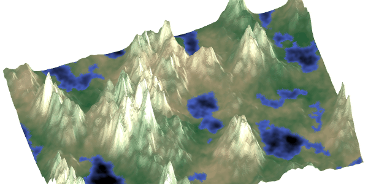

我不会去解释怎么绘制这些地图，那取决于你用的语言，图形库，平台等。我只会在这里教你怎么*用地图数据填充一个数组*。
## [**#**](https://www.mcbbs.net/plugin.php?id=link_redirect&target=http%3A%2F%2Fwww.redblobgames.com%2Fmaps%2Fterrain-from-noise%2F%23noise) Noise  噪波

用噪波生成地图的常见方法是用带宽限制噪波函数，比如 Perlin 和 Simplex 噪波，来生成地图。噪波函数看起来是这样的：

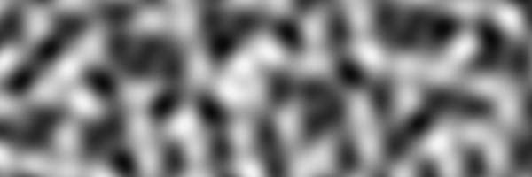

我们将地图上的每个点分配为 0.0 - 1.0。这里，我们用 0.0 代表黑色，1.0 代表白色。这是一个C语言格式的的函数，用来设置每个点的颜色：

```c
for (int y = 0; y < height; y++) {
  for (int x = 0; x < width; x++) {      
    double nx = x/width - 0.5, ny = y/height - 0.5;
    value[y][x] = noise(nx, ny);
  }
}
```

这段循环在 Javascript, Python, Haxe, C++, C#, Java 和其他的主流语言下运行效果相同，你也可以自行转换到别的语言。在剩下的教程里，我会展示随着加入更多的函数，主要部分的函数（value\[y]\[x]=… line）部分是怎么变化的。在结尾，我会展示一个完整的例子。

## [**#**](https://www.mcbbs.net/plugin.php?id=link_redirect&target=http%3A%2F%2Fwww.redblobgames.com%2Fmaps%2Fterrain-from-noise%2F%23elevation) Elevation 高度

噪波自己只是一串数字。我们需要给他们加上***实际意义***。我们的第一件事是让噪波的数字对应高度（也叫作高度图）。将现在的噪波提取作为高度图后看起来是这样的：

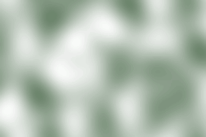

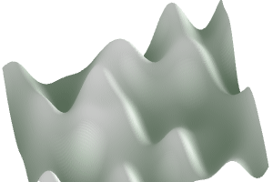

代码除了内部循环不同以外几乎一样，现在看起来像这样：

```c
elevation[y][x] = noise(nx, ny);
```

是的，就是这样。地图数据也一样。现在我把它称为**高度**而不是**数字**。
现在有很多山了，但是还是不够。哪里出问题了？

### 频率 Frequency

噪波可以用任何频率生成。现在只用了一个频率，让我们看看它的作用。**试着拖动滑块**来看看不同的频率会发生什么：
（注：原文中有可拖动的滑块）

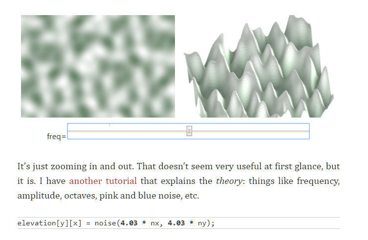

只是放大和缩小而已，看起来不是很有用，但是我还有[另一篇教程](https://www.mcbbs.net/plugin.php?id=link_redirect&target=http%3A%2F%2Fwww.redblobgames.com%2Farticles%2Fnoise%2Fintroduction.html)来介绍这些理论：频率，幅度，倍频，粉噪波，蓝噪波等。

```c
elevation[y][x] = noise(频率 * nx, 频率 * ny);
```

有时考虑波长很有用，这是频率的倒数。加倍频率会使所有东西变为原来的一半大小。加倍波长会让所有东西扩大两倍。波长是距离，以像素、米或者你用的单位来测量。波长取决于频率：**波长=地图大小/频率**。

### 倍频 Octave

为了让高度图更加有趣，我们将要添加*不同的频率*的噪波：

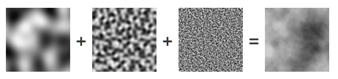

```c
elevation[y][x] =   1 * noise(1 * nx, 1 * ny)
          +  0.5 * noise(2 * nx, 2 * ny);
          + 0.25 * noise(4 * nx, 2 * ny);
```

让我们将低频率和高频率的山脉混合在同一个地图里。**移动滑块**来添加小的山脉：
（注：原文有可拖动的滑块）

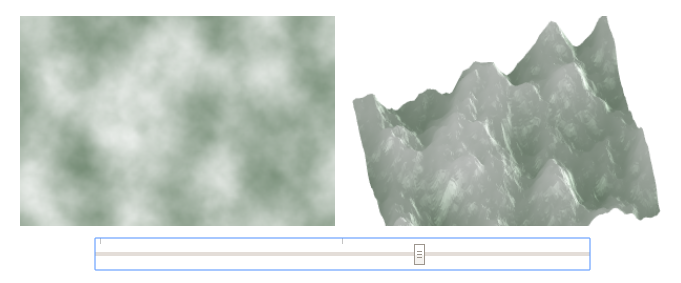

现在看起来更像是不同的地形了！现在有了丘陵和山脉，但是还是没有平坦的山谷，我们还需要点别的：

### 重新分配 Redistribution

噪波函数给我们了一串0到1的值（或者-1到1，取决于你使用的噪波库）。为了得到平坦的山谷，我们可以提高海拔。**移动滑块**来尝试不同的指数：
（注：原文有可拖动的滑块）

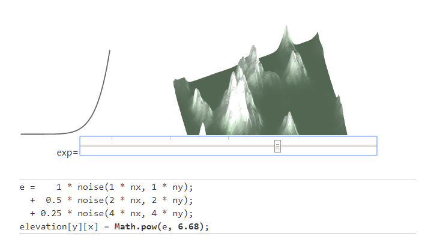

```c
e =    1 * noise(1 * nx, 1 * ny);
  +  0.5 * noise(2 * nx, 2 * ny);
  + 0.25 * noise(4 * nx, 4 * ny);
elevation[y][x] = Math.pow(e, 指数);
```

更高的值让地平线靠近山谷，更低的值将地平线靠近山峰。我们想让地形更低，所以我使用了 Math.pow 函数，因为这很简单，虽然你也可以使用任意函数。这里还有一个[演示](https://www.mcbbs.net/plugin.php?id=link_redirect&target=https%3A%2F%2Fwww.redblobgames.com%2Farticles%2Fnoise%2F2d%2F%23spectrum)。现在有了合理的高度，让我们来加点生物群系！

## [**#**](https://www.mcbbs.net/plugin.php?id=link_redirect&target=http%3A%2F%2Fwww.redblobgames.com%2Fmaps%2Fterrain-from-noise%2F%23biomes) Biomes 生物群系

噪波给了我们许多数字，但是我们想要的是一张有森林，沙漠，海洋的地图。我们要做的第一件事就是将低处变成水
（注：原文有可拖动的滑块）

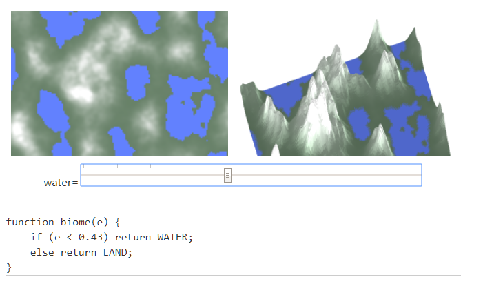

```javascript
function biome(e) {
    if (e < 水高度) return WATER;
    else return LAND;
}
```

嘿，这开始像一个程序生成的世界了！我们有了水，草和雪，可是如果还想要更多东西呢？那就加上一些水，沙滩，草原，森林，热带草原和沙漠：

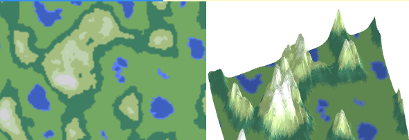

*生物群系只基于高度*

```javascript
function biome(e) {
  if (e < 0.1) return WATER;
  else if (e < 0.2) return BEACH;
  else if (e < 0.3) return FOREST;
  else if (e < 0.5) return JUNGLE;
  else if (e < 0.7) return SAVANNAH;
  else if (e < 0.9) return DESERT;
  else return SNOW;
}
```

嘿，这看起来很顶赞！你可以为你的游戏自行更改生物群系。举个例子，孤岛危机就有更多的雨林，天际线就有更多的冰雪。但是无论你怎么改，这么做都有一定的限制。生物群系与海拔一致，至始至终就只能形成类似的群系。为了让这个地图更加有趣且真实，我们需要使用其他的参数来决定生物群系，让我们加入***第二个***噪波图，“湿度”：

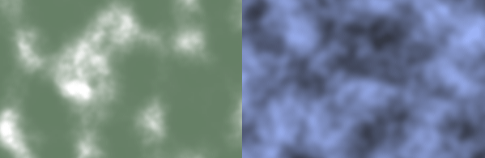

*左边是高度，右边是湿度*

现在让我们**同时**使用高度和湿度。在左下的图里，Y轴是高度，X轴是水分。这样就产生了一个合理的地图：

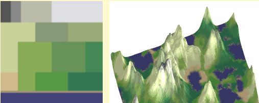

*基于两个噪波的地形图*

较低的地形是海洋和海滩，更高就是岩石和雪。在它们之间，我们现在有了更多样的群系。代码看起来像这样：

```javascript
function biome(e, m) {      
  if (e < 0.1) return OCEAN;
  if (e < 0.12) return BEACH;
  
  if (e > 0.8) {
    if (m < 0.1) return SCORCHED;
    if (m < 0.2) return BARE;
    if (m < 0.5) return TUNDRA;
    return SNOW;
  }
  if (e > 0.6) {
    if (m < 0.33) return TEMPERATE_DESERT;
    if (m < 0.66) return SHRUBLAND;
    return TAIGA;
  }
  if (e > 0.3) {
    if (m < 0.16) return TEMPERATE_DESERT;
    if (m < 0.50) return GRASSLAND;
    if (m < 0.83) return TEMPERATE_DECIDUOUS_FOREST;
    return TEMPERATE_RAIN_FOREST;
  }
  if (m < 0.16) return SUBTROPICAL_DESERT;
  if (m < 0.33) return GRASSLAND;
  if (m < 0.66) return TROPICAL_SEASONAL_FOREST;
  return TROPICAL_RAIN_FOREST;
}
```

你可以自行改变条件来适应你的游戏。


另外如果你不需要上文的生物群系生成，平滑梯度噪波（[这篇文章](https://www.mcbbs.net/plugin.php?id=link_redirect&target=http%3A%2F%2Fwww.shadedrelief.com%2Fhypso%2Fhypso.html)）可以产生类似的效果。

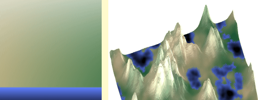

无论是生物群系还是梯度噪波，一个噪波都不够产生足够的多样性，但是两个噪波就很不错。

## [**#**](https://www.mcbbs.net/plugin.php?id=link_redirect&target=https%3A%2F%2Fwww.redblobgames.com%2Fmaps%2Fterrain-from-noise%2F%23climate) Climate 气候

在前面一章中，我们使用了高度来决定温度，更高的地方温度更低。但是，纬度也会影响温度。现在我们就同时使用这两个参数来决定温度：

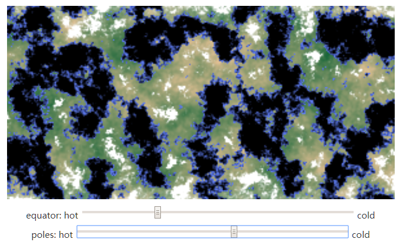

邻近极圈（纬度较高）的地方气候更冷，山顶的气候（高度较高）气候也更冷。我在这方面下的功夫很少，实际上这些参数还需要大量调整才能称之为准确。
季节的更替也会对气候造成影响。夏季和冬季温度将会升高或降低，但是赤道的气候不会变化太多。如果实现这个，那么要做的事儿就多了，比如模拟季风和洋流对气候的影响以及海洋对温度的调节作用。

## [**#**](https://www.mcbbs.net/plugin.php?id=link_redirect&target=http%3A%2F%2Fwww.redblobgames.com%2Fmaps%2Fterrain-from-noise%2F%23islands) Islands 岛屿

对于有些项目，地图的边界需要是水，而世界是一个或多个岛屿。有很多方法可以做到这一点，但是对于我的多边形地图生成器，我使用的方法更加简单：

改变高度 e = e + a  -  b * d ^ c，其中d是距离中心的距离（缩放到 0-1）。

另一个选择是 e =（e + a）*（1-b * d ^ c）。 常数 a 可以改变所有设置，b将地图边缘向下降，c控制下降的速度。

（注：原文有可拖动的滑块）

（注：原文没有可拖动的滑块）

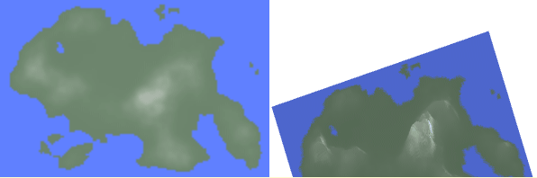

我对此不甚满意，应该试试别的。曼哈顿距离还是欧几里德距离？ 根据距离到中心还是根据距离到边缘？ 距离是平方或线性还是其他指数？ 应该是加/减，乘/除，还是别的？ 尝试加法，a = 0.1，b = 0.3，c = 2.0 或尝试乘法，a = 0.05，b = 1.00，c = 1.5。 你喜欢哪些参数将取决于你的需求。
为什么要坚持使用标准的数学函数呢？ 正如我在关于[RPG伤害的文章](https://www.mcbbs.net/plugin.php?id=link_redirect&target=http%3A%2F%2Fwww.redblobgames.com%2Farticles%2Fprobability%2Fdamage-rolls.html%23nonparametric)中所探讨的，每个人（包括我）都使用数学函数，如多项式，指数等，但在计算机上，我们不限于此。我们可以使用一个查找表 e = e + height_adjust[d] 来绘制任何类型形状的函数并使用。我还没有试过这个。

## [**#**](https://www.mcbbs.net/plugin.php?id=link_redirect&target=http%3A%2F%2Fwww.redblobgames.com%2Fmaps%2Fterrain-from-noise%2F%23terraces) Terraces 梯形图

如果将高度四舍五入到12个等级，我们就会得到梯形图：

（注：原文有可拖动的滑块）

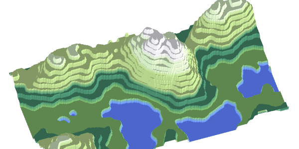

这是 e = f(e) 形式的高度重新分配函数的应用。 之前我们设置 e = Math.pow（e为指数），使山峰更陡峭; 这里我们使用 e = Math.round（e * 12）/ 12 来制作梯形图。 附加其他的函数后，梯田可以更加圆或仅在某些海拔生成。

## [**#**](https://www.mcbbs.net/plugin.php?id=link_redirect&target=https%3A%2F%2Fwww.redblobgames.com%2Fmaps%2Fterrain-from-noise%2F%23ridged) Ridged Noise 山脊形噪波

除了将生成的高度用指数函数算一遍以外，我们可以使用绝对值来创造锋利的山脊：

```javascript
function ridgenoise(nx, ny) {
  return 2 * (0.5 - abs(0.5 - noise(nx, ny)));
}
```

增加倍频，我们可以改变较高频率的幅度，这样只有山脉才会使用我们添加的新噪波：

```javascript
e0 =    1 * ridgenoise(1 * nx, 1 * ny);
e1 =   0.5 * ridgenoise(2 * nx, 2 * ny) * e0;
e2 =  0.25 * ridgenoise(4 * nx, 4 * ny) * (e0+e1);
e = e0 + e1 + e2;
elevation[y][x] = Math.pow(e, exponent);
```

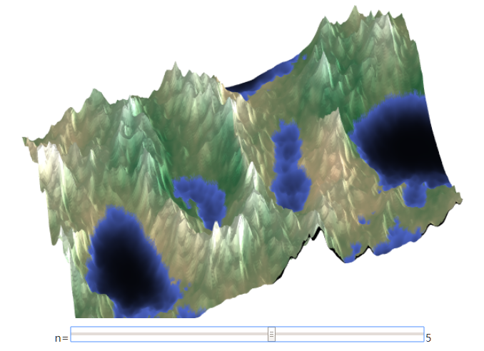

我对这一部分的尝试不是很多，还得好好玩一玩这个技巧才能学会如何用好它们。将脊形低频噪波和非脊形高频噪波混起来可能会很有意思。

## [**#**](https://www.mcbbs.net/plugin.php?id=link_redirect&target=http%3A%2F%2Fwww.redblobgames.com%2Fmaps%2Fterrain-from-noise%2F%23trees) Tree placement 树的放置

我们通常使用分形噪波来创造高度和湿度，但它也可以用于放置不规则间隔的物体，如树木和岩石。对于高度，我们使用低频率高幅度的噪波（“红噪波”）。 对于物体放置，我们要使用高频率高幅度的噪波（“蓝噪波”）。在左边是蓝色噪波的形式; 右侧是噪波超过某一特定值的位置点图：

（注：原文有可拖动的滑块）

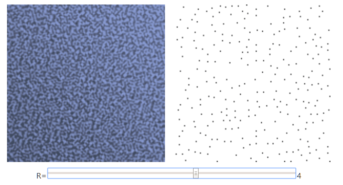

```javascript
for (int yc = 0; yc < height; yc++) {
  for (int xc = 0; xc < width; xc++) {
    double max = 0;
    // there are more efficient algorithms than this
    for (int yn = yc - R; yn <= yc + R; yn++) {
      for (int xn = xc - R; xn <= xc + R; xn++) {
        double e = value[yn][xn];
        if (e > max) { max = e; }
      }
    }
    if (value[yc][xc] == max) {
      // place tree at xc,yc
    }
  }
}
```

通过在每个生物群使用不同的 R 值（即上图的拖动变量），我们可以得到一个可变密度的树的放置点图：

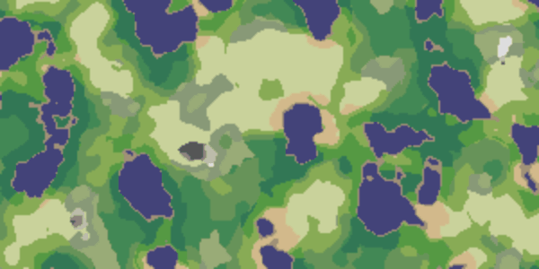

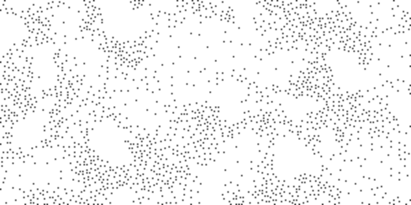

这太酷了！噪音可以用于放置树木，但是其他算法，如 (泊松分布)Poisson discs，Wang tiles(一个纹理合成算法)或图形抖动(graphics dithering)，通常更有效率，也可以产生更均匀的分布。

## [**#**](https://www.mcbbs.net/plugin.php?id=link_redirect&target=http%3A%2F%2Fwww.redblobgames.com%2Fmaps%2Fterrain-from-noise%2F%23infinite) To infinity and beyond 无限？超越？

任意位置（x，y）处的生物群系的计算与任何其他位置的计算无关。这个**局部计算**产生两个不错的属性：它可以并行计算，也可以用于生成无限大小的地形。 **将鼠标放在小地图**的左边，以生成右侧的地图。 我们可以生成地图的任何部分，而不必先生成（或存储）整个地图。

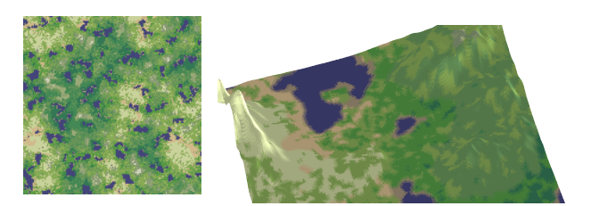

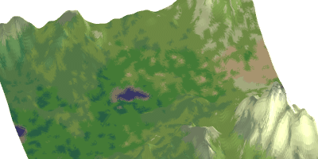

## [**#**](https://www.mcbbs.net/plugin.php?id=link_redirect&target=http%3A%2F%2Fwww.redblobgames.com%2Fmaps%2Fterrain-from-noise%2F%23implementation) Implementation 实现

- Javascript

  ```javascript
  var gen = new SimplexNoise();
  function noise(nx, ny) {
    // Rescale from -1.0:+1.0 to 0.0:1.0
    return gen.noise2D(nx, ny) / 2 + 0.5;
  }
     
  for (var y = 0; y < height; y++) {
    for (var x = 0; x < width; x++) {      
      var nx = x/width - 0.5, ny = y/height - 0.5;
      value[y][x] = noise(nx, ny);
    }
  }
  ```

  

- C++

  ```c++
  module::Perlin gen;
  double noise(double nx, double ny) {
    // Rescale from -1.0:+1.0 to 0.0:1.0
    return gen.GetValue(nx, ny, 0) / 2.0 + 0.5;
  }
  for (int y = 0; y < height; y++) {
    for (int x = 0; x < width; x++) {
      double nx = x/width - 0.5, 
               ny = y/height - 0.5;
      value[y][x] = noise(nx, ny);
    }
  }
  ```

  

- Python

  ```python
  from opensimplex import OpenSimplex
  gen = OpenSimplex()
  def noise(nx, ny):
      # Rescale from -1.0:+1.0 to 0.0:1.0
      return gen.noise2d(nx, ny) / 2.0 + 0.5
  for y in range(height):
      for x in range(width):
          nx = x/width - 0.5
          ny = y/height - 0.5
          value[y][x] = noise(nx, ny)
  ```

  

噪波库的使用非常相似。 尝试使用 [opensimplex for Python](https://www.mcbbs.net/plugin.php?id=link_redirect&target=https%3A%2F%2Fpypi.python.org%2Fpypi%2Fopensimplex%2F) 或 [libnoise for C++](https://www.mcbbs.net/plugin.php?id=link_redirect&target=http%3A%2F%2Flibnoise.sourceforge.net%2Fdocs%2F) 或 [simplex-noise](https://www.mcbbs.net/plugin.php?id=link_redirect&target=https%3A%2F%2Fwww.npmjs.com%2Fpackage%2Fsimplex-noise) for Javascript。 大多数流行语言有很多噪波库。你可能需要花时间研究 Perlin 噪音如何工作，然后自行实现一个。反正*我没有这样做。*
使用的语言的噪波库的细节可能会有所不同（有些返回0.0到1.0之间的数字，而其他的为-1.0到+1.0），但基本是一样的。 对于一个真正的项目，您可能希望将噪波函数和生成对象包装到一个类中，但是这些细节在这里是不相关的，所以我把它们全局化。
对于这个简单的项目，你可以不用担心你用的噪波库是Perlin噪波、Silplex噪波、OpenSimplex噪波、值噪波、中点位移、菱形位移或逆傅里叶变换，他们各有优点和缺点，但是都足够作为这个地图生成器的噪波函数。
地图的绘制关系到平台和游戏，所以我在这里不提供此部分的代码，本篇的代码只用来生成地形高度和生物群系，而地图绘制是取决于你游戏的类型的。**你可以随意复制代码在你自己的项目里使用。**

## [**#**](https://www.mcbbs.net/plugin.php?id=link_redirect&target=http%3A%2F%2Fwww.redblobgames.com%2Fmaps%2Fterrain-from-noise%2F%23demo) Playground

我将倍频混合，提高了高度，将高度和湿度混合来选择生物群系。这是一个可交互的程序，可以让你尝试所有不同的参数，然后展示代码是怎么应用这些参数的：
（注：原文有可拖动的滑块，这是全文的最后一个整合了的图像，并且随着拖动，代码部分的参数会随之改变，点击小标题部分的“#”前往查看）

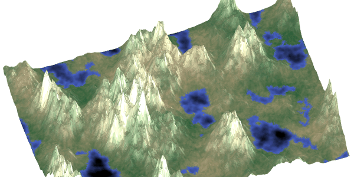

这里是代码：

```javascript
var rng1 = PM_PRNG.create(seed1);
var rng2 = PM_PRNG.create(seed2);
var gen1 = new SimplexNoise(rng1.nextDouble.bind(rng1));
var gen2 = new SimplexNoise(rng2.nextDouble.bind(rng2));
function noise1(nx, ny) { return gen1.noise2D(nx, ny)/2 + 0.5; }
function noise2(nx, ny) { return gen2.noise2D(nx, ny)/2 + 0.5; }
   
for (var y = 0; y < height; y++) {
  for (var x = 0; x < width; x++) {      
    var nx = x/width - 0.5, ny = y/height - 0.5;
    var e = ( * noise1( 1 * nx,  1 * ny)
           +  * noise1( 2 * nx,  2 * ny)
           +  * noise1( 4 * nx,  4 * ny)
           +  * noise1( 8 * nx,  8 * ny)
           +  * noise1(16 * nx, 16 * ny)
           +  * noise1(32 * nx, 32 * ny));
    e /= (+++++);
    e = Math.pow(e, );
    var m = ( * noise2( 1 * nx,  1 * ny)
           +  * noise2( 2 * nx,  2 * ny)
           +  * noise2( 4 * nx,  4 * ny)
           +  * noise2( 8 * nx,  8 * ny)
           +  * noise2(16 * nx, 16 * ny)
           +  * noise2(32 * nx, 32 * ny));
    m /= (+++++);
    /* draw biome(e, m) at x,y */
  }
}
```

有一点很棘手：在高度和湿度的噪波图中你需要使用不同的随机数种子，否则最后你的地图可能不会很有趣。在Javascript中，我使用[prng-parkmiller 库](https://www.mcbbs.net/plugin.php?id=link_redirect&target=https%3A%2F%2Fwww.npmjs.com%2Fpackage%2Fprng-parkmiller-js); 在C ++中，您可以使用两个单独的[linear_congruential_engine 对象](https://www.mcbbs.net/plugin.php?id=link_redirect&target=http%3A%2F%2Fwww.cplusplus.com%2Freference%2Frandom%2Flinear_congruential_engine%2Flinear_congruential_engine%2F); 在Python中，您可以实例化[random.Random 类](https://www.mcbbs.net/plugin.php?id=link_redirect&target=https%3A%2F%2Fdocs.python.org%2F3%2Flibrary%2Frandom.html)的两个单独实例。

## [**#**](https://www.mcbbs.net/plugin.php?id=link_redirect&target=http%3A%2F%2Fwww.redblobgames.com%2Fmaps%2Fterrain-from-noise%2F%23thoughts) Thoughts 思考

我喜欢这种地图生成方法的原因是：***它很简单***。 速度很快，并且只用很少的代码就可以产生体面的结果。
我不喜欢这种方法原因是它有局限。 本地计算意味着每个位置都与其他位置不相关，地图的不同区域也不互相联系。地图上的每个地方“感觉”都一样，没有任何全局的制约，如“这里应该有三个或者五个湖”，或是真实世界中的河流从最高峰流入海洋。
为什么我会推荐这种方法呢？ 我认为这是一个很好的**起点**，特别是对于独立游戏。我的两个朋友在30天内写了 [Realm of the Mad God](https://www.mcbbs.net/plugin.php?id=link_redirect&target=https%3A%2F%2Fen.wikipedia.org%2Fwiki%2FRealm_of_the_Mad_God) 的第一个版本，进行了一场[游戏比赛](https://www.mcbbs.net/plugin.php?id=link_redirect&target=http%3A%2F%2Fwww.tigsource.com%2F2010%2F02%2F07%2Fassemblee-competition-results%2F)。他们让我帮助他们制作地图。我用这个技术（还有一些额外的函数）帮他们制作了一张地图。几个月后，在从玩家获得反馈并观看游戏设计之后，我在[这里](https://www.mcbbs.net/plugin.php?id=link_redirect&target=http%3A%2F%2Fwww-cs-students.stanford.edu%2F~amitp%2Fgame-programming%2Fpolygon-map-generation%2F)介绍了使用Voronoi多边形设计更先进的地图生成器，这个地图生成器不使用这里的技术，而是使用非常不一样的噪波来生成地图。

## [**#**](https://www.mcbbs.net/plugin.php?id=link_redirect&target=http%3A%2F%2Fwww.redblobgames.com%2Fmaps%2Fterrain-from-noise%2F%23more) More 更多

世界上有很多很酷的噪音函数。如果你在网上搜索，你会看到诸如湍流，波浪，脊状多重分形，振幅阻尼，梯田，Voronoi 噪波，分析衍生物，域翘曲等变体。我专注于简化这篇文章。

我以前的地图生成器：

- 使用通用的 Perlin 噪波作为我的第一个 Realm of the Mad God 地图生成器。 我们在 Alpha 测试的头六个月使用，然后根据我们在alpha测试中确定的游戏需求，用定制的[Voronoi 多边形地图生成器](https://www.mcbbs.net/plugin.php?id=link_redirect&target=http%3A%2F%2Fwww-cs-students.stanford.edu%2F~amitp%2Fgame-programming%2Fpolygon-map-generation%2F)替换了它。本文中的生物群落及其颜色来自这些项目。
- 在学习音频信号处理的同时，我撰写了一个关于噪波的教程，其中包括频率，幅度，倍频和噪波“颜色”等概念。适用于音频的相同概念也适用于基于噪波的地图生成。当时我做了一些[地形生成的演示](https://www.mcbbs.net/plugin.php?id=link_redirect&target=http%3A%2F%2Fwww.redblobgames.com%2Farticles%2Fnoise%2F2d%2F) ，但没有完成。
- 有时我试着寻找限制。我想看看在制作合理的地图的同时，可以尽量减少多少代码。在[这个迷你的项目](https://www.mcbbs.net/plugin.php?id=link_redirect&target=http%3A%2F%2Fwww.redblobgames.com%2Fx%2F1446-svg-filters%2F)中，我得到了**零**行代码 - 全都是图像过滤器（湍流，阈值，颜色渐变）。我感到高兴，也有点困惑，使用图像过滤器可以完成多少地图生成？ 非常多。我之前描述的“光滑梯度配色方案”中的一切都来自这个实验。 噪波层是湍流图像滤波器; 倍频是彼此叠加的图像; 该指数在Photoshop中被称为“曲线调整”工具。

这给我带来了麻烦：我们游戏开发人员编写的基于噪波的地形生成（包括中点位移）的大部分代码与音频和图像过滤器相同，并且它的代码很少，所以我写了这篇你正在阅读的文章。这是一个快速和容易的起点。我通常不会长时间使用这些类型的地图；而是会用一个自定义的地图生成器替换它们，一旦游戏制造完成，我就能更好地了解哪种类型的地图最符合游戏的设计。 这对我来说是一个常见的模式：**从一些非常简单的东西开始，然后在我更好地理解我正在开发的系统之后更换它。**

